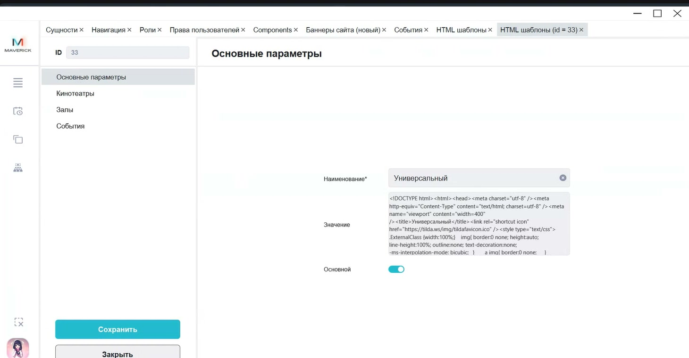

# HTML-шаблоны писем с билетами в Manager

Инструкция помогает изменить HTML-блок, который приходит клиенту в письме вместе с билетами.

<div class="kb-meta" markdown>
<div markdown>
<strong>Для кого</strong>
Контент-менеджер, маркетинг, поддержка, администратор настройки.
</div>
<div markdown>
<strong>Когда применяется</strong>
Когда нужно обновить информационный или рекламный блок в письме с билетами.
</div>
<div markdown>
<strong>Что получится</strong>
В письме с билетами используется актуальный HTML-шаблон для общего случая, кинотеатра или зала.
</div>
</div>

## Где находится

Открой:

```text
Manager → Меню → Настройки → HTML шаблоны
```



## Как работают шаблоны

- HTML-шаблон добавляет информационный блок в письмо с билетами.
- **Универсальный** шаблон используется, если для объекта или зала не задан отдельный шаблон.
- В подтверждённом процессе шаблоны применяются для кинотеатров и залов.
- Существующие шаблоны редактируют; новые создают только при отдельном решении владельца процесса.

Пример применения: для залов с доставкой еды можно подготовить отдельный HTML-блок с информацией о заказе еды в зал.

## Перед началом

- Подготовь согласованный HTML-текст или блок.
- Определи, где он должен применяться: универсально, для конкретного кинотеатра или для конкретного зала.
- Проверь, нет ли уже подходящего шаблона.

## Изменить HTML-шаблон

1. Открой **HTML шаблоны**.
2. Выбери существующий шаблон.
3. Если нужно понять текущий вид, нажми предпросмотр.
4. Измени поле **Значение**: добавь или замени HTML.
5. Закрой редактор значения.
6. Снова открой предпросмотр и проверь отображение.
7. Нажми **Сохранить**.

## Проверка результата

Перед сохранением и после изменения проверь:

- выбран правильный шаблон;
- HTML отображается в предпросмотре без сломанной вёрстки;
- область применения соответствует задаче: универсально, кинотеатр или зал;
- старый актуальный текст не удалён случайно.

## Важно

!!! warning "Письмо получает клиент"
    HTML-шаблон влияет на письмо с билетами. Ошибка в HTML, ссылке или области применения может попасть клиенту. Не сохраняй неподготовленный HTML и не меняй универсальный шаблон вместо шаблона конкретного кинотеатра или зала.

## Частые ошибки

- Редактируют универсальный шаблон, хотя нужен отдельный кинотеатр или зал.
- Сохраняют HTML без предпросмотра.
- Вставляют HTML из неподготовленного источника и ломают отображение письма.
- Создают новый шаблон вместо проверки существующего.
- Путают шаблон письма с баннером на сайте.

## Связанные страницы

- [Настройки в Manager](Настройки%20в%20Manager.md)
- [Билеты и касса](../Продажа%20билетов.md)
