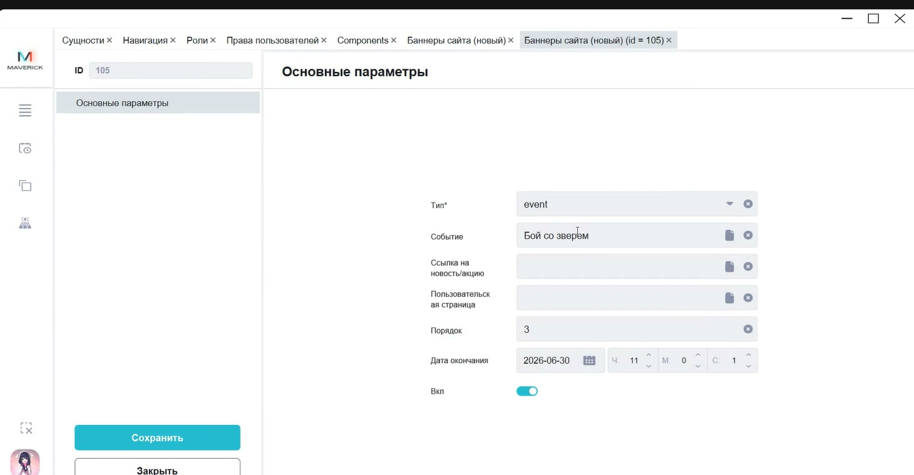
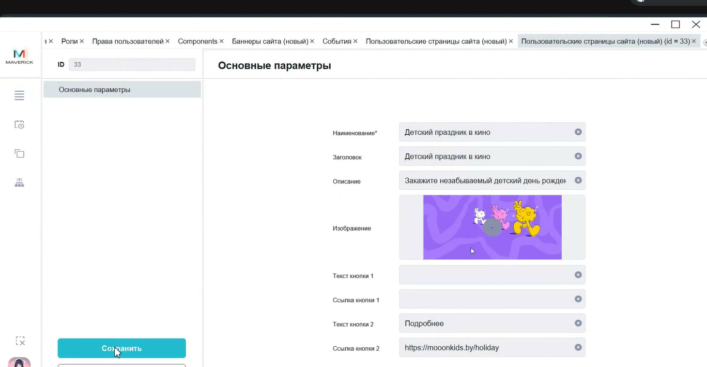

# Баннеры сайта и пользовательские страницы в Manager

Инструкция помогает настроить баннеры главной страницы `mooon.by` через Manager: привязать баннер к событию, новости или пользовательской странице.

<div class="kb-meta" markdown>
<div markdown>
<strong>Для кого</strong>
Контент-менеджер, поддержка, администратор настройки.
</div>
<div markdown>
<strong>Когда применяется</strong>
Когда нужно добавить или изменить баннер на главной странице сайта.
</div>
<div markdown>
<strong>Что получится</strong>
Баннер включён, имеет тип, порядок показа, срок отображения и ведёт на нужную страницу.
</div>
</div>

## Где находится

Открой:

```text
Manager → Меню → Настройки → Баннеры сайта (новый)
```

Для связанных материалов используются также:

```text
Manager → Меню → Настройки → Новости сайта (новый)
Manager → Меню → Настройки → Пользовательские страницы сайта (новый)
Portal → управление → Новости
```

## Типы баннеров

| Тип | Куда ведёт баннер | Что нужно до настройки |
| --- | --- | --- |
| `event` | На страницу события | Событие создано в Manager, в карточке события заполнены баннер и постер. |
| `News` | На новость, акцию или статью сайта | Материал создан в Portal и подтянулся в таблицу **Новости сайта (новый)**. |
| `Custom Page` | На пользовательскую или внешнюю страницу | Пользовательская страница создана в Manager. |

## Настроить баннер события

1. Открой **Баннеры сайта (новый)**.
2. Нажми **+** или открой существующий баннер.
3. В поле **Тип** выбери `event`.
4. В поле **Событие** выбери событие из справочника.
5. Укажи **Порядок**. Он определяет очередность баннера на главной странице.
6. Укажи **Дату окончания** и время, до которого баннер должен отображаться.
7. Включи переключатель **Вкл**.
8. Нажми **Сохранить**.



Для баннера типа `event` изображение берётся из карточки события. Проверь в событии раздел **Фото/видео**: там должны быть заполнены баннер и постер.

## Настроить баннер новости

1. Создай или проверь новость, акцию или статью в Portal.
2. Вернись в Manager и открой **Новости сайта (новый)**.
3. Убедись, что материал появился в таблице.
4. Открой **Баннеры сайта (новый)**.
5. В поле **Тип** выбери `News`.
6. В поле **Ссылка на новость/акцию** выбери нужный материал.
7. Укажи порядок, дату окончания и включи баннер.
8. Сохрани карточку.

Кнопка баннера ведёт на страницу новости или акции на `mooon.by`.

## Создать пользовательскую страницу для баннера

1. Открой **Пользовательские страницы сайта (новый)**.
2. Нажми **+**.
3. Заполни **Наименование**, **Заголовок** и **Описание**.
4. Добавь изображение.
5. При необходимости заполни текст и ссылку первой кнопки.
6. При необходимости заполни текст и ссылку второй кнопки.
7. Сохрани страницу.



После этого открой **Баннеры сайта (новый)**, выбери тип `Custom Page`, привяжи пользовательскую страницу, укажи порядок, дату окончания, включи баннер и сохрани.

## Проверка результата

После сохранения проверь:

- баннер появился на главной странице сайта;
- баннер находится в нужной позиции;
- кнопка ведёт на правильное событие, новость, пользовательскую или внешнюю страницу;
- дата окончания и переключатель **Вкл** соответствуют задаче;
- для события на сайте отображаются корректные баннер и постер.

## Важно

!!! warning "Баннер видят посетители сайта"
    Ошибка в типе, ссылке, изображении или порядке может отправить посетителя не туда или показать устаревшую акцию. Перед сохранением проверь связанный материал и срок отображения.

## Частые ошибки

- Выбирают тип `event`, но в карточке события не заполнен баннер или постер.
- Создают новость в Manager вместо Portal.
- Для `News` не проверяют, подтянулась ли новость в таблицу Manager.
- Для `Custom Page` настраивают баннер до создания пользовательской страницы.
- Указывают порядок, не проверив текущие активные баннеры.
- Продлевают дату окончания, но забывают включить баннер.

## Связанные страницы

- [Настройки в Manager](Настройки%20в%20Manager.md)
- [События в Manager](События%20в%20Manager.md)
- [Управление новостями через Portal](../Портал/Новости%20в%20Portal.md)
- [Главная страница и глобальная навигация](../Сайт%20mooon.by/Главная%20страница%20и%20глобальная%20навигация.md)
