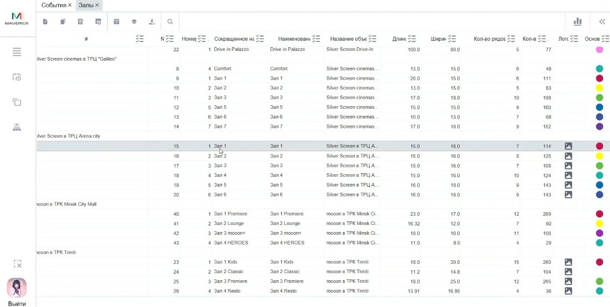

# Залы в Manager

Справочник **Залы** хранит залы внутри объектов и параметры, которые влияют на расписание и продажу мест.

<strong>Для кого</strong>
Администратор настройки, поддержка, специалист по расписанию.

<strong>Когда применяется</strong>
Когда нужно проверить зал, количество рядов и мест, цвет зала или связь зала с объектом.

<strong>Что получится</strong>
Понятно, какой зал привязан к какому объекту и какие параметры влияют на расписание и продажи.

## Где находится

Открой **Общее → События → Залы**.

## Что содержит таблица залов

По видео подтверждены такие данные:

- объект;
- ID зала;
- номер или название зала;
- количество рядов;
- количество мест;
- логотип или изображение зала;
- цвет зала для визуального отображения в расписании.

## Когда нужно менять зал

Зал нужно проверить или обновить, если в объекте изменились реальные параметры зала:

- поменяли кресла;
- изменилось количество рядов;
- изменилось количество мест;
- нужно переименовать зал;
- нужно уточнить визуальное отображение зала в расписании.

## Порядок действий

1. Открой справочник **Залы**.
2. Найди объект и нужный зал.
3. Открой карточку зала двойным щелчком или через редактирование.
4. Проверь привязанный объект.
5. Проверь номер, название, количество рядов и мест.
6. При необходимости обнови цвет зала для расписания.
7. Сохрани изменения.
8. Проверь, что данные корректно отображаются в расписании и связанных интерфейсах.

## Важно

!!! warning "Влияет на продажи мест"
    Количество рядов и мест влияет на доступность мест для продажи. Не меняй эти параметры без подтверждения актуальной схемы зала.

## Частые ошибки

- Меняют название зала, но не проверяют расписание.
- Не обновляют количество мест после изменения схемы зала.
- Путают объект и зал: объект — площадка, зал — часть объекта.

## Связанные страницы

- [Объекты в Manager](Объекты%20в%20Manager.md)
- [События в Manager](События%20в%20Manager.md)
- [Афиша и витрина](../Афиша%20и%20витрина.md)
