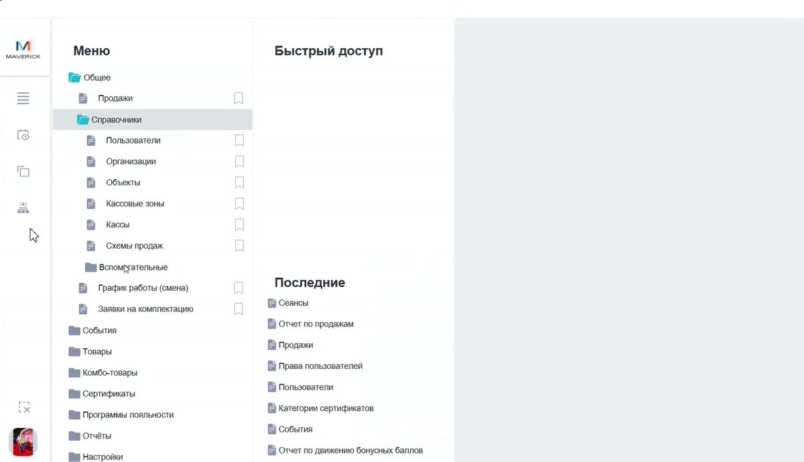

# Запуск и навигация в Manager

Эта инструкция объясняет базовую навигацию в Manager: где искать разделы, как устроено меню, как пользоваться быстрым доступом и чем отличаются основные группы.

<strong>Для кого</strong>
Поддержка, администратор, менеджер настройки.

<strong>Когда применяется</strong>
Когда нужно быстро найти справочник, отчёт, продажу, товар, сертификат или настройку в Manager.

<strong>Что получится</strong>
Понятно, где искать нужный раздел и как не потеряться в дереве меню.

## Меню Manager

Основное меню открывается кнопкой с тремя полосками на левой панели.

Меню работает как дерево папок:

- верхний уровень задаёт рабочую область;
- вложенные пункты уточняют тип сущности или справочника;
- значок закладки рядом с пунктом добавляет его в **Быстрый доступ**;
- блок **Последние** помогает вернуться к недавно открытым таблицам.

## Основные разделы

| Раздел | Что искать внутри |
| --- | --- |
| **Общее** | продажи, пользователи, организации, объекты, кассовые зоны, кассы, схемы продаж |
| **События** | события, сеансы, залы и справочники, связанные с афишей и расписанием |
| **Товары** | продукты, прайсы продуктов, товарные справочники |
| **Комбо-товары** | комбо и связанные настройки |
| **Сертификаты** | категории сертификатов, выпуск, операции, списки и проверки |
| **Программы лояльности** | скидки, бонусные программы, категории лояльности |
| **Отчёты** | отчёты и аналитические таблицы |
| **Настройки** | настройки бизнес-сущностей, доступные через Manager |

По разделу **Программы лояльности** см. отдельную инструкцию: [Программы лояльности в Manager](Программы%20лояльности%20в%20Manager.md).

!!! note "Структура меню"
    Дерево меню задаётся системой. Если пользователь не видит нужный пункт, сначала проверяй права и контекст, а не создавай новую сущность.

## Быстрый доступ

Быстрый доступ нужен для часто используемых таблиц и справочников.

Как добавить пункт:

1. Открой меню.
2. Найди нужный раздел или таблицу.
3. Нажми значок закладки рядом с пунктом.
4. Проверь, что пункт появился в блоке **Быстрый доступ**.

Как убрать пункт:

1. Найди его в меню или быстром доступе.
2. Нажми значок закладки повторно.

## Последние открытые

Блок **Последние** показывает таблицы и разделы, которые недавно открывались в работе: продажи, пользователи, категории сертификатов, отчёты и другие часто используемые экраны.

## Левая панель

На левой панели находятся служебные кнопки:

| Кнопка | Для чего нужна |
| --- | --- |
| Меню | открывает дерево разделов Manager |
| Расписание | переход к расписанию, если доступно по правам |
| Копирование расписаний | служебное действие для расписаний |
| Массовые возвраты | служебное действие, доступ зависит от прав |
| Закрыть открытые таблицы | закрывает открытые вкладки/таблицы |
| Выйти | выход из Manager |

## Горячие клавиши интерфейса

В Manager доступны служебные переключатели:

| Клавиша | Что делает |
| --- | --- |
| F1 | светлая тема |
| F2 | чёрно-белая тема |
| F3 | тёмная тема |
| F4 | русский язык |
| F5 | показывает в таблицах технические названия из базы данных |
| F6 | английский язык |

После смены темы может потребоваться перезапуск программы.

!!! warning "F5"
    F5 полезна разработчикам и поддержке, но для обычной работы технические названия полей могут мешать.

## Частые ошибки

- Ищут настройку в кассе или на сайте, хотя она находится в Manager.
- Не используют быстрый доступ и каждый раз ищут один и тот же справочник вручную.
- Путают **Продажи** как таблицу операций и **Отчёт по продажам**.
- Считают, что пользователь сам может менять дерево меню.

## Связанные страницы

- [Таблицы, фильтры и выгрузка в Manager](Таблицы%20фильтры%20и%20выгрузка%20в%20Manager.md)
- [Проверка продаж в Manager](Проверка%20продаж%20в%20Manager.md)
- [Пользователи в Manager](Пользователи%20в%20Manager.md)
- [Справочники Manager](Справочники%20Manager.md)
