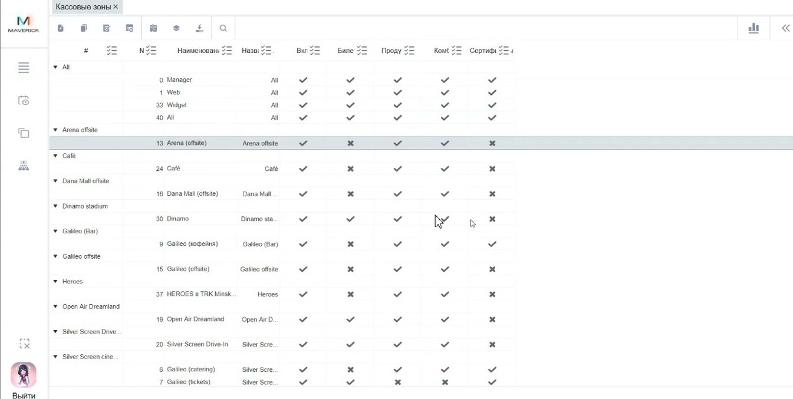

# Кассовые зоны в Manager

Справочник **Кассовые зоны** определяет, какие виды продаж доступны для кассы в конкретном объекте.

<strong>Для кого</strong>
Администратор настройки, поддержка, специалист по продажам.

<strong>Когда применяется</strong>
Когда на кассе или в Seller отображаются не те вкладки продаж: билеты, продукты, комбо или сертификаты.

<strong>Что получится</strong>
Понятно, какая кассовая зона должна быть привязана к кассе и какие продажи она включает.

## Где находится

Открой **Общее → Справочники → Кассовые зоны**.

## Что такое кассовая зона

Кассовая зона — это настройка продаж внутри объекта. Она определяет, какие вкладки и виды товаров доступны в Seller или на конкретной кассе.

Кассовая зона может включать виды продаж:

- билеты;
- продукты;
- комбо;
- сертификаты.

## Как это работает

1. В справочнике для объекта заведены варианты кассовых зон.
2. У каждой кассовой зоны есть ID.
3. Этот ID затем привязывается к кассе.
4. После привязки касса получает набор доступных продаж.

Если кассе привязана зона только с билетами и сертификатами, на этой кассе не должны отображаться продукты и комбо.

## Что проверить при проблеме с продажей

Если касса не показывает нужную вкладку или товарный тип:

1. Найди объект.
2. Проверь доступные кассовые зоны объекта.
3. Посмотри, какие виды продаж включены в нужной зоне.
4. Открой справочник **Кассы**.
5. Проверь, какая кассовая зона привязана к конкретной кассе.

## Важно

!!! warning "Влияет на доступность продаж"
    Неправильная кассовая зона может скрыть нужные продажи или открыть лишние. Меняй привязку только после проверки объекта и кассы.

## Частые ошибки

- Проверяют только товар или прайс, но не проверяют кассовую зону.
- Привязывают кассу к зоне другого объекта.
- Ожидают продукты или комбо на кассе, где зона включает только билеты и сертификаты.

## Связанные страницы

- [Кассы в Manager](Кассы%20в%20Manager.md)
- [Объекты в Manager](Объекты%20в%20Manager.md)
- [Схемы продаж в Manager](Схемы%20продаж%20в%20Manager.md)
- [Базовая работа в Seller Web](../Seller/Базовая%20работа%20в%20Seller%20Web.md)
