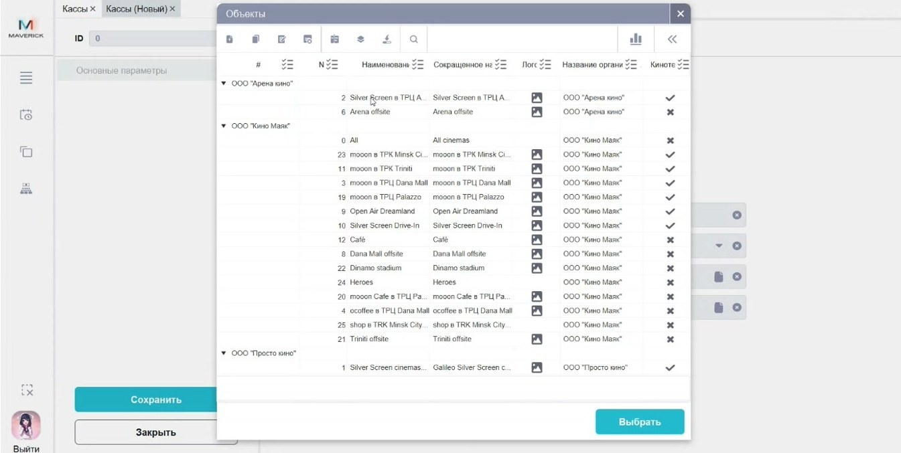

# Кассы в Manager

Справочник **Кассы** хранит точки продаж и их связь с объектами и кассовыми зонами.

<strong>Для кого</strong>
Администратор настройки, поддержка, специалист по продажам.

<strong>Когда применяется</strong>
Когда нужно проверить, через какую кассу проходит продажа и какая кассовая зона к ней привязана.

<strong>Что получится</strong>
Касса связана с правильным объектом и правильной кассовой зоной.

## Где находится

Открой **Общее → Справочники → Кассы**.

## Что такое касса в Manager

Касса — это точка продаж. В справочнике могут быть офлайн- и онлайн-точки: кассы Seller, сайт, виджет, портал и другие каналы, через которые проходят кассовые операции.

## Что видно в справочнике

По видео подтверждены данные:

- объект;
- название кассы;
- ID или номер кассы;
- тип кассы;
- привязанная кассовая зона;
- варианты выбора кассовой зоны для объекта.

## Как связаны объект, кассовая зона и касса

1. Объект задаёт площадку продаж.
2. Для объекта есть кассовые зоны.
3. Касса привязывается к объекту и одной из кассовых зон.
4. Кассовая зона определяет, что на кассе доступно к продаже.

## Создание или проверка кассы

1. Открой справочник **Кассы**.
2. Выбери или создай кассу.
3. Укажи объект.
4. Выбери кассовую зону из вариантов, доступных для этого объекта.
5. Сохрани карточку.
6. Проверь, что касса появилась в списке и показывает нужную зону продаж.

## Удаление кассы

Удалять можно только кассу, к которой не привязаны операции и которая не используется в продажах. Новую тестовую кассу без связей можно удалить, но рабочую кассу удалять нельзя без проверки истории операций.

## Важно

!!! warning "Касса связана с операциями"
    Через кассы проходят продажи. Нельзя удалять или менять рабочую кассу без проверки связанных операций, объекта и кассовой зоны.

## Частые ошибки

- Создают кассу без правильной кассовой зоны.
- Выбирают зону продаж не того объекта.
- Проверяют проблему в Seller, но не проверяют привязку кассы в Manager.

## Связанные страницы

- [Кассовые зоны в Manager](Кассовые%20зоны%20в%20Manager.md)
- [Объекты в Manager](Объекты%20в%20Manager.md)
- [Проверка продаж в Manager](Проверка%20продаж%20в%20Manager.md)
- [Базовая работа в Seller Web](../Seller/Базовая%20работа%20в%20Seller%20Web.md)
