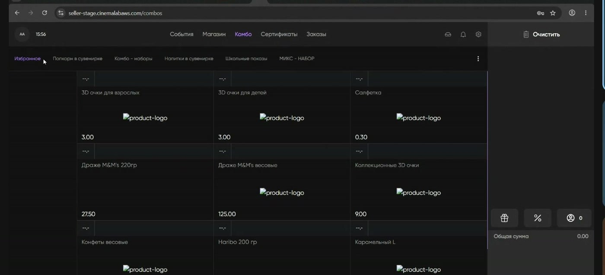
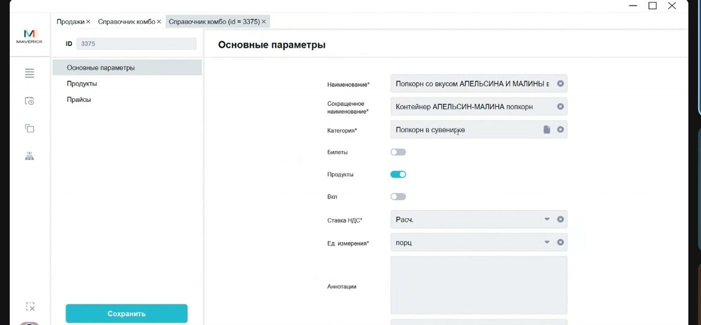
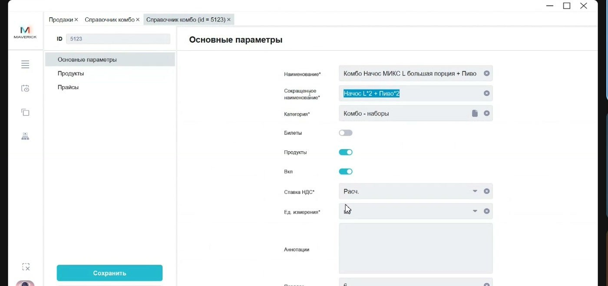
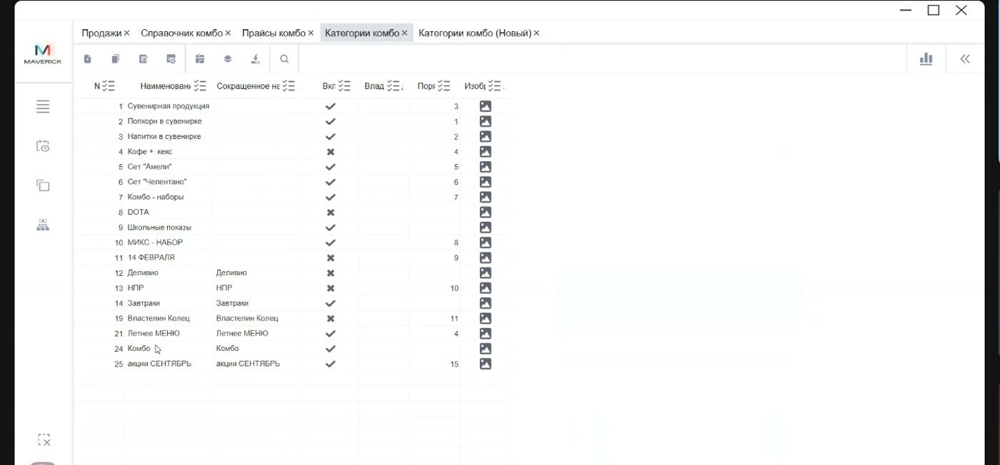
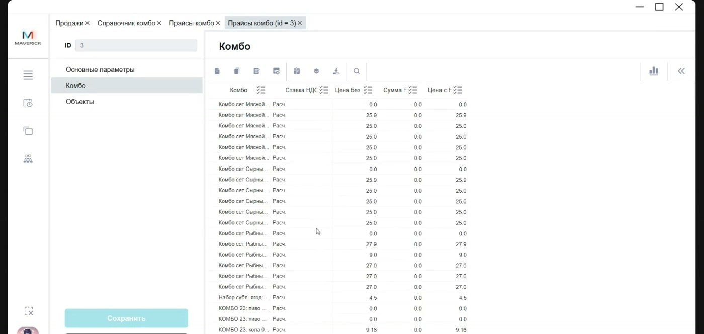

# Комбо в Manager и Seller Web

Комбо — это набор из нескольких товаров, который продаётся на кассе Seller Web или в киоске одной позицией. В Manager для комбо настраиваются карточка, категория отображения, состав товаров и прайс.

<div class="kb-meta" markdown>
<div markdown>
<strong>Для кого</strong>
Администратор настройки, поддержка, кассовый администратор.
</div>
<div markdown>
<strong>Когда применяется</strong>
Когда нужно завести комбо, проверить его состав, цену или причину, почему оно не отображается на кассе.
</div>
<div markdown>
<strong>Что получится</strong>
Комбо включено, относится к нужной категории, содержит правильные товары, имеет цену и отображается в Seller Web или киоске.
</div>
</div>

## Что проверять в первую очередь

Для продажи комбо должны совпасть четыре условия:

1. Комбо есть в справочнике **Справочные комбо**.
2. В карточке выбрана правильная категория.
3. Комбо включено.
4. Для комбо заполнен прайс.

Если одно из условий не выполнено, комбо может быть заведено в Manager, но не продаваться на кассе.

## Как комбо выглядит в Seller Web

В Seller Web открой вкладку **Комбо**.



В разделе видны:

- избранные товары;
- категории комбо;
- комбо внутри выбранной категории;
- корзина заказа справа.

Категории работают как папки. Если комбо находится не в той папке, проверяй поле **Категория** в карточке комбо.

## Где открыть карточку комбо

Путь:

```text
Manager → Продукты → Справочные комбо
```



Справочник содержит все комбо: действующие, недействующие и старые. Наличие строки в справочнике не означает, что комбо уже продаётся.

## Как заполнить основные параметры

В карточке комбо открой вкладку **Основные параметры**.

Заполни и проверь поля:

| Поле | Что означает |
| --- | --- |
| **Наименование** | Полное название комбо в Manager. |
| **Сокращённое наименование** | Короткое название для отображения в интерфейсах. |
| **Категория** | Папка, в которой комбо отображается на кассе. |
| **Билетный** | Для текущего процесса комбо используется как продуктовый набор; билетный сценарий отдельно не описан. |
| **Продукты** | Комбо включает товары. Для продуктового комбо этот признак должен быть включён. |
| **Вкл** | Активность комбо. Выключенное комбо не должно продаваться. |
| **Ставка НДС** | Налоговая ставка для продажи комбо. Проверяй по налоговому правилу клиента. |
| **Ед. измерения** | Единица измерения, например порция. |
| **Аннотация** | Внутренняя пометка в карточке. Не используй как основной источник клиентского описания. |
| **Порядок** | Очередность комбо внутри категории на кассе. |
| **Цвет** | Визуальная подсветка комбо на кассе, если используется. |

!!! warning "НДС и цена"
    Комбо связано с продажами и налогами. Не меняй ставку НДС и цену без подтверждённого правила для клиента.

## Как настроить порядок отображения

Поле **Порядок** управляет местом комбо внутри выбранной категории.

Пример: если в категории «Попкорн + напиток» несколько комбо, значение `1` ставит комбо выше остальных позиций этой категории.

Если кассир говорит, что нужное комбо «есть, но его неудобно искать», проверь:

1. категорию комбо;
2. порядок отображения;
3. включённость комбо;
4. наличие цены в прайсе.

## Как добавить товары в состав комбо

Открой вкладку **Продукты**.



Проверь состав набора:

- какие товары входят в комбо;
- сколько единиц каждого товара входит в набор;
- не перепутан ли товар с похожим товаром;
- соответствует ли состав названию комбо.

Комбо — это не категория товара и не обычная карточка товара. Это отдельный набор, который собирается из товаров.

## Как проверить категорию комбо

Категории комбо открываются из поля **Категория** в карточке или через справочник категорий комбо.



Категория определяет папку на кассе Seller Web. Если комбо не отображается в ожидаемом месте, сначала проверь категорию, а не прайс.

## Как проверить прайс комбо

Открой вкладку **Прайсы**.



Прайс задаёт цену комбо. Без прайса включённое комбо может не продаваться.

Проверь:

1. Для комбо есть строка прайса.
2. Цена заполнена.
3. Ставка НДС соответствует правилу клиента.
4. Цена относится к нужному объекту или каналу продаж, если в настройке используется ограничение по объектам.
5. После сохранения комбо отображается в Seller Web или киоске.

## Проверка после настройки

После сохранения карточки:

1. Открой Seller Web.
2. Перейди во вкладку **Комбо**.
3. Открой нужную категорию.
4. Найди комбо по названию.
5. Добавь комбо в корзину.
6. Проверь цену и состав заказа до оплаты.

Не проводи тестовую оплату в рабочей среде без отдельного разрешения.

## Если комбо не отображается на кассе

Проверь по порядку:

1. Комбо включено в карточке.
2. Выбрана правильная категория.
3. В составе есть товары.
4. Заполнен прайс.
5. Цена действует для нужного объекта или канала продаж.
6. Кассир открыт в нужной кассовой зоне.
7. Seller Web обновил данные после изменения настройки.

Если после этих проверок комбо не появилось, передай в поддержку: название комбо, категорию, объект, кассу, скрин карточки и скрин вкладки **Комбо** в Seller Web.

## Если у комбо нет картинки

На кассе может отображаться техническая заглушка вместо изображения.

Для товаров изображения управляются через карточку товара на Portal: картинку загружают на сервер или указывают ссылку. Отдельное поведение изображений именно для комбо и кассира требует уточнения.

## Частые ошибки

| Ошибка | Что проверить |
| --- | --- |
| Комбо завели, но оно не продаётся | Включённость, прайс, объект или канал продаж. |
| Комбо видно не в той папке | Поле **Категория**. |
| Комбо есть в Manager, но кассир его не видит | Категорию, прайс, кассовую зону и обновление Seller Web. |
| Цена не совпадает с ожидаемой | Прайс комбо и ставку НДС. |
| В набор попал не тот товар | Вкладку **Продукты**. |
| Кассир ищет картинку, но видит заглушку | Настройку изображений товара/комбо и актуальность поведения для кассы. |

## Связанные страницы

- [Базовая работа в Seller Web](../Seller/Базовая%20работа%20в%20Seller%20Web.md)
- [Справочники Manager](Справочники%20Manager.md)
- [Кассовые зоны в Manager](Кассовые%20зоны%20в%20Manager.md)
- [Заполнение прайса с НДС](../Прайсы%20и%20налоги/Заполнение%20прайса%20с%20НДС.md)
