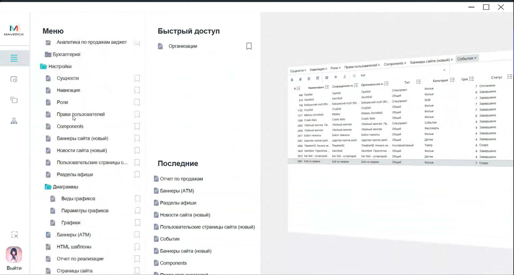

# Настройки в Manager

Раздел **Настройки** содержит служебные и контентные настройки Manager: роли, права пользователей, баннеры сайта, пользовательские страницы, HTML-шаблоны писем и другие таблицы.

<strong>Для кого</strong>
Поддержка, администратор настройки, системный администратор.

<strong>Когда применяется</strong>
Когда нужно найти настройку, которая влияет на доступы, сайт `mooon.by`, письма с билетами или служебные таблицы Manager.

<strong>Что получится</strong>
Понятно, какую связанную инструкцию открыть и какие разделы не менять без подтверждённого владельца процесса.

## Где находится

Открой меню Manager и выбери **Настройки**.

## Основные рабочие настройки

| Раздел | Для чего используется |
| --- | --- |
| `Роли` | Настройка доступа роли к сущностям Manager и Seller. |
| `Права пользователей` | Привязка одной или нескольких ролей к staffer-пользователю. |
| `Баннеры сайта (новый)` | Управление баннерами на главной странице `mooon.by`. |
| `Новости сайта (новый)` | Список новостей и акций сайта, созданных через Portal и доступных для выбора в баннере. |
| `Пользовательские страницы сайта (новый)` | Создание пользовательских страниц, которые можно привязать к баннеру типа `Custom Page`. |
| `HTML шаблоны` | Настройка HTML-блоков, которые приходят в письме с билетами. |

## Куда перейти

- Для доступов открой [Роли и права пользователей в Manager](Роли%20и%20права%20пользователей%20в%20Manager.md).
- Для баннеров главной страницы, новостей и пользовательских страниц открой [Баннеры сайта и пользовательские страницы в Manager](Баннеры%20сайта%20и%20пользовательские%20страницы%20в%20Manager.md).
- Для HTML-блоков в письмах с билетами открой [HTML-шаблоны писем с билетами в Manager](HTML-шаблоны%20писем%20с%20билетами%20в%20Manager.md).
- Для новостей и акций, которые выбираются в баннере, открой [Управление новостями через Portal](../Портал/Новости%20в%20Portal.md).

## Как работать безопасно

1. Сначала определи, какой результат нужен: доступ пользователя, баннер на сайте, пользовательская страница или HTML-блок в письме.
2. Открой связанную инструкцию и проверь путь.
3. Не меняй служебные таблицы из раздела **Настройки**, если по ним нет отдельной инструкции или владельца процесса.
4. После сохранения проверь связанный интерфейс: доступ пользователя, главную страницу сайта или предпросмотр HTML-шаблона.

## Важно

!!! warning "Настройки влияют на пользователей и клиентов"
    Ошибка в настройках может закрыть доступ сотруднику, изменить публичный сайт или изменить письмо, которое получает клиент с билетами. Не сохраняй изменения без согласованного содержания и проверки результата.

## Частые ошибки

- Меняют служебную таблицу, не понимая, где она используется.
- Путают создание новости в Portal и выбор новости в баннере Manager.
- Меняют баннер события, но не проверяют баннер и постер в карточке события.
- Редактируют HTML-шаблон письма без предпросмотра.
- Удаляют роль, не проверив пользователей, которым она назначена.

## Связанные страницы

- [Manager / back-office](../Manager.md)
- [Запуск и навигация в Manager](Запуск%20и%20навигация%20в%20Manager.md)
- [Роли и права пользователей в Manager](Роли%20и%20права%20пользователей%20в%20Manager.md)
- [Баннеры сайта и пользовательские страницы в Manager](Баннеры%20сайта%20и%20пользовательские%20страницы%20в%20Manager.md)
- [HTML-шаблоны писем с билетами в Manager](HTML-шаблоны%20писем%20с%20билетами%20в%20Manager.md)
