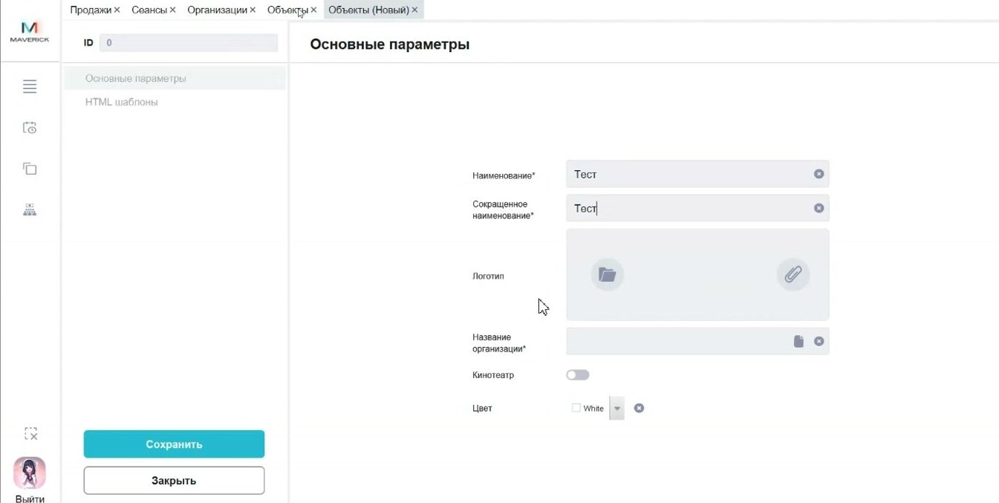

# Объекты в Manager

Справочник **Объекты** хранит площадки, где ведётся продажа билетов или продуктов: кинотеатры, кафе и другие точки работы.

<strong>Для кого</strong>
Администратор настройки, поддержка.

<strong>Когда применяется</strong>
Когда нужно проверить или завести объект, к которому потом привязываются залы, кассовые зоны и кассы.

<strong>Что получится</strong>
Объект доступен для дальнейших настроек продаж и расписания.

## Что такое объект

Объект — это не зал и не подразделение внутри кинотеатра. Это верхний уровень площадки, где ведётся торговля билетами или продуктами.

Примеры объектов по смыслу:

- кинотеатр;
- кафе;
- другая площадка продаж.

## Где находится

Открой **Общее → Справочники → Объекты**.

## Что видно в карточке объекта

В карточке доступны поля:

- наименование;
- сокращённое наименование;
- логотип;
- организация;
- признак активности;
- цвет.

В таблице доступны действия добавления, редактирования, удаления и выгрузки.

## Создание объекта

1. Открой справочник **Объекты**.
2. Нажми **+**.
3. Заполни обязательные поля.
4. Укажи наименование и сокращённое наименование.
5. Добавь логотип: через выбор файла или ссылку, если такой способ доступен в карточке.
6. Привяжи объект к организации.
7. Проверь признак активности.
8. При необходимости выбери цвет.
9. Сохрани карточку.
10. Убедись, что объект появился в таблице.

## Что зависит от объекта

От объекта дальше зависят:

- залы;
- кассовые зоны;
- кассы;
- расписание и продажи;
- отображение объекта в связанных клиентских интерфейсах.

## Важно

!!! warning "Не путать объект и зал"
    Зал создаётся внутри объекта. Если поменять объект или удалить его, это может затронуть связанные залы, кассовые зоны, кассы и продажи.

## Частые ошибки

- Пытаются описывать зал как объект.
- Создают объект без связи с организацией.
- Не проверяют, используется ли объект в залах, кассах и расписании.

## Связанные страницы

- [Организации в Manager](Организации%20в%20Manager.md)
- [Залы в Manager](Залы%20в%20Manager.md)
- [Кассовые зоны в Manager](Кассовые%20зоны%20в%20Manager.md)
- [Кассы в Manager](Кассы%20в%20Manager.md)
