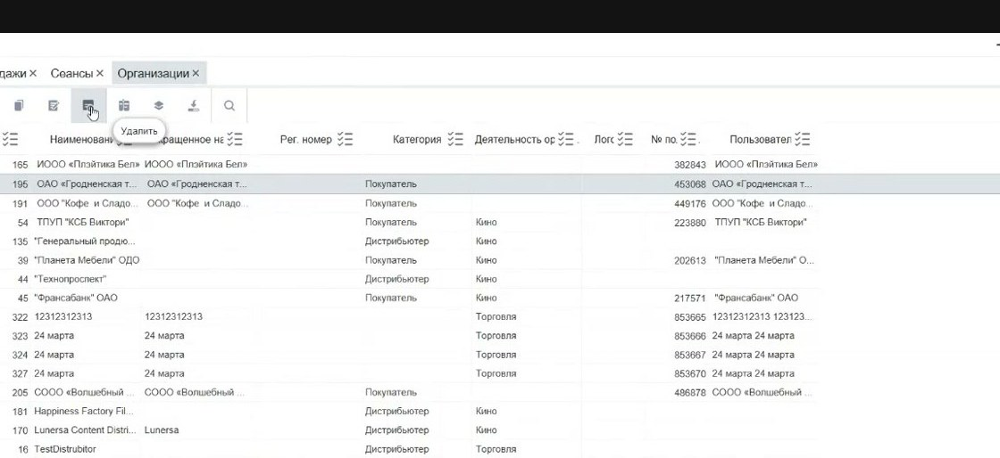

# Организации в Manager

Справочник **Организации** хранит отдельный список организаций и юрлиц, которые используются в продажах, транзакциях, сертификатах, событиях и других разделах Manager.

<strong>Для кого</strong>
Администратор настройки, поддержка, специалист, который заводит данные для продаж и отчётов.

<strong>Когда применяется</strong>
Когда нужно добавить или проверить организацию, которая дальше выбирается в других карточках Manager.

<strong>Что получится</strong>
Организация доступна для привязки в связанных справочниках и операциях.

## Где находится

Открой **Общее → Справочники → Организации**.

## Что содержит справочник

В таблице организаций видны записи, которые потом используются в других местах Manager. По видео подтверждены поля и действия:

- ID;
- наименование;
- сокращённое наименование;
- регистрационный номер;
- категория;
- деятельность организации;
- логотип;
- связанный пользователь;
- действия с таблицей: добавить, копировать, редактировать, удалить, настроить колонки, группировать, выгрузить в Excel, искать.

## Когда организация нужна

Организация может использоваться:

- при продаже сертификатов;
- при продаже билетов юридическим лицам;
- в карточках событий, например для дистрибьюторов;
- в связанных справочниках и транзакциях.

## Создание организации

1. Нажми **+** в таблице организаций.
2. Заполни обязательные поля, отмеченные звёздочкой.
3. Укажи наименование.
4. При необходимости укажи сокращённое наименование и регистрационный номер.
5. Выбери категорию из выпадающего списка.
6. Выбери деятельность организации из выпадающего списка.
7. При необходимости добавь логотип.
8. Если требуется связь с пользователем, выбери пользователя из таблицы пользователей.
9. Сохрани карточку.
10. Проверь, что новая организация появилась в таблице.

## Что проверить перед сохранением

- Организация ещё не заведена под другим названием.
- Категория и деятельность выбраны из правильных вспомогательных справочников.
- Если организация должна участвовать в продажах или событиях, её можно выбрать в нужной связанной карточке.

## Важно

!!! warning "Юрлица и продажи"
    Организации могут участвовать в продажах, сертификатах и транзакциях. Не удаляй и не переименовывай запись без проверки связанных операций.

## Частые ошибки

- Заводят дубль организации вместо редактирования существующей записи.
- Не выбирают категорию или деятельность, из-за чего запись хуже фильтруется и используется.
- Не проверяют, подтянулась ли организация в нужной связанной карточке.

## Связанные страницы

- [Вспомогательные справочники в Manager](Вспомогательные%20справочники%20в%20Manager.md)
- [Объекты в Manager](Объекты%20в%20Manager.md)
- [События в Manager](События%20в%20Manager.md)
- [Проверка и разбор проблем с сертификатами](../Сертификаты/Проверка%20и%20разбор%20проблем%20с%20сертификатами.md)
