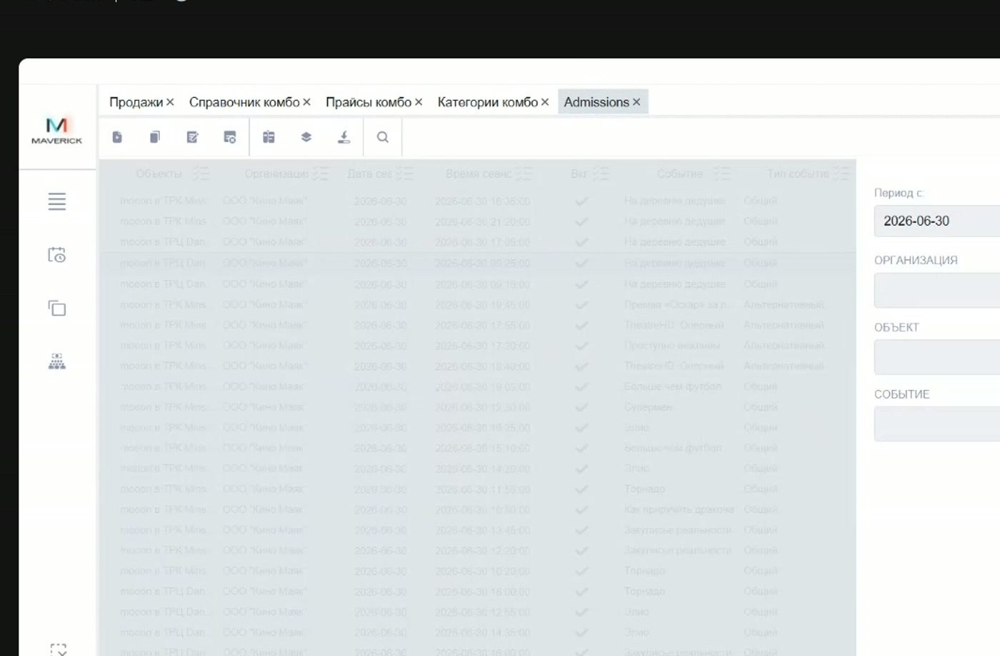
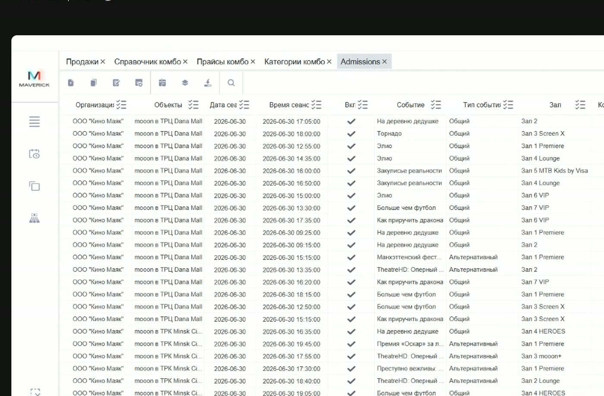
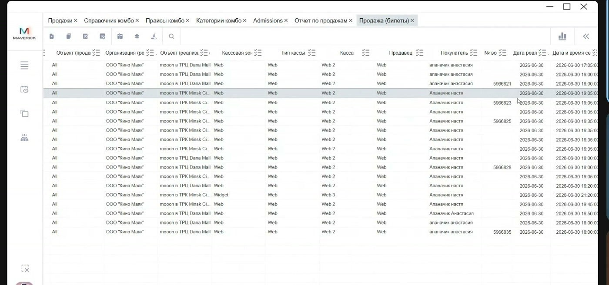
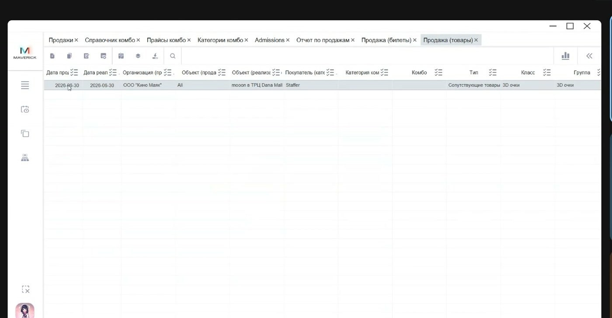
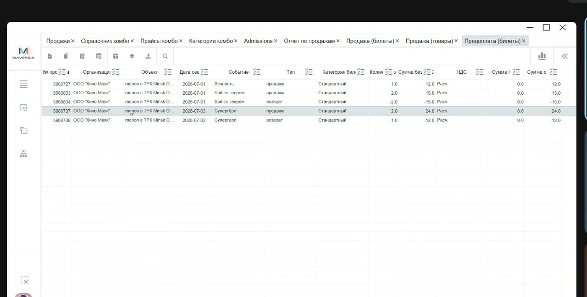
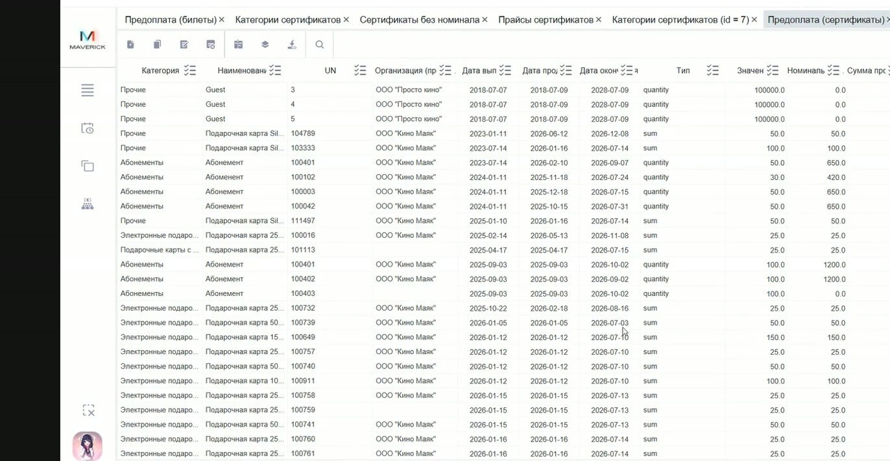
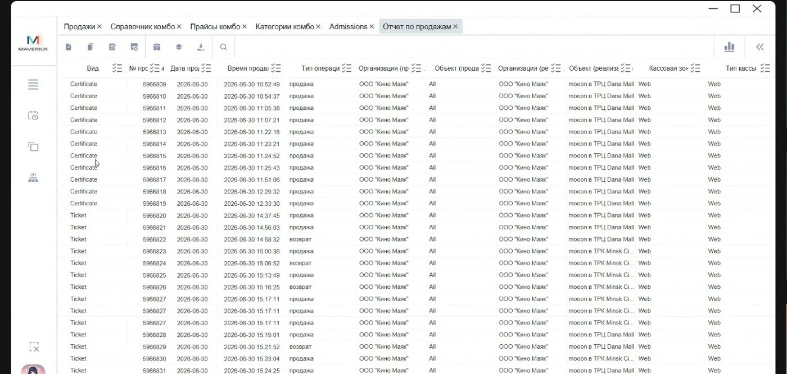
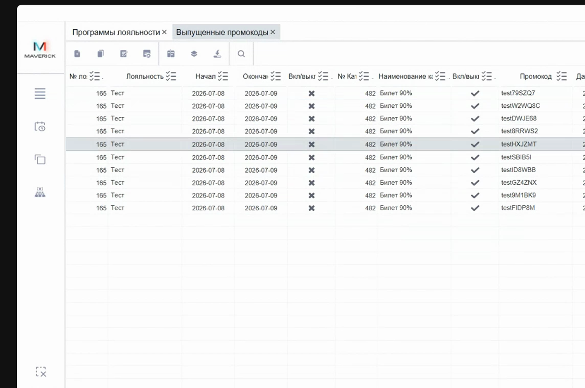

# Отчёты в Manager

Раздел **Отчёты** нужен для проверки продаж, возвратов, посещаемости, товаров, предоплат и управленческих сумм. Начинай с выбора правильного отчёта: разные отчёты отвечают на разные вопросы.

<div class="kb-meta" markdown>
<div markdown>
<strong>Для кого</strong>
Поддержка, администратор, бухгалтерия, менеджер объекта.
</div>
<div markdown>
<strong>Когда применяется</strong>
Когда нужно проверить продажи, возвраты, количество проданных билетов, реализацию товаров или выгрузить таблицу.
</div>
<div markdown>
<strong>Что получится</strong>
Сотрудник выбирает нужный отчёт, задаёт фильтры, читает ключевые колонки и понимает ограничения отчёта.
</div>
</div>

## Как выбрать отчёт

| Задача | Какой отчёт открыть |
| --- | --- |
| Посмотреть количество проданных билетов по сеансам | **Admissions** |
| Проверить продажи и возвраты по билетам | **Продажи (билеты)** |
| Проверить, какие товары были проданы | **Продажи (товары)** |
| Проверить билетные предоплаты | **Предоплата (билеты)** |
| Получить общий управленческий список продаж и возвратов | **Продажи** |

Если нужно разобрать конкретную операцию по оплатам, скидкам или статусу, используй не только отчёты, но и таблицу **Продажи** в Manager. См. [Проверка продаж в Manager](Проверка продаж в Manager.md).

## Где находится раздел

Путь:

```text
Manager → Отчёты
```

В разделе собраны управленческие, бухгалтерские, финансовые и операционные отчёты. Перед чтением данных всегда проверяй правую панель фильтров.

## Общие действия с таблицами

В отчётах можно:

- группировать строки по колонке;
- сортировать строки нажатием на заголовок колонки;
- скрывать лишние колонки;
- возвращать скрытые колонки;
- перетаскивать колонки мышью;
- искать по таблице;
- выгружать данные в Excel;
- фильтровать по периоду, организации, объекту или событию.



Порядок базовой проверки:

1. Открой нужный отчёт.
2. Проверь дату или период справа.
3. Если нужно, выбери организацию, объект или событие.
4. Примени фильтр или обнови отчёт.
5. Настрой колонки: убери лишние, перетащи важные ближе.
6. Используй группировку или сортировку, если строк много.
7. Для передачи данных выгрузи таблицу в Excel.

## Admissions

**Admissions** показывает сеансы и количество проданных билетов.



Используй этот отчёт, когда нужно оценить посещаемость или продажи билетов по сеансам.

В отчёте удобно смотреть:

- организацию;
- объект;
- дату;
- время начала;
- событие;
- тип события;
- зал;
- количество проданных билетов.

Особенность: из строки отчёта нельзя открыть карточку операции. Это отчёт для просмотра, группировки и выгрузки.

## Продажи билетов

**Продажи (билеты)** показывает продажи и возвраты по билетам за выбранный период.



Используй отчёт, когда нужно проверить билетную продажу или возврат без перехода в карточку продажи.

Ключевые колонки:

| Колонка | Что означает |
| --- | --- |
| Номер продажи / возврата | Номер операции. При возврате указывается связанный номер продажи. |
| Дата и время продажи | Когда была проведена продажа или возврат. |
| Тип операции | Продажа или возврат. |
| Организация / объект продажи | Где была выполнена продажа. |
| Организация / объект реализации | Где фактически реализуется услуга. |
| Кассовая зона, тип кассы, касса | Через какую кассу прошла операция. |
| Продавец | Пользователь или канал продажи. |
| Покупатель | Заполнен, если покупатель был указан или идентифицирован. |
| Дата и время сеанса | Когда проходит сеанс. Может отличаться от даты продажи. |
| Событие, зал, ряд, место | Детали билета. |
| Категория билета | Тип или категория места. |
| Количество мест | Количество мест в билете. Для двойного дивана может быть больше одного места. |
| Суммы и НДС | Сумма без НДС, НДС, сумма с НДС, скидка и сумма после скидки. |

Важно различать дату продажи и дату сеанса: билет может быть продан сегодня на завтрашний сеанс.

## Продажи товаров

**Продажи (товары)** показывает товары, проданные за выбранный период. Пользователи могут искать этот раздел как «продажи товары» или «отчёт по товарам».



Используй отчёт, когда нужно проверить именно товарную реализацию: попкорн, напитки, очки, сувениры и другие товары.

Особенности:

- отчёт читается как список проданных товаров;
- он не предназначен для разбора полной транзакции продажи;
- отдельного номера транзакции продажи в этом отчёте может не быть.

Если нужен номер продажи, оплата, скидка или связь с чеком, переходи к общему отчёту **Продажи** или к таблице **Продажи** в Manager.

## Предоплата по билетам

**Предоплата (билеты)** используется для проверки билетов, которые проданы заранее и относятся к будущему или ещё не состоявшемуся сеансу на выбранную дату. Пользователи могут искать этот раздел как «предоплата билеты» или «отчёт по предоплатам».



Проверяй:

- объект;
- событие;
- дату;
- количество;
- суммы;
- НДС.

Если данных нет или строк слишком мало, сначала проверь период и фильтры справа.

## Предоплата по сертификатам

Отчёт **Предоплата (сертификаты)** используется для просмотра выпущенных/активированных сертификатов на выбранную дату и связанных с ними признаков. Пользователи могут искать этот раздел как «предоплата сертификаты» или «отчёт по сертификатам».



В отчёте могут быть:

- категория сертификата;
- наименование сертификата;
- UN;
- организация продажи;
- дата продажи;
- дата окончания;
- тип сертификата: сумовой или количественный;
- номинал;
- сумма продажи;
- признак закрытия;
- сумма после закрытия.

Если организация продажи пустая, сначала проверь, был ли сертификат фактически продан или только создан/выпущен.

## Общий отчёт продаж

**Продажи** — общий управленческий отчёт по продажам и возвратам.



Он может включать разные виды продаж:

- билеты;
- товары;
- комбо;
- сертификаты;
- другие позиции.

Ключевые колонки:

| Колонка | Что означает |
| --- | --- |
| Вид | Что продано: билет, продукт, комбо, сертификат и т. д. |
| Номер | Уникальный номер продажи или возврата. |
| Дата и время продажи | Когда была проведена операция. |
| Тип операции | Продажа или возврат. |
| Организация / объект продажи | Где выполнена продажа. |
| Организация / объект реализации | Где реализуется услуга или товар. |
| Кассовая зона, тип кассы, касса | Через какую кассу или канал прошла операция. |
| Продавец | Кассир, сайт или другой канал. |
| Покупатель | Заполнен, если покупатель был указан. |
| Номер возврата | При возврате связывает возврат с исходной продажей. |
| Категория / продукт / событие | Что именно продано. Для билета — событие, ряд и место; для товара — товарная группа или свойство. |
| Количество | Количество билетов или единиц товара. |
| Суммы и НДС | Суммы операции. |
| Тип оплаты | Вариант оплаты: карта, наличные, сертификат, бонусы, комбинированная оплата и т. д. |
| Номер сертификата | Заполняется при оплате сертификатом, если применимо. |

!!! note "Это не фискальный чек"
    Общий отчёт **Продажи** — управленческий отчёт. Его нельзя использовать как замену фискальному чеку.

Если применяешь фильтр, сортировку или группировку, проверяй итоговые суммы внизу таблицы: итоги могут пересчитываться по текущей выборке или группе.

## Отчёты по лояльности

В разделе **Программы лояльности** есть отчёт **Выпущенные промокоды**. Он используется, когда нужно проверить, какие промокоды были выпущены по программе и категории.



В отчёте проверяй:

- программу лояльности;
- категорию лояльности;
- промокод;
- дату выпуска;
- количество использований, если колонка доступна.

Отчёты **Отчёт по программам лояльности** и **Бонусные программы клиента** требуют отдельного подтверждения по бизнес-смыслу и правилам чтения. В бонусных отчётах могут быть персональные данные, поэтому не публикуй скриншоты без обезличивания.

Подробнее по настройке скидок, категорий и промокодов: [Программы лояльности в Manager](Программы%20лояльности%20в%20Manager.md).

## Типовые сценарии

### Найти продажи билетов за день

1. Открой **Продажи (билеты)**.
2. Выбери дату или период.
3. При необходимости выбери объект или событие.
4. Проверь строки продаж и возвратов.
5. Если нужна детализация оплаты, открой таблицу **Продажи** в Manager.

### Проверить, какие товары продались

1. Открой **Продажи (товары)**.
2. Выбери дату или период.
3. Проверь список товаров и количество.
4. Если нужен номер транзакции, используй общий отчёт **Продажи**.

### Проверить посещаемость сеансов

1. Открой **Admissions**.
2. Выбери дату или период.
3. Сгруппируй по объекту, событию или залу.
4. Проверь количество проданных билетов.

### Получить общую управленческую картину

1. Открой **Продажи**.
2. Выбери период.
3. Проверь вид продажи: билет, продукт, комбо, сертификат.
4. Настрой нужные колонки.
5. Выгрузи в Excel, если нужно передать отчёт дальше.

## Частые ошибки

| Ошибка | Что делать |
| --- | --- |
| Смотрят текущую дату, хотя операция была в другом периоде | Проверь правую панель фильтров. |
| Путают дату продажи и дату сеанса | Для билетов проверяй обе даты. |
| Ищут товарную продажу в отчёте по билетам | Открой **Продажи (товары)** или общий отчёт **Продажи**. |
| Ожидают номер транзакции в отчёте **Продажи (товары)** | Для номера операции используй **Продажи**. |
| Считают общий отчёт продаж фискальным документом | Для фискальных данных используй кассовые документы и регламент бухгалтерии. |
| Не видят строки в отчёте | Проверь период, объект, организацию, событие и активные фильтры. |

## Связанные страницы

- [Проверка продаж в Manager](Проверка продаж в Manager.md)
- [Таблицы, фильтры и выгрузка в Manager](Таблицы фильтры и выгрузка в Manager.md)
- [Комбо в Manager и Seller Web](Комбо в Manager и Seller Web.md)
- [Кассы в Manager](Кассы в Manager.md)
