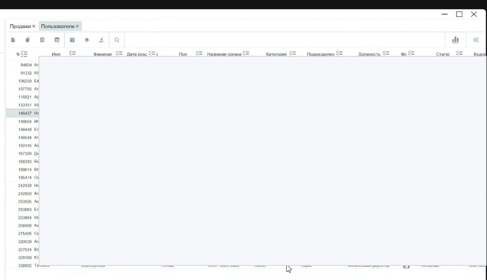
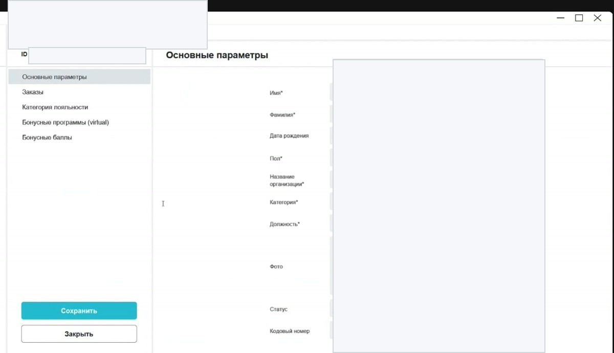
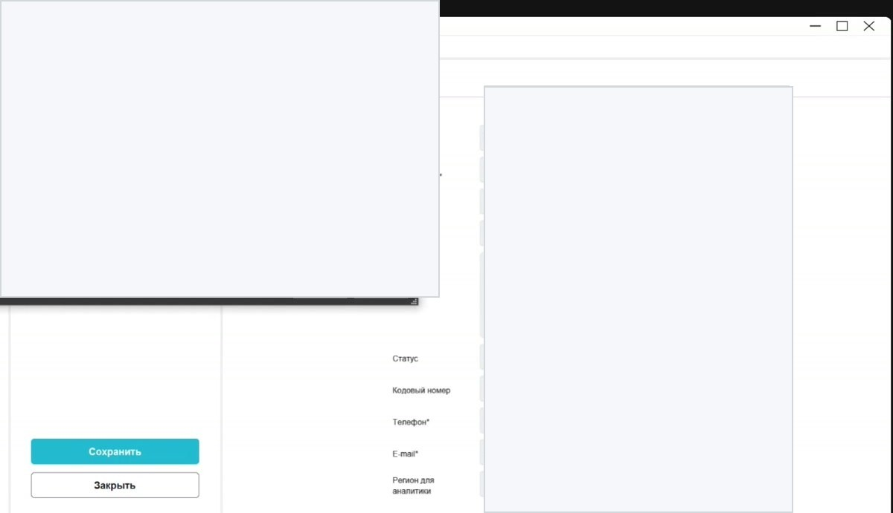

# Пользователи в Manager

Справочник **Пользователи** содержит клиентов, сотрудников и другие пользовательские записи. Через него проверяют категорию пользователя, статус, организацию, должность, кодовый номер, заказы, лояльность и бонусные баллы.

<div class="kb-meta" markdown>
<div markdown>
<strong>Для кого</strong>
Поддержка, администратор, менеджер настройки.
</div>
<div markdown>
<strong>Когда применяется</strong>
Когда нужно найти пользователя, проверить статус, категорию, карту/кодовый номер, бонусы или заказы.
</div>
<div markdown>
<strong>Риск</strong>
Персональные данные. Не публиковать и не пересылать реальные ФИО, телефоны, e-mail, даты рождения и кодовые номера без необходимости.
</div>
</div>

## Где находится

Путь:

```text
Manager → Меню → Общее → Справочники → Пользователи
```



## Что видно в списке

В списке пользователей обычно проверяют:

| Колонка | Что означает |
| --- | --- |
| № | id пользователя |
| Имя / фамилия | данные пользователя |
| Дата рождения | дата рождения, если заполнена |
| Пол | пол или значение «не определился» |
| Название организации | организация пользователя или сотрудника |
| Категория | например Staffer или Customer |
| Подразделение | подразделение сотрудника |
| Должность | должность или роль |
| Фото | признак наличия фото |
| Статус | активный или удалённый |
| Кодовый номер | номер карты или связанный идентификатор |
| Телефон / e-mail | контактные данные |

!!! warning "Персональные данные"
    В пользовательских таблицах много персональных данных. В скриншотах, задачах и переписке их нужно закрывать, если они не нужны для решения конкретной проблемы.

## Как пользователь попадает в справочник

Пользователь появляется в справочнике автоматически, если он:

- зарегистрировался на сайте;
- купил билет на сайте или в виджете;
- купил билет как гость без полноценной авторизации;
- был создан как сотрудник или служебная запись.

Если клиент покупает билет без авторизации и оставляет только e-mail, в Manager может появиться временная пользовательская запись.

## Как найти пользователя

1. Открой справочник **Пользователи**.
2. Проверь активные фильтры: список может быть ограничен категорией и статусом.
3. Если пользователь не находится, сними лишние отборы.
4. Ищи по фамилии, e-mail, телефону или кодовому номеру.
5. При необходимости отфильтруй по категории, организации, подразделению или статусу.

Для больших списков не открывай «всех пользователей» без фильтра: таблица может долго загружаться.

## Статусы пользователей

Список статусов в Manager общий для разных сущностей, поэтому в фильтре пользователей могут быть статусы, которые относятся скорее к транзакциям. Для пользователей важны в первую очередь:

| Статус | Что означает |
| --- | --- |
| **Начальный** | пользователь начал регистрацию, но не завершил подтверждение по ссылке из письма |
| **Активный** | пользователь успешно завершил регистрацию или активен как запись |
| **Временный** | пользователь купил билет как гость без авторизации |
| **Удалённый** | аккаунт удалён через личный кабинет или администратором в Manager |

Статусы вроде **Подтверждённый**, **Отменённый**, **Аннулированный** чаще относятся к транзакциям. Если они видны в фильтре пользователей, это не значит, что их нужно применять к пользовательской карточке.

## Карточка пользователя

Карточка открывается двойным щелчком по строке.



В карточке есть разделы:

| Раздел | Что проверять |
| --- | --- |
| **Основные параметры** | имя, фамилия, дата рождения, пол, организация, категория, должность, фото, статус, кодовый номер |
| **Заказы** | связанные заказы пользователя |
| **Категория лояльности** | категория пользователя в программе лояльности |
| **Бонусные программы (virtual)** | виртуальные бонусные программы |
| **Бонусные баллы** | начисления и остатки бонусов |

## Кодовый номер и QR

Кодовый номер присваивается пользователю при регистрации. Это номер, который может быть зашифрован в QR-коде и отображаться в личном кабинете на сайте.

Не путай:

- кодовый номер пользователя;
- номер сертификата;
- номер продажи;
- UN или номер платежа.

## Заказы пользователя

Раздел **Заказы** показывает операции пользователя: продажи, возвраты и связанные транзакции.

В заказах проверяй:

- номер транзакции;
- дату и время начала выбора;
- окончание продажи — момент оплаты и перехода на страницу успеха;
- тип операции: продажа или возврат;
- продавца: сайт, касса, виджет, киоск или конкретный кассир;
- кассовую зону и кассу;
- объект реализации;
- статус транзакции;
- суммы с НДС, без НДС и сумму НДС.

!!! note "Отчётная дата"
    В Manager отчётные сутки могут отличаться от календарных: смена считается не с 00:00, а по рабочему правилу периода. Поэтому дата отчётная и дата календарная могут не совпадать.

## Лояльность и бонусы

В карточке пользователя есть разделы по лояльности и бонусам:

- **Категория лояльности** — категория пользователя в программе лояльности;
- **Бонусные программы (virtual)** — бонусные программы, если они есть у пользователя;
- **Бонусные баллы** — движение баллов пользователя.

Категория лояльности используется для программ, привязанных к конкретному пользователю. Если нужно добавить или убрать такую привязку, см. [Программы лояльности в Manager](Программы%20лояльности%20в%20Manager.md).

В движении бонусных баллов проверяй:

- дату продажи;
- вид операции: начисление или оплата бонусами;
- бонусную программу и категорию;
- дату учёта;
- дату окончания действия баллов;
- номер продажи или возврата;
- сумму начисленных или списанных баллов;
- комментарий;
- сумму продажи, по которой было движение бонусов.

!!! warning "Бонусы требуют отдельной проверки"
    В видео прямо отмечено, что бонусные баллы нужно разбирать отдельно и подробно. Если спор связан с балансом бонусов, не делай вывод только по одной строке — проверяй всё движение баллов.

## Фото пользователя

В карточке есть блок фото. Изображение выбирается через кнопку загрузки рядом с полем фото.



Правила:

- используй только корректное фото пользователя или служебное изображение по регламенту;
- не загружай случайные файлы;
- после изменения нажми **Сохранить**;
- если меняешь данные клиента или сотрудника, фиксируй причину изменения.

Если файл не предлагается в окне выбора, вероятная причина — неподходящий формат или размер изображения.

## Частые ошибки

- Ищут клиента только среди Staffer и забывают снять фильтр категории.
- Не проверяют статус пользователя.
- Путают кодовый номер пользователя и номер сертификата.
- Публикуют скриншоты пользователей без закрытия персональных данных.
- Меняют карточку без понимания, где эти данные используются дальше.

## Связанные страницы

- [Запуск и навигация в Manager](Запуск%20и%20навигация%20в%20Manager.md)
- [Таблицы, фильтры и выгрузка в Manager](Таблицы%20фильтры%20и%20выгрузка%20в%20Manager.md)
- [Проверка продаж в Manager](Проверка%20продаж%20в%20Manager.md)
- [Программы лояльности в Manager](Программы%20лояльности%20в%20Manager.md)
- [Сертификаты в Manager](Сертификаты%20в%20Manager.md)
