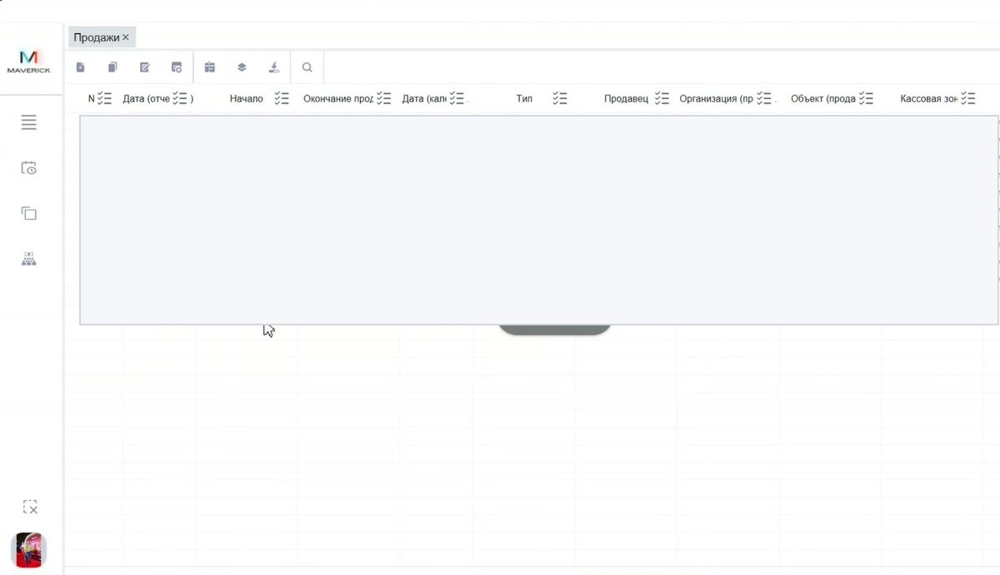
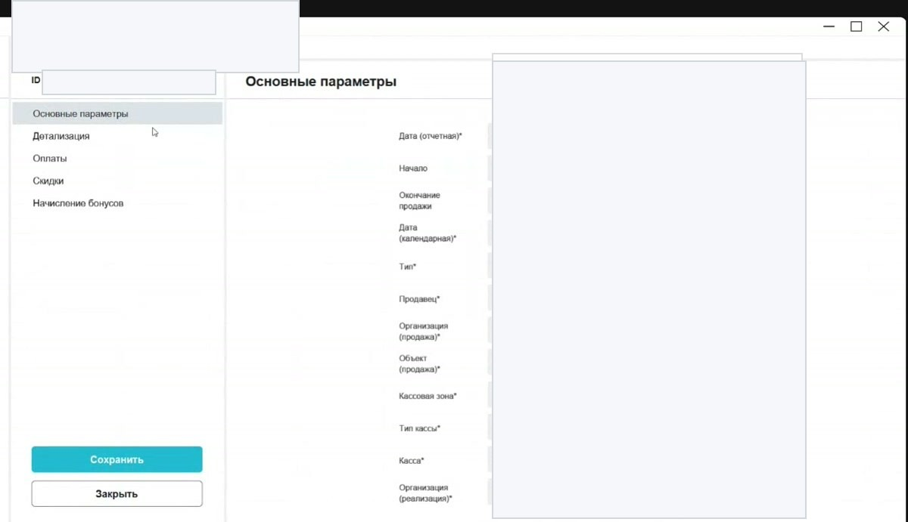

# Проверка продаж в Manager

Таблица **Продажи** показывает операции, которые прошли через кассу, сайт или другие каналы продаж. Через неё проверяют статус операции, сумму, кассу, объект, детализацию, оплаты, скидки и начисление бонусов.

<div class="kb-meta" markdown>
<div markdown>
<strong>Для кого</strong>
Поддержка, администратор, бухгалтерия, менеджер настройки.
</div>
<div markdown>
<strong>Когда применяется</strong>
Когда нужно разобрать продажу, возврат, оплату, скидку, начисление бонусов или спорную операцию.
</div>
<div markdown>
<strong>Риск</strong>
Деньги, оплаты, возвраты и учёт. Изменения статусов нельзя делать без подтверждённого регламента.
</div>
</div>

## Где находится

Путь:

```text
Manager → Меню → Общее → Продажи
```

Таблица продаж открывается со списком операций. По умолчанию обычно показывается текущая дата.



## Что видно в таблице

В таблице продаж отображаются операции за выбранную дату или период. В ней могут быть продажи и возвраты, успешные и отменённые операции.

Ключевые колонки:

| Колонка | Что означает |
| --- | --- |
| № | номер операции/транзакции |
| Дата отчётная | дата, на которую операция попадает в учёте |
| Начало | время начала операции |
| Окончание продажи | время завершения операции |
| Дата календарная | календарная дата операции |
| Тип | продажа или возврат |
| Продавец | канал или пользователь продажи |
| Организация продажи | кто продаёт |
| Объект продажи | где совершена продажа |
| Кассовая зона | зона продажи |
| Тип кассы | Web, касса или другой тип |
| Касса | конкретная касса |
| Статус | состояние операции |
| Суммы | суммы без НДС, НДС и с НДС |
| № чека / UN | чек, банковский номер или связанный служебный номер |

## Как найти продажу

1. Открой таблицу **Продажи**.
2. Проверь дату или период на правой панели отбора.
3. Если известен объект, касса, клиент или организация — задай фильтр.
4. Если известен номер операции, чек или UN — используй поиск.
5. Если строк много, настрой колонки и сортировку.

См. также: [Таблицы, фильтры и выгрузка в Manager](Таблицы%20фильтры%20и%20выгрузка%20в%20Manager.md).

## Как открыть карточку продажи

Карточка продажи открывается двойным щелчком по строке.



В карточке есть вкладки:

| Вкладка | Что проверять |
| --- | --- |
| **Основные параметры** | дата, время, продавец, организация, объект, кассовая зона, касса, статус, суммы |
| **Детализация** | состав заказа: товары, билеты, количество, сумма, ряд/место для билета |
| **Оплаты** | способ оплаты: наличные, карта, сертификат и другие виды оплаты |
| **Скидки** | применённые скидки по позициям чека |
| **Начисление бонусов** | бонусы, начисленные по продаже |

!!! warning "Осторожно со статусами"
    В старой инструкции указано, что ошибочно проведённую продажу можно отменять через изменение статуса. Видео подтверждает наличие статуса в карточке, но не подтверждает актуальный регламент отмен. Перед изменением статуса нужна отдельная проверка процесса.

## Проверка скидок

Если в продаже применялась скидка, она отображается на вкладке **Скидки**. Скидка может показываться отдельными строками по позициям: например, по каждому билету.

Проверяй:

- название программы лояльности;
- категорию лояльности;
- вид продукта;
- категорию продукта или билета;
- количество;
- сумму скидки.

## Проверка оплаты

На вкладке **Оплаты** смотри:

- вид оплаты;
- валюту;
- сумму;
- ответ банка, если применимо;
- UN или связанный номер платежа;
- детали платежа.

Если вопрос связан с сертификатом, смотри также [Проверка и разбор проблем с сертификатами](../Сертификаты/Проверка%20и%20разбор%20проблем%20с%20сертификатами.md).

## Частые ошибки

- Ищут продажу только за календарную дату и не учитывают отчётную дату.
- Не проверяют правую панель отбора и активные фильтры.
- Смотрят только основную строку и не открывают карточку продажи.
- Путают вкладки **Оплаты** и **Скидки**.
- Меняют статус без подтверждённого регламента.

## Связанные страницы

- [Таблицы, фильтры и выгрузка в Manager](Таблицы%20фильтры%20и%20выгрузка%20в%20Manager.md)
- [Сертификаты в Manager](Сертификаты%20в%20Manager.md)
- [Проверка и разбор проблем с сертификатами](../Сертификаты/Проверка%20и%20разбор%20проблем%20с%20сертификатами.md)
