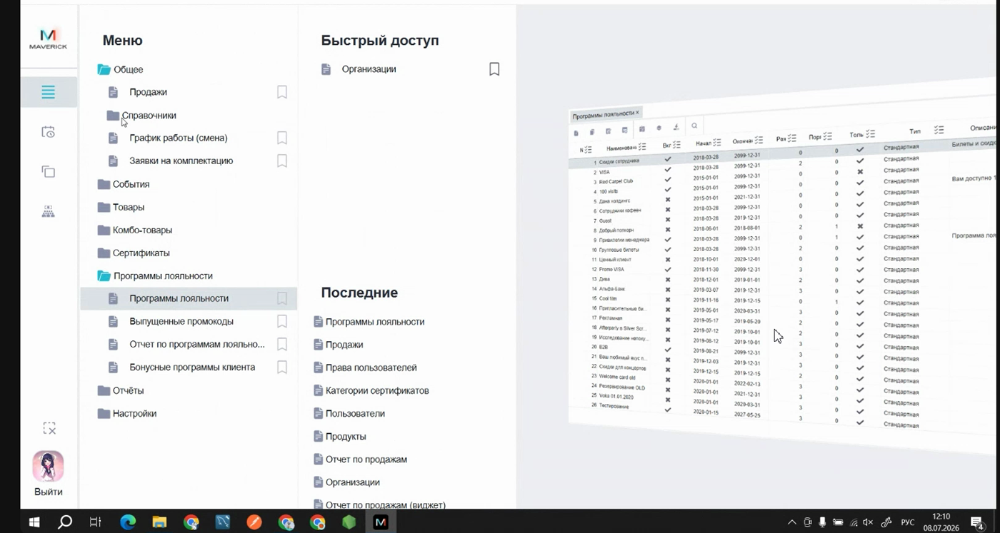
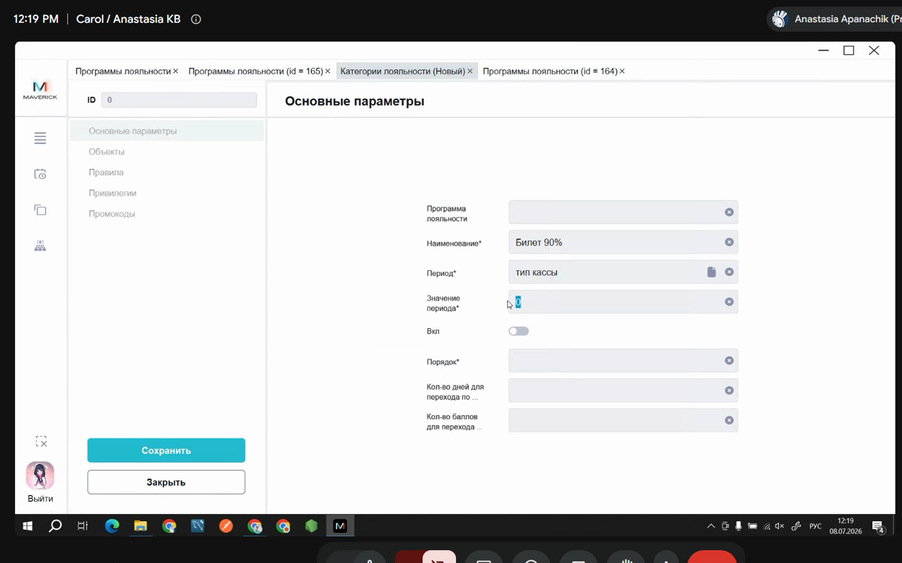
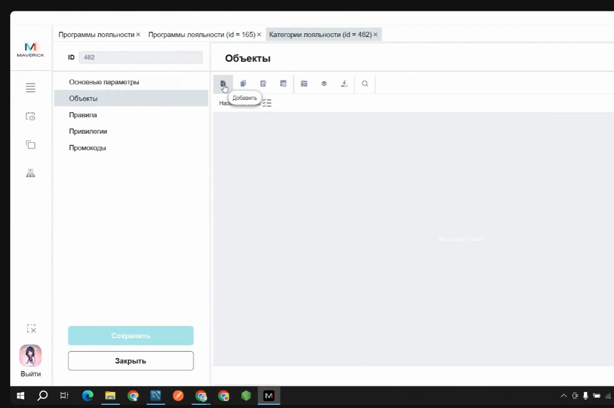
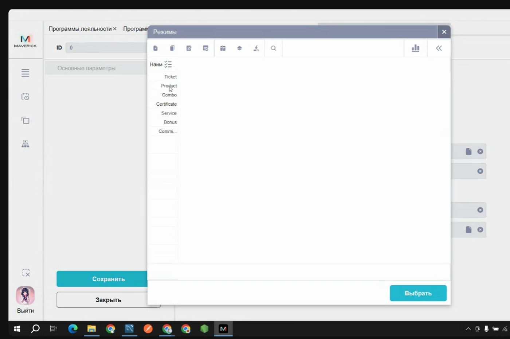
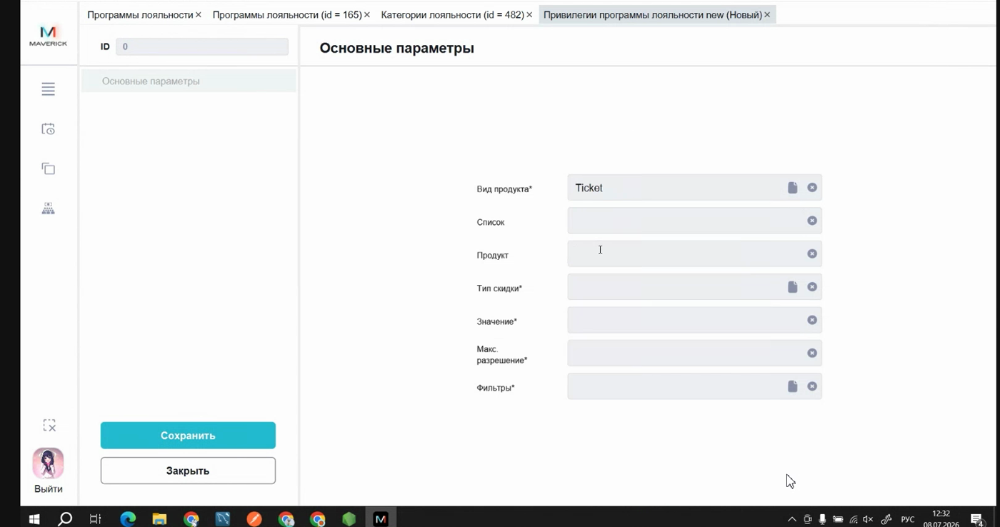
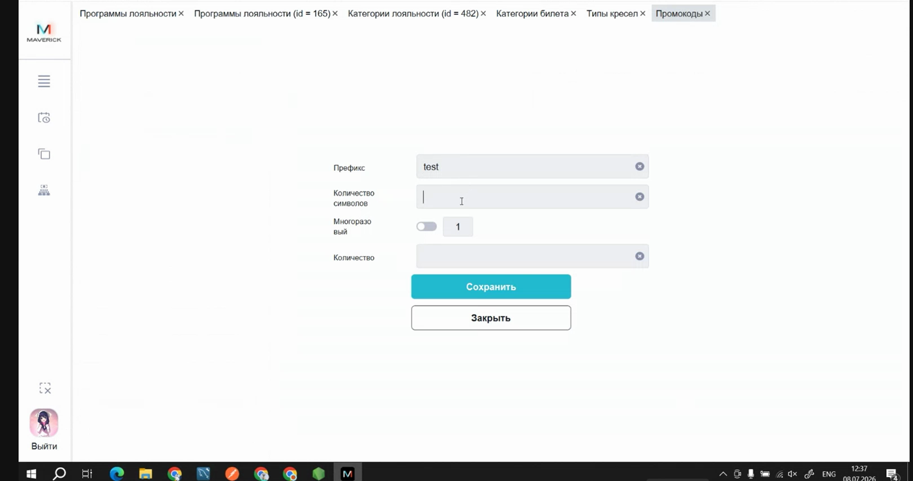
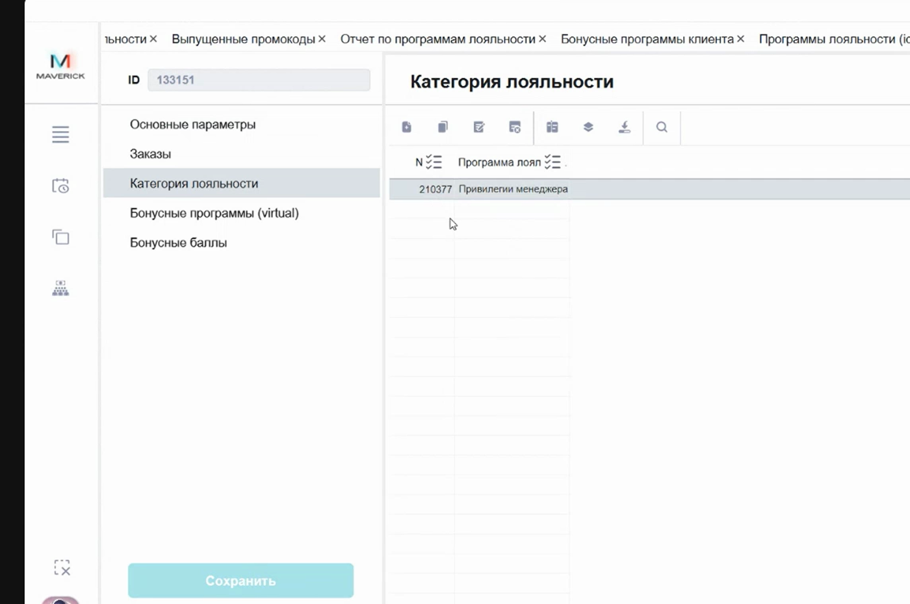

# Программы лояльности в Manager

Программы лояльности в Manager управляют скидками, бонусами, промокодами и условиями, которые влияют на итоговую стоимость покупки или доступные привилегии клиента.

<div class="kb-meta" markdown>
<div markdown>
<strong>Для кого</strong>
Поддержка, менеджер настройки, администратор кассовой зоны.
</div>
<div markdown>
<strong>Когда применяется</strong>
Когда нужно проверить, включить, продлить, ограничить по объекту, выпустить промокоды или привязать лояльность к пользователю.
</div>
<div markdown>
<strong>Риск</strong>
Высокий: скидки, бонусы и промокоды меняют сумму продажи; пользовательская лояльность связана с персональными данными.
</div>
</div>

!!! warning "Не меняй условия без подтверждённого запроса"
    Лояльность влияет на деньги, скидки, бонусы и клиентский опыт. Перед изменением периода, объектов, правил, привилегий или привязки к пользователю проверь, что запрос подтверждён и понятно, какой результат должен получиться.

## Где находится

Путь к программам:

```text
Manager → Меню → Общее → Программы лояльности → Программы лояльности
```



Для привязки лояльности к конкретному пользователю:

```text
Manager → Меню → Общее → Справочники → Пользователи → карточка пользователя → Категория лояльности
```

## Как устроена лояльность

Программа лояльности сама по себе является оболочкой. Чтобы она начала работать, внутри должна быть хотя бы одна включённая категория с условиями применения.

| Уровень | Что задаёт |
| --- | --- |
| **Программа лояльности** | название, период действия, режим, тип, описание, общий признак активности |
| **Категория лояльности** | конкретные условия применения внутри программы |
| **Объекты** | где работает категория |
| **Правила** | дополнительные условия, например наличие нужного продукта в чеке |
| **Привилегии** | на что действует скидка или привилегия и как считается скидка |
| **Промокоды** | коды для программ, которые работают по промокодам |
| **Пользовательская привязка** | связь конкретного пользователя с категорией лояльности |

## Карточка программы

В карточке программы проверяй название, признак активности, период действия, режим, порядок, признак эксклюзивности, тип и описание.

Режимы, которые используются в материалах:

| Режим | Как используется |
| --- | --- |
| `0` | Лояльность привязана к пользователю. Если пользователь авторизован на сайте, скидка может применяться автоматически. |
| `1` | Автоматическая программа. |
| `2` | Ручной выбор через кнопки на кассе. |
| `3` | Программа по промокодам. |

Если включён признак **Только эта программа лояльности**, программа применяется как эксклюзивная. В обычном сценарии, когда в чеке подходит несколько программ, система выбирает более выгодную для клиента; эксклюзивная программа не должна конкурировать с остальными как обычная скидка.

Тип **Стандартная** используется для обычных скидок и промокодов. Тип **Бонусная** относится к бонусным программам и требует отдельной проверки правил начисления и списания.

## Что проверить, если лояльность не сработала

1. Программа включена.
2. Текущая дата попадает в период действия программы.
3. Внутри программы есть включённая категория.
4. У категории заполнены нужные объекты.
5. У категории есть привилегия или другое действие, которое должно сработать.
6. Для режима `3` выпущены промокоды.
7. Для пользовательской лояльности категория привязана к нужному пользователю.
8. В чеке выполняются дополнительные правила, если они настроены.

Частая ошибка: включают программу, но оставляют выключенной категорию внутри неё. В этом случае лояльность не применяется.

## Категории лояльности

Категория создаётся внутри программы:

```text
Программа лояльности → Категории → Добавить
```



В категории задаются название, период или правило применения, значение периода при необходимости, признак активности и порядок. Поля про переход через дни и баллы относятся к бонусным сценариям. Для стандартной скидочной программы их не заполняют без отдельного подтверждения.

## Объекты

Вкладка **Объекты** ограничивает, где работает категория лояльности.

```text
Категория лояльности → Объекты → Добавить
```



Чтобы убрать объект, открой вкладку **Объекты**, выбери строку и используй удаление. После добавления или удаления объекта сохрани карточку.

## Правила

Вкладка **Правила** нужна для дополнительных условий. Например, скидка может применяться только если в чеке есть определённый продукт или нужное количество товаров.



В материалах отмечено, что фильтры и некоторые списки создаются не в Manager, а через базу данных или техническую настройку. Если нужного фильтра или списка нет в выборе, не подменяй его похожим значением: зафиксируй вопрос и передай техническому специалисту.

## Привилегии

Вкладка **Привилегии** определяет, на что действует скидка или промокод.

```text
Категория лояльности → Привилегии → Добавить
```



| Поле | Что означает |
| --- | --- |
| **Вид продукта** | билет, товар или другой тип продукта |
| **Список / продукт** | список продуктов или конкретная позиция |
| **Тип скидки** | сумма, процент или приведение к цене |
| **Значение** | размер скидки или новая цена |
| **Макс. раз** | сколько позиций в одном чеке получают скидку |
| **Фильтры** | дополнительные ограничения по периоду, объекту, событию, дню недели и т. д. |

Типы скидки:

- **сумма** — фиксированная скидка на позицию;
- **процент** — процентная скидка;
- **приведение к цене** — итоговая цена позиции становится указанной суммой.

Если **Макс. раз** не заполнен, в материалах это описано как применение ко всем подходящим позициям в чеке. Такую настройку нужно использовать осторожно и проверять итоговую сумму до запуска.

## Промокоды

Для режима `3` после настройки категории и привилегий нужно выпустить промокоды:

```text
Категория лояльности → Промокоды → Добавить
```



При генерации можно указать префикс, количество символов, количество использований одного промокода и количество промокодов. Если количество использований не заполнено, в материалах это описано как одно использование.

## Типовые операции

### Продлить программу

1. Открой **Программы лояльности**.
2. Найди нужную программу.
3. Открой карточку двойным щелчком.
4. Измени дату окончания.
5. Сохрани.

### Включить или выключить программу

1. Открой карточку программы.
2. Измени признак **Вкл**.
3. Сохрани.

Если нужно временно остановить программу, безопаснее выключить её или ограничить период действия, а не удалять.

### Добавить или убрать объект

1. Открой программу.
2. Перейди в **Категории**.
3. Открой нужную категорию.
4. Перейди во вкладку **Объекты**.
5. Добавь объект через плюс или удали лишний объект из списка.
6. Сохрани.

### Привязать лояльность к пользователю

1. Открой **Справочники → Пользователи**.
2. Найди пользователя.
3. Открой карточку.
4. Перейди во вкладку **Категория лояльности**.
5. Добавь нужную категорию или удали лишнюю.
6. Сохрани.



Если лояльность привязана к пользователю, она может отображаться в личном кабинете на сайте в блоке лояльности. Описание берётся из настроек программы или карточки.

## Отчёты по лояльности

Для промокодов используется отчёт **Выпущенные промокоды**. Он показывает выпущенные коды с привязкой к программе и категории.


В отчёте можно проверять программу лояльности, категорию, промокод, дату выпуска и количество использований, если колонка доступна.

Отчёты **Отчёт по программам лояльности** и **Бонусные программы клиента** есть в интерфейсе, но их точный бизнес-смысл и правила чтения требуют подтверждения. Для бонусных отчётов учитывай, что в таблицах могут быть персональные данные клиентов.

## Удаление

Удаление программы лояльности не используется как обычная операционная процедура. В материалах отмечено, что у программ много зависимостей и удаление обычно требует технического разбора.

Если программа больше не должна работать:

- выключи её;
- или поставь завершившуюся дату окончания;
- или передай задачу техническому специалисту, если требуется физическое удаление.

## Частые ошибки

| Ошибка | Что проверить |
| --- | --- |
| Программа включена, но скидка не работает | Включена ли категория внутри программы |
| Промокод не применяется | Режим `3`, выпущены ли промокоды, подходит ли дата и категория |
| Скидка работает не там | Вкладку **Объекты** у категории |
| Скидка применяется не к тем позициям | Вкладку **Привилегии**, вид продукта, список, фильтры |
| Не видно фильтра или списка | Фильтр/список может настраиваться технически, не в Manager |
| Пользователь не видит лояльность на сайте | Привязку в карточке пользователя и описание программы |
| Нужно “удалить” программу | Не удалять как обычное действие; выключить или передать техническому специалисту |

## Связанные страницы

- [Пользователи в Manager](Пользователи%20в%20Manager.md)
- [Проверка продаж в Manager](Проверка%20продаж%20в%20Manager.md)
- [Отчёты в Manager](Отчёты%20в%20Manager.md)
- [Запуск и навигация в Manager](Запуск%20и%20навигация%20в%20Manager.md)
- [Таблицы, фильтры и выгрузка в Manager](Таблицы%20фильтры%20и%20выгрузка%20в%20Manager.md)
