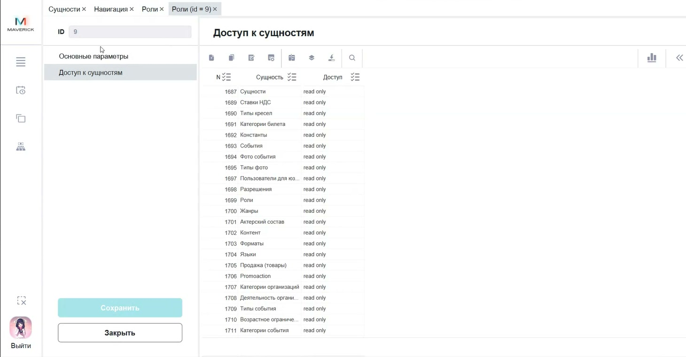
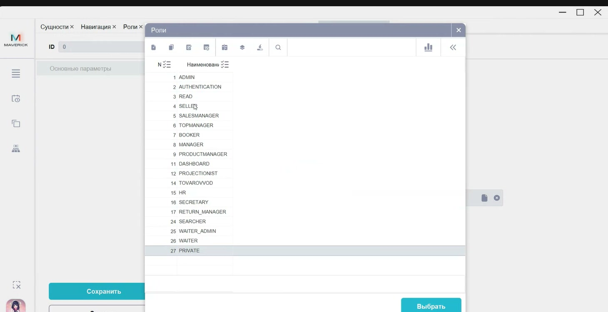

# Роли и права пользователей в Manager

Инструкция помогает проверить или настроить роль и привязать её к сотруднику, чтобы определить доступ к разделам и сущностям Manager или Seller.

<div class="kb-meta" markdown>
<div markdown>
<strong>Для кого</strong>
Системный администратор, поддержка, администратор настройки.
</div>
<div markdown>
<strong>Когда применяется</strong>
Когда сотруднику нужно выдать, изменить или снять доступ к функциям Manager или Seller.
</div>
<div markdown>
<strong>Что получится</strong>
Роль содержит нужные доступы к сущностям, а staffer-пользователь связан с одной или несколькими ролями.
</div>
</div>

## Где находится

Открой:

```text
Manager → Меню → Настройки → Роли
Manager → Меню → Настройки → Права пользователей
```

## Как устроены доступы

- **Роли** определяют, к каким сущностям есть доступ и какой уровень доступа выбран.
- **Права пользователей** связывают staffer-пользователя с ролями.
- У одного пользователя может быть несколько ролей.
- Если роль удалена или снята, пользователь может войти в Manager, но при открытии раздела увидеть сообщение о недостатке прав.



## Создать или изменить роль

1. Открой **Настройки → Роли**.
2. Чтобы создать роль, нажми **+**. Чтобы изменить существующую, открой её из таблицы.
3. В основных параметрах укажи наименование роли.
4. Открой раздел **Доступ к сущностям**.
5. Нажми **+** и выбери сущность из справочника.
6. Выбери уровень доступа для этой сущности.
7. Добавь остальные сущности, которые должны входить в роль.
8. Нажми **Сохранить**.

Не выбирай доступы только по названию роли. Перед сохранением проверь список сущностей и уровни доступа внутри карточки роли.

## Привязать роль к пользователю

1. Открой **Настройки → Права пользователей**.
2. Нажми **+**.
3. В поле пользователя выбери сотрудника из справочника staffer-пользователей.
4. Сохрани карточку, чтобы перейти к настройке ролей.
5. В разделе ролей нажми **+**.
6. Выбери роль из справочника ролей.
7. Сохрани карточку прав пользователя.



## Снять роль с пользователя

1. Открой карточку в **Права пользователей**.
2. В списке ролей выбери роль, которую нужно снять.
3. Нажми удаление для этой строки.
4. Сохрани карточку.
5. Проверь, что пользователь больше не видит функции, которые давала эта роль.

## Проверка результата

После настройки должно быть так:

- роль открывается и содержит нужные строки в **Доступ к сущностям**;
- пользователь есть в таблице **Права пользователей**;
- в карточке пользователя привязаны нужные роли;
- при входе под пользователем доступны только разрешённые разделы.

## Важно

!!! warning "Доступы влияют на служебные операции"
    Ошибка в роли может открыть лишние функции или закрыть сотруднику рабочий раздел. Не удаляй роли и не меняй уровни доступа без проверки, кому эта роль назначена.

## Частые ошибки

- Назначают пользователю роль, не проверив её доступы к сущностям.
- Создают новую роль вместо проверки существующей.
- Удаляют роль из общего справочника, хотя её используют сотрудники.
- Путают карточку пользователя и карточку прав пользователя.
- Снимают роль и не проверяют вход сотрудника после изменения.

## Связанные страницы

- [Настройки в Manager](Настройки%20в%20Manager.md)
- [Пользователи в Manager](Пользователи%20в%20Manager.md)
- [Запуск и навигация в Manager](Запуск%20и%20навигация%20в%20Manager.md)
