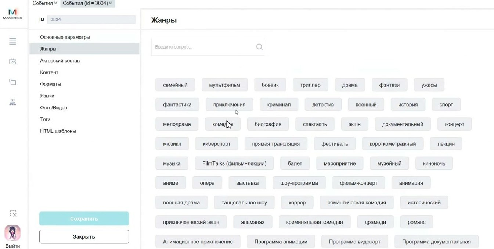

# События в Manager

Справочник **События** хранит карточки фильмов и других мероприятий, по которым продаются билеты.

<strong>Для кого</strong>
Контент-менеджер, специалист по расписанию, поддержка.

<strong>Когда применяется</strong>
Когда нужно проверить карточку события, данные для сайта, жанры, возрастные ограничения, даты проката, постеры или баннеры.

<strong>Что получится</strong>
Событие корректно заполнено и его данные подтягиваются в афишу и карточку события на сайте.

## Где находится

Открой **Общее → События → События**.

## Что такое событие

Событие — это карточка фильма или мероприятия, по которому могут продаваться билеты. Если один и тот же фильм выходит в другой версии, озвучке или формате, это может быть отдельное событие.

## Что содержит карточка события

В карточке события доступны поля и разделы:

- ID;
- наименование;
- сокращённое наименование;
- оригинальное наименование;
- тип;
- категория;
- уровень;
- статус;
- возрастное ограничение;
- год выпуска;
- длительность;
- рейтинги;
- глобальный и локальный дистрибьютер;
- глобальный и локальный лист;
- начало и окончание показа;
- жанры;
- актёрский состав;
- контент;
- форматы;
- языки;
- фото/видео;
- теги;
- HTML-шаблоны.

## Что тянется на сайт

Из карточки события на сайт и в афишу подтягиваются:

- название;
- описание или аннотация;
- жанры;
- возрастное ограничение;
- длительность;
- даты проката;
- постер;
- баннер;
- фото и видео, если они заполнены.

![[media/manager/manager-event-site-card-pub.jpg]]

Если поле в карточке события не заполнено, на сайте соответствующая информация может не появиться.

## Порядок проверки события

1. Найди событие в таблице.
2. Открой карточку события.
3. Проверь обязательные поля, отмеченные звёздочкой.
4. Проверь название, возрастное ограничение, длительность и даты показа.
5. Проверь жанры и описание.
6. Проверь фото/видео: постер и баннер.
7. Если событие должно участвовать в специальной странице или подборке, проверь теги.
8. Сохрани изменения.
9. Проверь карточку события на сайте или в афише.

## Важно

!!! warning "Данные видит клиент"
    Карточка события влияет на клиентскую афишу и страницу события. Не публикуй карточку без проверки названия, ограничений, описания и изображений.

## Частые ошибки

- Создают новую версию фильма в старой карточке, хотя версия или озвучка отличается.
- Заполняют событие в Manager, но не проверяют, как оно выглядит на сайте.
- Не добавляют постер или баннер.
- Ожидают жанр или описание на сайте, хотя поле не заполнено в карточке.

## Связанные страницы

- [Залы в Manager](Залы%20в%20Manager.md)
- [Сортировка афиши](../Афиша%20и%20витрина/Сортировка%20афиши.md)
- [Афиша и витрина](../Афиша%20и%20витрина.md)
