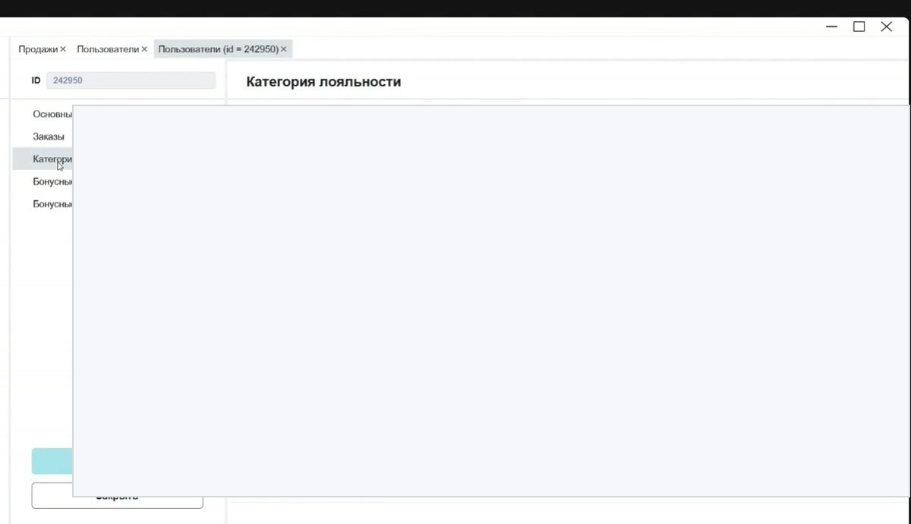

# Справочники Manager

Справочники Manager задают базовые сущности, от которых зависят продажи, кассы, сайт, Waiter, сертификаты, товары, комбо, лояльность и отчёты.

<strong>Для кого</strong>
Поддержка, администратор, менеджер настройки.

<strong>Когда применяется</strong>
Когда нужно понять, где хранится организация, объект, кассовая зона, касса, схема продаж, товарный список или другая базовая настройка.

<strong>Риск</strong>
Изменения в справочниках могут влиять на продажи, доступность товаров, сайт, кассу и отчёты.

## Как устроены справочники

Справочники находятся в меню Manager и обычно открываются как таблицы.

Общий принцип:

1. Открой нужный раздел меню.
2. Найди справочник.
3. Открой список.
4. Используй фильтры, поиск и колонки.
5. По двойному щелчку открой карточку записи, если карточка доступна.
6. Сохраняй изменения только если понимаешь, где эта настройка используется.

## Базовые справочники раздела «Общее»

| Справочник | Для чего нужен |
| --- | --- |
| **Пользователи** | клиенты, сотрудники, категории, статусы, кодовые номера, бонусы |
| **Организации** | юридические и операционные организации |
| **Объекты** | объекты продаж: кинотеатры, площадки, локации |
| **Кассовые зоны** | зоны продаж внутри объекта: билеты, продукты, комбо, сертификаты |
| **Кассы** | точки продаж и их типы |
| **Схемы продаж** | правила, какие типы товаров и категории доступны для продажи или бронирования |
| **Вспомогательные** | служебные списки: категории, типы, ставки НДС и другие значения для выбора |

## Кассовые зоны и кассы

Кассовая зона определяет, какие виды товаров можно продавать в конкретной зоне: билеты, продукты, комбо, сертификаты.

Касса относится к объекту и кассовой зоне. Если позиция не продаётся там, где ожидается, проверяй не только товар или прайс, но и кассовую зону.

## Схемы продаж

Схемы продаж описывают, какие типы продаж и категории товаров доступны в конкретном сценарии.

В схемах могут быть вкладки по видам товаров:

- билеты;
- продукты;
- комбо;
- сертификаты.

Через такие настройки определяется, доступна ли продажа или бронирование конкретной категории.

## Товарные справочники и списки

В разделе **Товары** находятся продукты, прайсы и товарные справочники. Важная часть — списки продуктов.

Списки продуктов используются в:

- программах лояльности;
- сертификатах;
- бонусных программах;
- настройках доступности товаров.

Если сертификат, скидка или программа работает не на тот товар, проверяй не только сам товар, но и список, в который он входит.

## Таблицы справочников

Справочники открываются как таблицы, поэтому для них действуют общие правила работы с таблицами.

- фильтруй перед поиском;
- проверяй скрытые колонки;
- открывай карточку двойным щелчком, если нужна детализация;
- не меняй значения без понимания связей;
- после изменений проверяй связанный пользовательский интерфейс: кассу, сайт, Waiter или отчёты.

## Что проверить перед изменением справочника

1. Какая сущность меняется: организация, объект, касса, зона, схема, товар, список.
2. Где она используется: касса, сайт, Waiter, сертификаты, отчёты.
3. Есть ли активные продажи или связанные операции.
4. Кто владелец процесса.
5. Нужно ли согласование из-за денег, НДС, сертификатов или лояльности.

!!! warning "Не менять вслепую"
    Справочник может выглядеть как обычный список, но изменение одной записи может изменить поведение продаж или сайта. Если связь не ясна — сначала уточни.

## Частые ошибки

- Меняют справочник, не проверив связанные прайсы или схемы продаж.
- Ищут проблему в кассе, хотя ограничение задано в кассовой зоне или схеме продаж.
- Добавляют товар, но не добавляют его в нужный список.
- Считают, что Manager и Portal — разные источники, хотя по части справочников данные могут отображать одну и ту же информацию.
- Не проверяют результат на пользовательском интерфейсе после изменения.

## Связанные страницы

- [Запуск и навигация в Manager](Запуск%20и%20навигация%20в%20Manager.md)
- [Таблицы, фильтры и выгрузка в Manager](Таблицы%20фильтры%20и%20выгрузка%20в%20Manager.md)
- [Пользователи в Manager](Пользователи%20в%20Manager.md)
- [Проверка и разбор проблем с сертификатами](../Сертификаты/Проверка%20и%20разбор%20проблем%20с%20сертификатами.md)
- [Настройка меню и цехов в Manager для Waiter](../Waiter/Настройка%20меню%20и%20цехов%20в%20Manager%20для%20Waiter.md)
