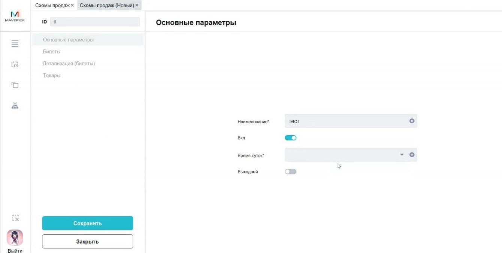

# Схемы продаж в Manager

Справочник **Схемы продаж** задаёт, через какие каналы и с какими категориями билетов или товаров доступна продажа.

<strong>Для кого</strong>
Администратор настройки, поддержка, специалист по продажам.

<strong>Когда применяется</strong>
Когда категория билета или товара не продаётся в нужном канале: касса, сайт, виджет, терминал или другой канал.

<strong>Что получится</strong>
Понятно, какая схема продаж используется и какие категории к ней привязаны.

## Где находится

Открой **Общее → Справочники → Схемы продаж**.

## Что такое схема продаж

Схема продаж участвует в публикации сеансов и определяет, где сеанс или категория будет доступна для продажи.

По видео подтверждены варианты по смыслу:

- продажа во всех каналах;
- продажа только на кассах / Seller;
- продажа только онлайн;
- продажа только на терминале / ATM.

## Детализация схемы

В карточке схемы есть детализация по категориям.

![[media/manager/manager-sales-scheme-details-pub.jpg]]

По видео подтверждено: если заведена новая категория билета, её нужно привязать к нужной схеме продаж. Иначе категория будет продаваться только там, где она действительно привязана.

## Что проверить при проблеме с доступностью продажи

1. Проверь, какая схема продаж указана у сеанса или связанной настройки.
2. Открой справочник **Схемы продаж**.
3. Проверь основную карточку схемы.
4. Открой детализацию.
5. Убедись, что нужная категория билета или товара привязана к схеме.
6. Проверь нужный канал продаж.
7. После изменения проверь продажу в пользовательском интерфейсе.

## Важно

!!! warning "Влияет на каналы продаж"
    Ошибка в схеме продаж может скрыть билет или товар в нужном канале. Не меняй схему без проверки сеанса, категории и канала продаж.

## Частые ошибки

- Заводят новую категорию билета, но не добавляют её в нужную схему продаж.
- Проверяют только кассовую зону, но не проверяют схему продаж.
- Меняют служебную схему, которая давно заведена и используется в действующих продажах.

## Связанные страницы

- [Кассовые зоны в Manager](Кассовые%20зоны%20в%20Manager.md)
- [Кассы в Manager](Кассы%20в%20Manager.md)
- [События в Manager](События%20в%20Manager.md)
- [Базовая работа в Seller Web](../Seller/Базовая%20работа%20в%20Seller%20Web.md)
