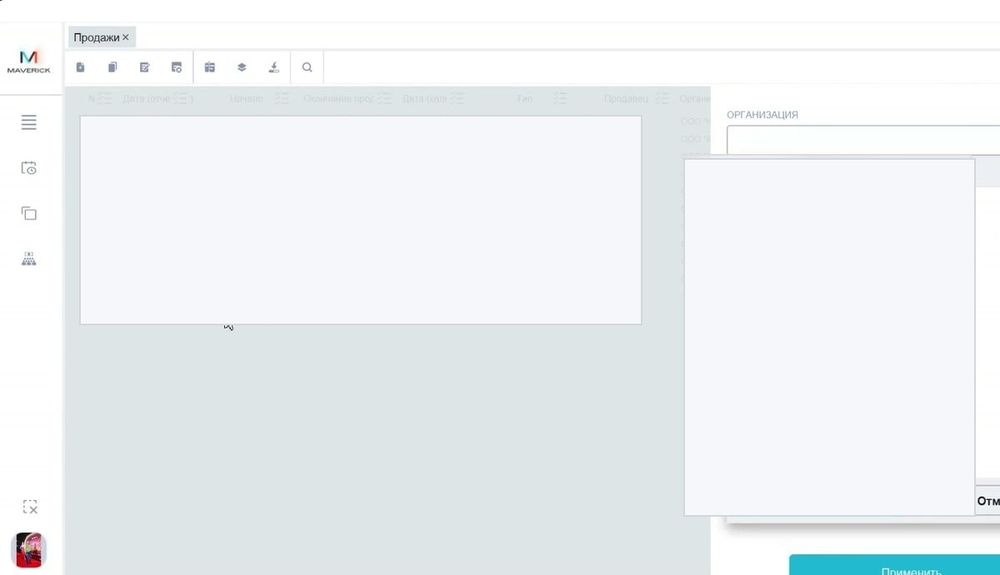
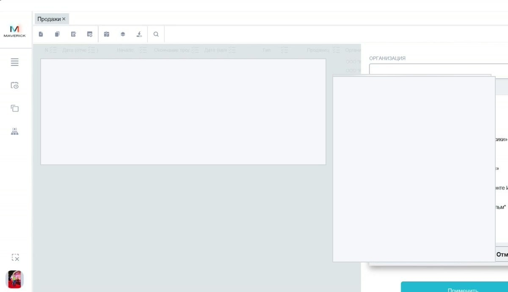
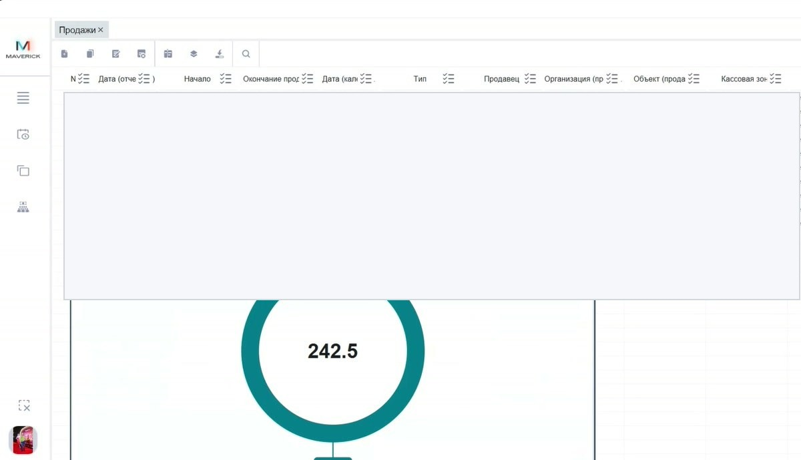

# Таблицы, фильтры и выгрузка в Manager

В Manager большинство справочников, документов и отчётов открываются как таблицы. Панель действий и принципы фильтрации похожи, поэтому эту страницу стоит использовать как базовую инструкцию перед работой с любым списком.

<strong>Для кого</strong>
Поддержка, администратор, менеджер настройки.

<strong>Когда применяется</strong>
Когда нужно найти запись, отфильтровать таблицу, скрыть лишние колонки, сгруппировать данные или выгрузить список.

<strong>Что получится</strong>
Понятный порядок работы с таблицами Manager без привязки к одному конкретному справочнику.

## Как выглядит таблица

Пример таблицы операций в Manager:

В типовой таблице есть:

- вкладка с названием открытого раздела;
- верхняя панель действий;
- строка заголовков колонок;
- значки сортировки и фильтрации в колонках;
- строки данных;
- прокрутка, если колонок или строк много.

## Верхняя панель действий

Набор кнопок зависит от таблицы, но логика общая.

| Действие | Что делает |
| --- | --- |
| Добавить | создаёт новую запись, если это разрешено |
| Копировать | создаёт копию выбранной записи, если доступно |
| Редактировать | открывает выбранную запись |
| Удалить | удаляет выбранную запись, если разрешено |
| Колонки | показывает/скрывает колонки таблицы |
| Группировка | группирует строки по одной или нескольким колонкам |
| Выгрузка | сохраняет таблицу в файл, например Excel |
| Поиск | ищет значение внутри текущей таблицы |

!!! note "Не все кнопки активны везде"
    Панель может выглядеть одинаково, но доступность действий зависит от конкретной таблицы, отчёта и прав пользователя.

## Фильтр по колонке

Фильтр открывается через значок в заголовке колонки. Внутри можно выбрать значения из списка или найти нужное значение через строку поиска.

Порядок действий:

1. Открой нужную таблицу.
2. Нажми значок фильтра в заголовке колонки.
3. Выбери одно или несколько значений.
4. Нажми **Применить**.
5. Проверь, что таблица показывает только нужные строки.

Внутри окна фильтра обычно есть:

- выбор всех значений;
- снятие выбора;
- сортировка;
- поиск по списку;
- кнопки **Применить** и **Отменить**.

## Правая панель отбора

В некоторых таблицах справа открывается отдельная панель отбора. Например, в продажах можно отбирать операции по дате, периоду, организации, объекту и другим параметрам.

Правило: фильтры колонок и правая панель отбора работают вместе. Если данных нет, сначала проверь, не остался ли включён лишний отбор.

## Колонки

Через кнопку **Колонки** можно скрыть лишние поля и оставить только то, что нужно для текущей проверки.

Используй это, когда таблица широкая и мешает видеть главное: статус, объект, кассу, сумму, клиента или номер операции.

## Группировка

Группировка помогает собрать строки по одной или нескольким колонкам: например, по объекту, кассе, статусу или типу операции.

Не путай группировку с фильтром:

- фильтр скрывает лишние строки;
- группировка оставляет строки, но меняет способ отображения.

## Выгрузка

Выгрузка сохраняет текущий набор данных в файл.

Перед выгрузкой проверь:

1. выбран ли нужный период;
2. нет ли лишних фильтров;
3. видны ли нужные колонки;
4. не сгруппирована ли таблица так, что выгрузка будет неудобной.

## Частые ошибки

- Ищут запись, но забывают снять старый фильтр.
- Смотрят только первые колонки и не прокручивают таблицу вправо.
- Путают поиск по таблице и фильтр по колонке.
- Выгружают таблицу до настройки периода и колонок.
- Считают, что кнопка доступна везде, хотя для конкретной таблицы она может быть неактивна.

## Связанные страницы

- [Запуск и навигация в Manager](Запуск%20и%20навигация%20в%20Manager.md)
- [Проверка продаж в Manager](Проверка%20продаж%20в%20Manager.md)
- [Пользователи в Manager](Пользователи%20в%20Manager.md)
- [Справочники Manager](Справочники%20Manager.md)
