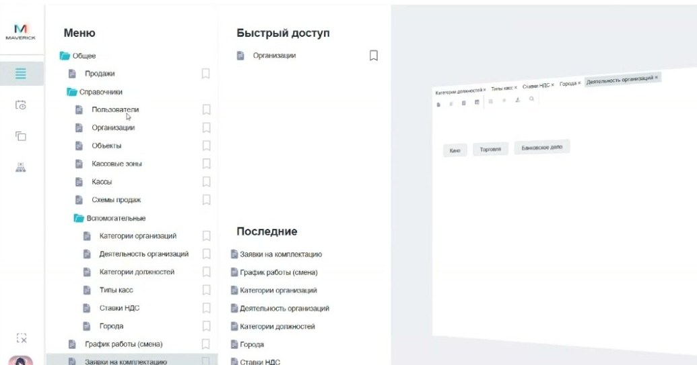

# Устаревшие справочники комплектации в Manager

В Manager есть исторические справочники, связанные с комплектацией и графиками смен. В текущем рабочем процессе они не используются как основной источник настроек.

<strong>Для кого</strong>
Поддержка, администратор настройки.

<strong>Когда применяется</strong>
Когда в меню Manager встречаются разделы комплектации и нужно понять, стоит ли использовать их в текущей работе.

<strong>Что получится</strong>
Понятно, что эти справочники исторические и не должны использоваться как источник текущих настроек без дополнительного подтверждения.

## Где находится

В меню Manager видны разделы, связанные с комплектацией.

## Что относится к историческому процессу

По объяснению в видео:

- справочники **График работы смены** и **Заявки на комплектацию** в активном процессе сейчас не используются;
- они были созданы для старого сценария, связанного с заявками на комплектацию;
- заявки могли использоваться для истории по заказам или выдаче продуктов;
- график работы смены описывал, кто и в какое время отвечает за разбор заявок.

## Как использовать эту информацию

1. Не используй эти справочники как текущий рабочий регламент.
2. Если задача связана с комплектацией, сначала уточни, какой процесс сейчас актуален.
3. Если в обращении упоминается старая комплектация, проверь, не относится ли оно к историческому сценарию.
4. Не меняй записи в этих справочниках без подтверждения владельца процесса.

## Важно

!!! warning "Исторический раздел"
    Эти справочники не используются в активной работе как основной источник настроек. Не настраивай через них новый процесс без отдельного подтверждения.

## Связанные страницы

- [Справочники Manager](Справочники%20Manager.md)
- [Кассы в Manager](Кассы%20в%20Manager.md)
