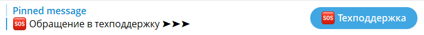
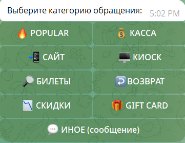
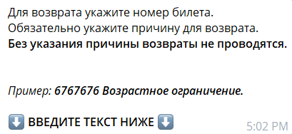

# Как пользоваться SupportBot

## Суть

SupportBot нужен, чтобы одинаково оформлять обращения в поддержку: меньше хаоса, быстрее маршрутизация и меньше уточнений.

Основной путь работы с ботом — через кнопки. Пользователь выбирает пункт, получает следующий набор кнопок или шаг для ввода текста, а в конце бот формирует обращение.

## Где запускается бот

Бот запускается только из топика support-чата: через закреплённое сообщение или кнопку в топике.

Личные сообщения с ботом используются только как техническая переписка с ботом: кнопки и ввод текста. Из личных сообщений сценарий не запускается.

Если пользователь пишет боту впервые, в личных сообщениях с ботом нужно отправить любое сообщение или `/Start`, иначе кнопки не появятся.

## Как начать работу

1. Открыть support-чат.
2. Перейти в support-топик.
3. Найти закреплённое сообщение для обращения в техподдержку.
4. Нажать кнопку запуска.
5. Перейти в техническую переписку с ботом и продолжить по кнопкам.

## Как выбрать категорию обращения

На шаге `menu` нужно выбрать один из предложенных вариантов. Писать текст на таком шаге не нужно.

Если выбран не тот пункт, для возврата используется кнопка `Назад`.

## Что делать на шагах ввода текста

На шаге ввода текста бот просит написать текст. Текст нужно отправлять одним сообщением и не дробить на несколько частей.

Пишите по примеру, который бот показывает прямо в этом поле ввода. После отправки текста нужно дождаться следующего шага или ответа бота.

## Что происходит после отправки обращения

В конце сценария бот формирует итоговое обращение и публикует его в нужном месте в рамках support-чата или support-топика.

После финального сообщения обращение считается созданным.

Если после создания нужно добавить детали, допишите их в этом же обращении или топике. Не запускайте сценарий заново для дополнительных деталей по тому же кейсу.

## Обязательные правила

- Запускать сценарий только из support-топика через закреплённое сообщение или кнопку.
- Личные сообщения использовать только как технический канал для кнопок и ввода.
- При первом обращении в личные сообщения боту отправить любое сообщение или `/Start`.
- Основной путь прохождения сценария — через кнопки.
- На шаге `menu` выбирать кнопку и не писать текст.
- На шаге ввода текста писать текст одним сообщением.
- После создания обращения дополнительные детали дописывать в том же обращении или топике.

## Частые ошибки

- Пытаются запустить сценарий напрямую из личных сообщений с ботом.
- Не отправляют первое сообщение или `/Start` в личных сообщениях и не видят кнопки.
- Пишут текст на шаге `menu` вместо выбора кнопки.
- Дробят ответ на шаге ввода текста на несколько сообщений.
- После создания обращения запускают сценарий заново, хотя нужно дописать детали в уже созданном обращении или топике.

## Связанные страницы

- Если информации недостаточно, зафиксируй вопрос и передай ответственному за процесс.
