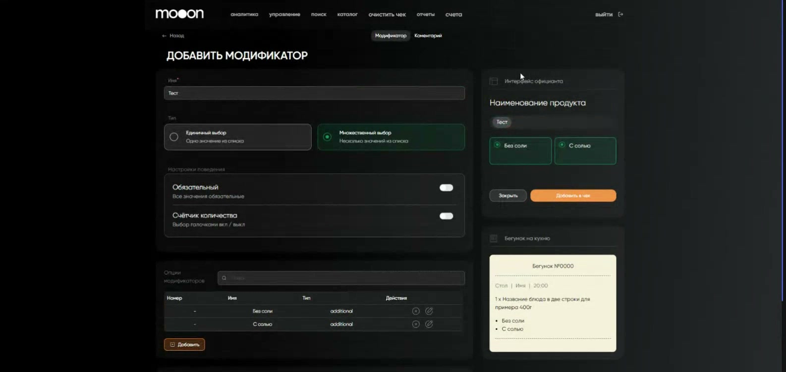
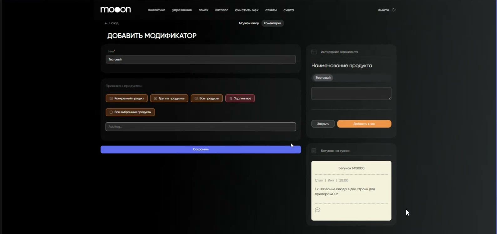
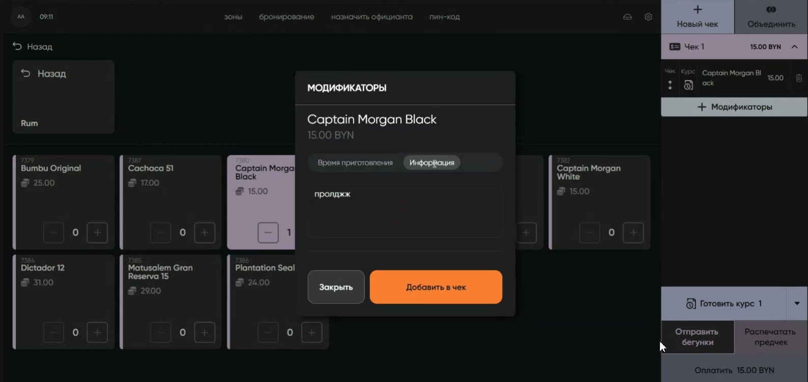

# Модификаторы и комментарии к блюдам в Waiter

## Суть

Модификатор — дополнительный параметр **конкретной позиции в заказе**. Он не меняет карточку блюда в каталоге: официант выбирает нужный вариант при добавлении блюда в чек. Например, можно выбрать время приготовления или вариант подачи.

Комментарий — текстовая пометка к позиции. Официант может выбрать заранее подготовленный тег или ввести свободный текст.

Настройка создаётся в Portal, выбирается официантом в Waiter и передаётся в бегунок на кухню.

## Как это связано

1. Администратор создаёт модификатор или комментарий в Portal.
2. Привязывает его к конкретному продукту, группе продуктов либо ко всем продуктам.
3. Официант добавляет блюдо в Waiter и открывает его модификаторы.
4. Выбранные варианты и комментарии становятся частью позиции в чеке и отображаются в бегунке на кухню.

## Настройка модификатора в Portal

### Где находится

Portal → `каталог` → `Модификаторы` → **«Добавить модификатор»**.

На странице можно переключаться между вкладками **«Модификатор»** и **«Комментарии»**.

### Создать модификатор

1. Откройте вкладку **«Модификатор»**.
2. Укажите понятное для официанта название.
3. В блоке «Привязка к продуктам» выберите область действия: конкретный продукт, группу продуктов или все продукты.
4. Выберите тип выбора:
   - **единичный** — официант выбирает один вариант;
   - **множественный** — официант может выбрать несколько вариантов.
5. При необходимости включите **«Обязательный»**: без выбора значения официант не сможет добавить позицию в чек.
6. Если для варианта нужно указывать число, включите **«Счётчик количества»**.
7. В блоке «Опции модификатора» добавьте варианты, которые должен видеть официант.
8. Проверьте предпросмотр интерфейса официанта и бегунка на кухню справа, затем нажмите **«Сохранить»**.

На примере видны выбор единичного или множественного значения, настройка обязательности, счётчик количества, список вариантов и предпросмотр того, что увидят официант и кухня.

!!! warning "Важно: сначала определите область действия"
    Модификатор относится только к продуктам, группам или всем продуктам, выбранным в блоке «Привязка к продуктам». Перед сохранением проверьте эту связь: она определяет, у каких блюд официант увидит настройку.

## Настройка комментария в Portal

Комментарий создаётся в том же разделе, но на вкладке **«Комментарии»**.

1. Нажмите **«Добавить модификатор»** и откройте вкладку **«Комментарии»**.
2. Укажите название комментария.
3. Выберите, к чему он относится: конкретному продукту, группе продуктов или всем продуктам.
4. При необходимости добавьте постоянные теги. Они подходят для повторяющихся просьб, например «две тарелки» или «два стакана». Введите тег и нажмите `Enter`.
5. Сверьте предпросмотр интерфейса официанта и бегунка, затем сохраните настройку.

Справа Portal показывает, как комментарий будет выглядеть у официанта и в бегунке на кухню.

## Работа официанта в Waiter

### Добавить блюдо с модификатором

1. Выберите блюдо в меню.
2. В строке добавленной позиции нажмите **«Модификаторы»**.
3. Откройте вкладку с нужным названием и выберите вариант. Для обязательного модификатора выбор нужен до добавления позиции в чек.
4. Нажмите **«Добавить в чек»**.

### Добавить комментарий

1. В окне **«Модификаторы»** откройте вкладку комментария.
2. Выберите постоянный тег, если он подходит, либо нажмите поле ввода и напишите комментарий.
3. Нажмите **«Добавить в чек»**.

В окне позиции отображаются отдельные вкладки модификаторов и комментариев. Текст комментария вводится в поле выбранной вкладки.

## Проверка перед использованием

- Название понятно официанту и не требует расшифровки.
- Выбраны нужные продукты или группа продуктов.
- Для взаимоисключающих вариантов установлен единичный выбор.
- Обязательность включена только там, где без параметра нельзя корректно приготовить блюдо.
- На предпросмотре бегунка видны нужные варианты и комментарии.
- Тестовая позиция с модификатором добавляется в чек и после отправки бегунка читается кухней.

## Связанные инструкции

- [Работа официанта в Waiter](Работа%20официанта%20в%20Waiter.md)
- [Работа администратора в Waiter](Работа%20администратора%20в%20Waiter.md)
- [Каталог в Portal](../Портал/Каталог%20в%20Portal.md)
