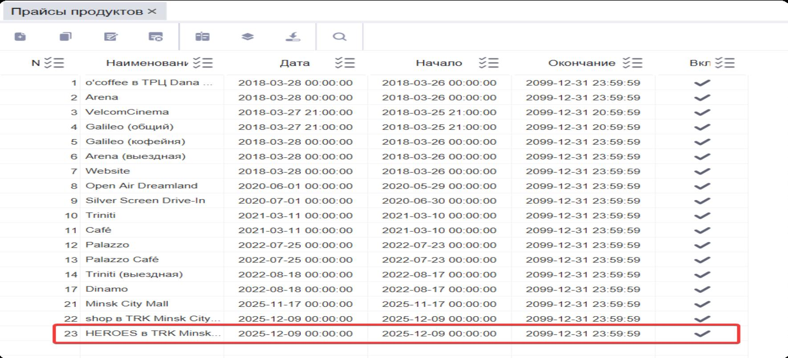
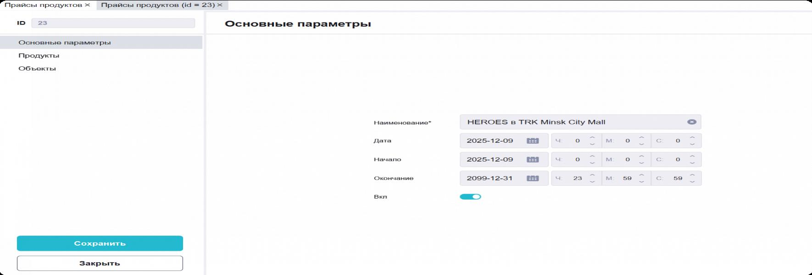
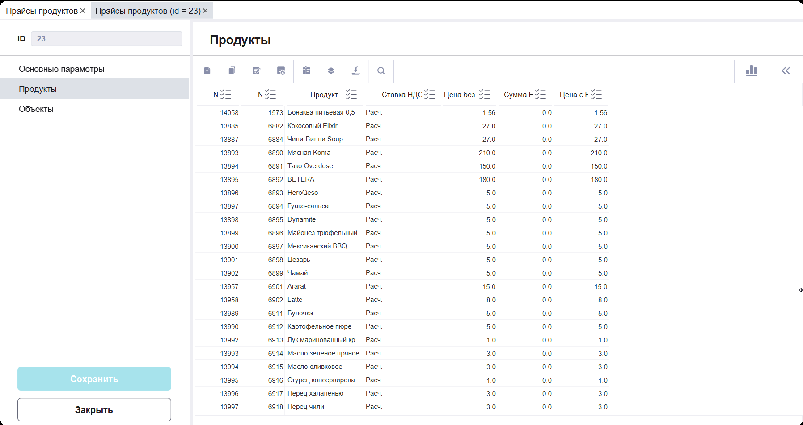
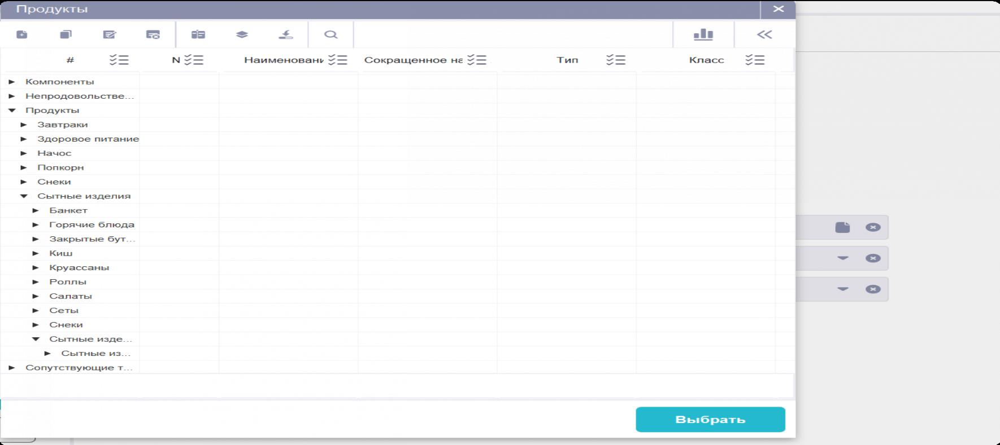
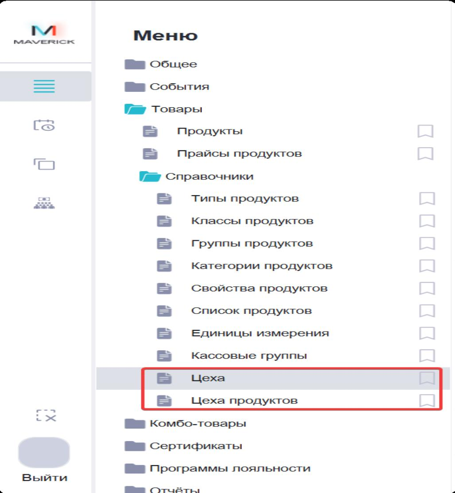
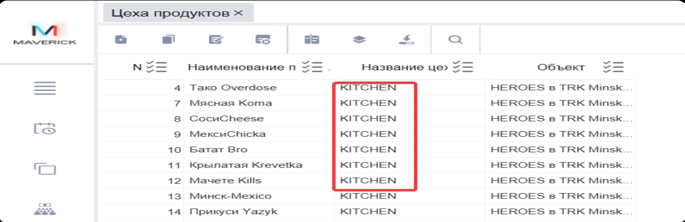
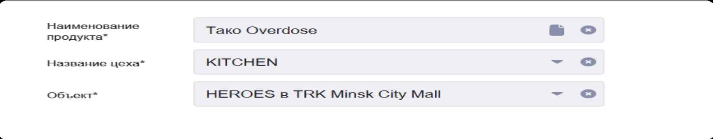
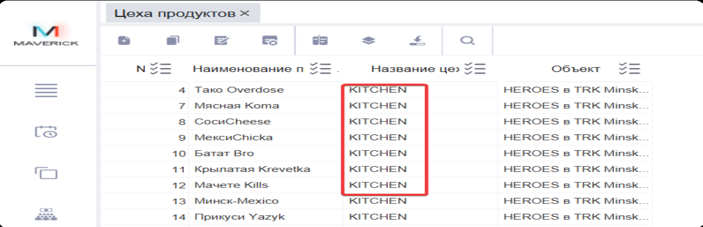

# Настройка меню и цехов в Manager для Waiter

## Суть

Manager (BackOffice) — источник меню и цен для Waiter (FrontOffice). Прайс продуктов в Manager определяет, какие позиции и по каким ценам видят официанты и гости в Waiter. Департаменты (цеха) определяют, куда отправляются бегунки.

Связка Waiter ↔ Manager строится из двух частей:

1. **Меню** — прайс продуктов в Manager → отображается в Waiter.
2. **Департаменты (цеха)** — привязка продукта к цеху → Waiter знает, куда отправлять бегунки.

## Прайс продуктов — меню ресторана

### Где находится

Manager → Меню → Товары → Прайсы продуктов

### Как найти нужный прайс

1. Открыть раздел «Прайсы продуктов».
2. Найти прайс ресторана по названию.
3. Открыть двойным кликом или через кнопку редактирования.

### Основные параметры прайса

Вкладка «Основные параметры»:

- **Наименование** — название прайса.
- **Начало / Окончание** — период действия прайса.
- **Вкл** — прайс должен быть включён (активен).

### Наполнение прайса позициями

Вкладка «Продукты» — здесь формируется состав меню и цены.

Для каждой позиции задаются:

- продукт (блюдо/напиток);
- ставка НДС;
- цена без НДС / цена с НДС (и связанные расчётные поля).

### Как добавить продукт в прайс

1. Нажать «Добавить» (иконка «+»).
2. В окне выбора найти продукт по дереву категорий.
3. Нажать «Выбрать».
4. Выставить ставку НДС и цену.

**Важно:** если продукта нет в выборе — он не создан в справочнике «Товары → Продукты». Это отдельная операция, не прайс.

### Привязка прайса к объекту

Вкладка «Объекты» — добавить объект ресторана. Это связывает прайс (меню) с конкретной точкой, где работает Waiter.

После внесения изменений нажать «Сохранить».

## Департаменты (цеха)

### Зачем нужны

Чтобы Waiter понимал, куда относится каждая позиция меню (кухня или бар), в Manager настраиваются:

1. **Департаменты (цеха)** — справочник департаментов (например, KITCHEN, BAR).
2. **Департаменты (цеха) продуктов** — привязка конкретного продукта к конкретному цеху для конкретного объекта.

### Где находятся

Manager → Меню → Товары → Справочники → Цеха

и

Manager → Меню → Товары → Справочники → Цеха продуктов

### Настройка справочника «Цеха»

Открыть раздел «Цеха» и убедиться, что нужные цеха созданы.

#### Добавить департамент (цех)

1. Нажать «Добавить» (иконка «+»).
2. Указать наименование (например, KITCHEN).
3. Нажать «Сохранить».

**Важно:** названия должны быть единообразными, без дубликатов (например, «Kitchen» и «KITCHEN» — это разные записи).

### Привязка продукта к департаменту (цеху)

Раздел «Департаменты (цеха) продуктов».

Каждая строка — правило: **Продукт → Департамент (Цех) → Объект**

Одна и та же позиция может быть привязана к разным цехам в разных объектах.

#### Добавить правило

1. Нажать «Добавить» (иконка «+»).
2. Выбрать продукт.
3. Выбрать департамент (цех).
4. Выбрать объект ресторана.
5. Сохранить.

## Связка Waiter и Manager

### Меню в Waiter берётся из прайса в Manager

1. В Manager меню и цены задаются в «Товары → Прайсы продуктов».
2. Внутри прайса настраиваются: период действия, включение, список позиций и цены.
3. Waiter показывает пользователям те позиции и цены, которые добавлены в прайс.

**Коротко:** нет позиции в прайсе — нет позиции в меню Waiter.

### Департаменты (цеха)

Департаменты (цеха) — разделение по месту приготовления (KITCHEN, BAR и т.п.).

Настраиваются в Manager → «Товары → Справочники → Цеха».

### Как Waiter понимает, куда отправлять позицию

Чтобы Waiter знал, в какой департамент отправлять позицию, в Manager настраивается привязка:

**продукт → департамент (цех) → объект**

Эта привязка задаётся в «Товары → Справочники → Цеха продуктов».

### Важно: без департамента не будет бегунка

Если для блюда не настроена привязка в «Цеха продуктов», Waiter не сможет определить департамент позиции, и она не будет уходить бегунком на кухню или в бар.

**Для работы бегунков обязательно должно быть заполнено правило:** продукт → департамент (цех) → объект.

## Что даёт правильная настройка

После настройки прайса и привязок департаментов:

- Waiter показывает актуальное меню и цены из прайса.
- Каждая позиция в заказе относится к своему департаменту (кухня/бар).
- Система может разделять позиции по департаментам для дальнейшей обработки.

## Риски и контроль

- Прайс должен быть включён («Вкл») и иметь актуальный период действия.
- Названия цехов должны быть единообразными.
- Каждый продукт в прайсе должен иметь привязку к департаменту через «Цеха продуктов».
- После изменений в прайсе или привязках проверить отображение в Waiter.

## Частые ошибки

- Прайс создан, но не включён.
- Период действия прайса истёк.
- Продукт добавлен в прайс, но не привязан к департаменту — бегунок не уходит.
- Дубликаты названий цехов («Kitchen» / «KITCHEN»).
- Продукт не создан в справочнике «Товары → Продукты», поэтому его нельзя добавить в прайс.

## Связанные страницы

- [Работа официанта в Waiter](Работа официанта в Waiter.md)
- [Работа администратора в Waiter](Работа администратора в Waiter.md)
- Если информации недостаточно, зафиксируй вопрос и передай ответственному за процесс.
