# Работа администратора в Waiter

## Суть

Администратор — роль с расширенными правами в Waiter. Управляет настройками зала и кассы, может вмешиваться в работу столов, тогда как официант только обслуживает гостей.

## Ключевые отличия от осицианта

- Может оплачивать счёт через кнопку «Оплатить» (у официанта этой кнопки нет).
- Может отменять позиции даже после печати предчека.
- Управляет залом и персоналом через верхнее меню (Зоны, Бронирование, Назначить официанта, Пин-код).
- Управляет схемой зала в Settings.

## Два режима заведения

Переключатель «Ресторан ↔ Кофейня» действует для текущей кассы/устройства:

- **Ресторан** — работа со столами и кухней: бегунки, предчек, статусы столов.
- **Кофейня** — быстрые продажи без кухни: «взял → оплатил», без предчека и без бегунков.

## Авторизация

1. На экране авторизации ввести 4-значный PIN-код.
2. Система авторизует пользователя и открывает рабочий интерфейс.
3. В левом верхнем углу отображаются инициалы и текущее время.
4. По нажатию на инициалы доступно только действие «Выйти».

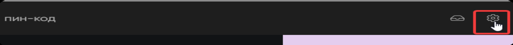

## Settings (шестерёнка)

Settings — техническая зона администратора. Здесь настраивают инфраструктуру:

- назначают рабочую кассу на устройстве;
- управляют зонами и схемой столов;
- выполняют кассовые действия;
- работают со сменой и отчётами.

Доступные разделы Settings (зависят от конфигурации):

- Выбор кассы
- Зоны (управление зонами и столами)
- Печать X-отчёта
- Кассовая лента
- Сверка итогов (терминал)
- Открыть смену / Закрыть смену
- Внести деньги / Изъять деньги

### Выбор кассы

Зачем: привязать устройство к конкретной кассе/рабочему месту.

1. Settings → Выбор кассы.
2. Нажать плитку нужной кассы.
3. Нажать «Сохранить».

Если выбрали не ту кассу — можно зайти снова и выбрать другую.

### Зоны в Settings (управление схемой зала)

**Важно:** Settings → Зоны ≠ верхнее меню → Зоны.

- Settings → Зоны — создание, редактирование, удаление зон и столов (схема).
- Верхнее меню → Зоны — операционная работа с активными столами сейчас.

#### Создать зону

1. Нажать «Создать зону».
2. Ввести имя зоны.
3. Нажать «Создать».

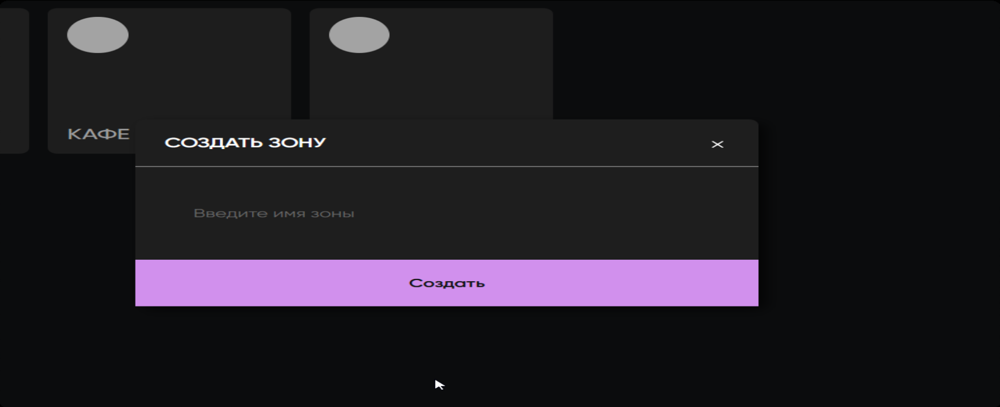

Названия зон могут повторяться — это ответственность администратора.

#### Переименовать зону

1. Открыть нужную зону.
2. Нажать на название (редактируемое поле) и изменить текст.
3. Нажать «Сохранить».

Без «Сохранить» новое имя не применится.

#### Удалить зону

- Зону нельзя удалить, если в ней есть столы.
- Сначала удалить все столы → затем удалить зону.
- Подтверждения удаления нет.
- Удалять зоны и столы можно только до начала работы с ними. Если по зоне/столу уже были рабочие действия — удаление только через техподдержку.

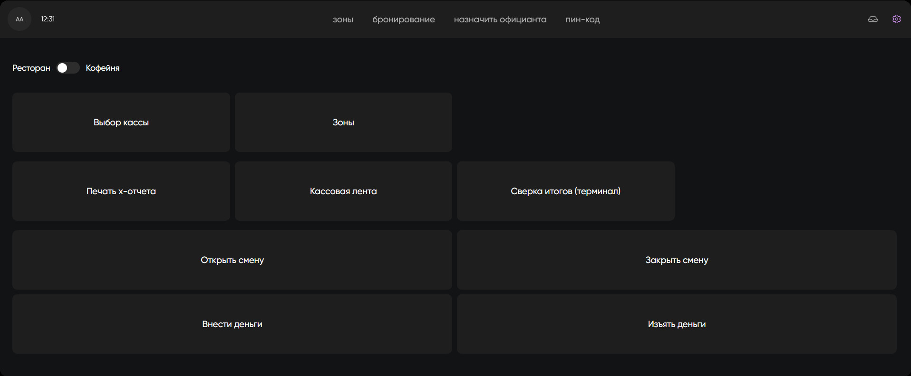

#### Добавить стол

1. Нажать «Добавить стол».
2. Заполнить параметры:
   - номер стола (уникален внутри зоны);
   - тип (виртуальный/временный/квадратный/круглый);
   - описание (опционально);
   - быстрый чек (если стол работает без кухни/предчека).
3. Нажать «Добавить».

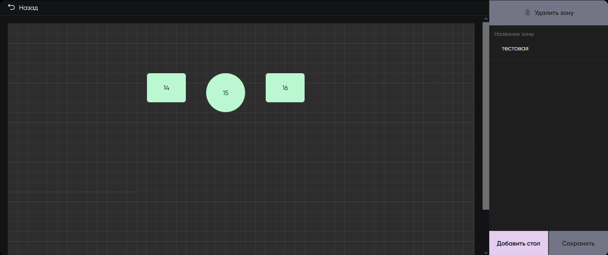

Если номер повторяется — система покажет ошибку.

#### Перемещение столов на схеме

- Столы перемещаются drag & drop.
- Позиции сохраняются автоматически.
- За границы схемы вынести нельзя.

#### Редактировать стол

1. Клик по столу → карточка стола.
2. Изменить номер/описание/тип/быстрый чек.
3. Нажать «Сохранить».

#### Удалить стол

- Кнопка «Удалить стол» в карточке стола.
- Подтверждения нет.
- Если стол в работе (открыт заказ/предчек/бронь) — удалить/редактировать нельзя.
- Если стол уже использовался в работе — удаление только через техподдержку.

### Внести деньги / Изъять деньги

Зачем: оформить размен в начале дня или инкассацию через форму по номиналам.

1. Settings → Внести деньги (или Изъять деньги).
2. В таблице номиналов указать количество купюр/монет.
3. Система посчитает итоговую сумму.
4. Нажать «Внести» или «Изъять».

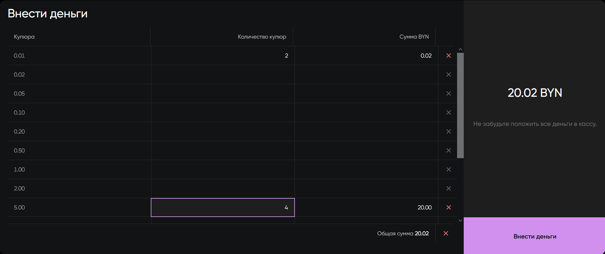

### Кассовые действия (X-отчёт, лента, сверка, смена)

Модуль привязан к программной кассе TitanPOS и согласовывается с бухгалтерией.

## Верхнее меню администратора

Верхнее меню — рабочие разделы администратора «на смене».

### Зоны (операционная работа)

Раздел «Зоны» в верхнем меню — просмотр текущей ситуации по столам: кто занят, кто свободен, где брони, где не назначен официант.

**Влияние переключателя Ресторан/Кофейня:**

- **Ресторан** — «Зоны» открываются схемой зала. Видны статусы столов.
- **Кофейня** — «Зоны» открываются списком быстрых чеков/столов без схемы.

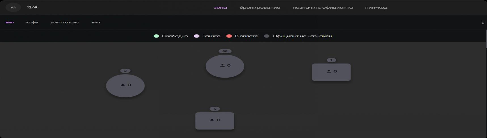

**Быстрый чек** — если конкретный стол настроен как «Быстрый чек» (обычно бар), он работает по принципу кофейни: без кухни и без предчека.

### Бронирование

Работает только в режиме Ресторан.

#### Создать бронирование

1. Верхнее меню → «Бронирование».
2. Выбрать зону.
3. Нажать на стол.
4. Нажать «Добавить бронирование».

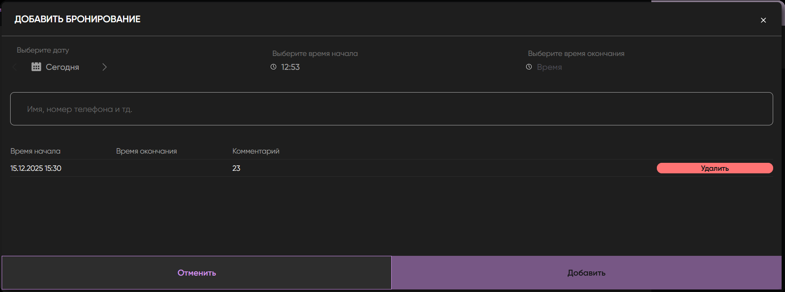

5. Заполнить форму:
   - дата;
   - время начала;
   - время окончания;
   - имя (обязательно);
   - телефон (обязательно);
   - комментарий (обязательно).
6. Нажать «Добавить».

Система не даст создать бронь, если она пересекается по времени с существующей бронью на этом столе.

Стол подсвечивается как «забронированный» за 2 часа до начала брони. До начала брони стол остаётся операционно доступным.

#### Посмотреть, редактировать, удалить бронь

- Открыть стол в бронировании — список броней.
- Текущую бронь можно редактировать.
- При удалении — подтверждение «Отменить / Подтвердить».

### Назначить официанта

Правила:

- Назначение возможно только на свободный стол.
- Если официант уже назначен — можно переназначить без подтверждения.

#### Назначить на один стол

1. Верхнее меню → «Назначить официанта».
2. Выбрать стол.
3. Нажать «Назначить Официанта».
4. Выбрать официанта из списка.
5. Нажать «Применить».

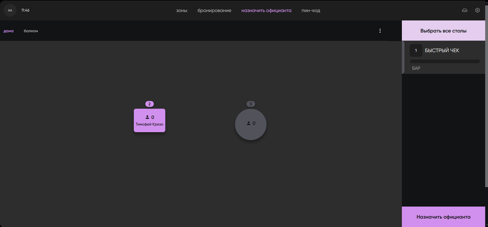

#### Массовое назначение

Кнопка «Выбрать все столы» позволяет назначить одного официанта сразу на все столы зоны.

В списке только активные официанты (неактивные/уволенные не отображаются).

### Пин-код

Раздел «Пин-код» позволяет сбросить PIN официанта.

1. Верхнее меню → «Пин-код».
2. Найти официанта.
3. Нажать на официанта — система сгенерирует новый случайный 4-значный PIN.

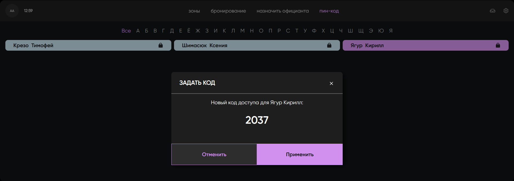

4. Нажать «Применить».

Особенности:

- PIN генерируется только рандомно, вручную задать нельзя.
- Посмотреть текущий PIN нельзя — можно только выдать новый.
- После применения новый PIN сразу отменяет старый.

## Работа администратора со столом и счётом

Интерфейс заказа у администратора такой же, как у официанта, но с расширенными правами.

### Открыть стол

1. Верхнее меню → «Зоны» (режим Ресторан).
2. Нажать на нужный стол на схеме.

### Состав счёта и чеки

Логика такая же, как у официанта:

- один стол может содержать несколько чеков (гостей);
- по умолчанию создаётся Чек 1;
- можно добавлять новых гостей, разделять и объединять чеки.

### Отправка Бегунков

Та же логика, что у официанта:

- до отправки — у позиций есть корзина, можно удалять/менять;
- после отправки — корзина исчезает, позиции зафиксированы;
- бегунки можно отправлять несколько раз;
- официант может отправлять новые позиции самостоятельно.

### Предчек

Условие: все позиции отправлены бегунками.

Отличия от официанта:

- официант может печатать предчек максимум **2 раза**;
- администратор может печатать предчек **неограниченное количество раз**.

После печати предчека стол переходит в состояние «к оплате».

## Оплата счёта (привилегия администратора)

У администратора внизу экрана есть кнопка «Оплатить».

Условия оплаты:

- по всем позициям отправлены бегунки;
- нет позиций «с корзиной».

### Экран оплаты

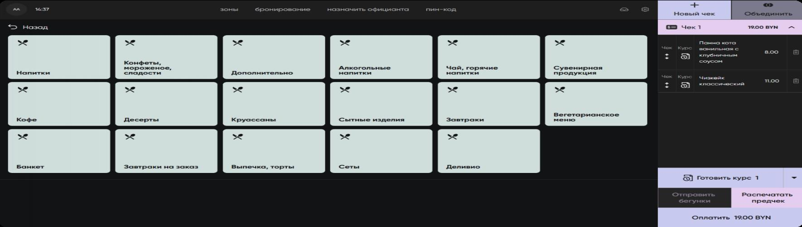

На экране:

- «К оплате» — сколько осталось закрыть;
- «Общая сумма» — сумма счёта;
- «Оплачено» — сколько уже внесено;
- «Добавленные оплаты» — список внесённых оплат, каждую можно отменить отдельно;
- строка «Отсканируйте карту лояльности».

### Оплата наличными

1. Выбрать «Наличные».
2. Ввести сумму гостя — система покажет сдачу.
3. Нажать «Оплатить».

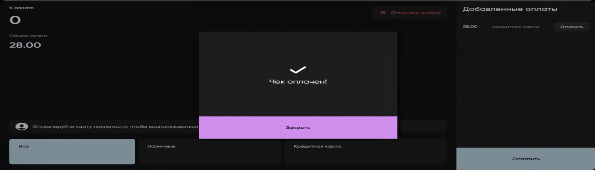

**Ошибка «Недостаточно наличных для сдачи»:**
Если сдачи в кассе не хватает — оплата не завершится. Что делать:
- принять точную сумму без сдачи;
- провести часть картой;
- внести размен и повторить оплату.

### Оплата картой (через переносной терминал)

1. Официант берёт терминал, проводит оплату.
2. Терминал печатает 2 чека: гостю и для банка.
3. Администратор сверяет сумму на терминальном чеке с суммой в Waiter.
4. В Waiter: «Кредитная карта» → «Оплатить».
5. Сообщение «Чек оплачен!» → «Закрыть».

### Комбинированная оплата (карта + наличные)

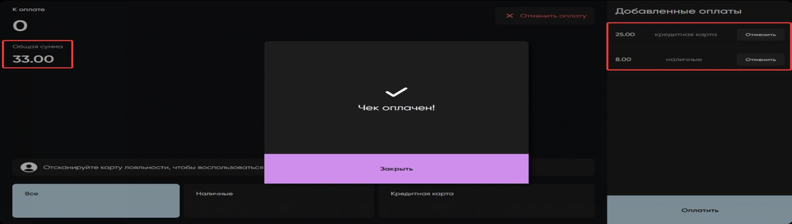

1. Принять оплату картой (через терминал).
2. В Waiter: «Кредитная карта» → зафиксировать сумму.
3. Гость доплачивает наличными: «Наличные» → ввести сумму → «Оплатить».
4. Когда «К оплате» = 0 → «Чек оплачен!» → стол закрывается.

### Отмена оплаты

На экране оплаты — кнопка «Отменить оплату», возвращает обратно в счёт без закрытия.

### Скидка по QR (сотрудники/партнёры Betera)

1. Открыть оплату (кнопка «Оплатить»).
2. Отсканировать QR-код скидки.
3. Система применит скидку ко всему столу.

На экране:

- общая сумма остаётся номинальной;
- «К оплате» уменьшается;
- отображается ФИО и размер скидки;
- скидку можно снять кнопкой «×».

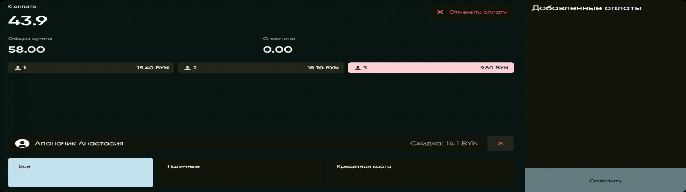

Скидку можно применить до или после печати предчека.

## Удаление позиций из счёта

Администратор может удалять позиции **в любое время**, в том числе после печати предчека.

1. Открыть стол и нужный чек.
2. Нажать иконку корзины напротив позиции.

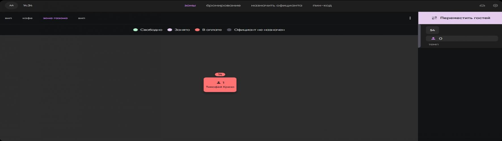

3. Указать причину удаления (обязательно).
4. Нажать «Удалить».

После удаления состав и сумма пересчитываются. Предчек можно распечатать повторно.

## Ограничения

- Нельзя удалить/редактировать стол в Settings, если он в работе (есть заказ/предчек/бронь).
- Нельзя удалить зону, если в ней есть столы.
- Назначить официанта можно только на свободный стол.
- В режиме Кофейня нет бегунков, предчека и цветовой легенды статусов.

## Риски и контроль

- Перед удалением позиции обязательно указать причину.
- Перед оплатой сверить сумму терминального чека с суммой в Waiter.
- При оплате наличными проверить наличие сдачи.
- Перед удалением зоны убедиться, что в ней нет столов.
- Перед удалением стола убедиться, что он не использовался в работе.

## Частые ошибки

- Путать Settings → Зоны (схема) и верхнее меню → Зоны (операционная работа).
- Удаляют зону, не удалив столы.
- Назначают официанта на стол «в работе».
- Печатают предчек с неотправленными позициями.
- Не сверяют сумму терминального чека перед оплатой картой.

## Связанные страницы

- [Работа официанта в Waiter](/Waiter/Работа официанта в Waiter)
- QUESTIONS
