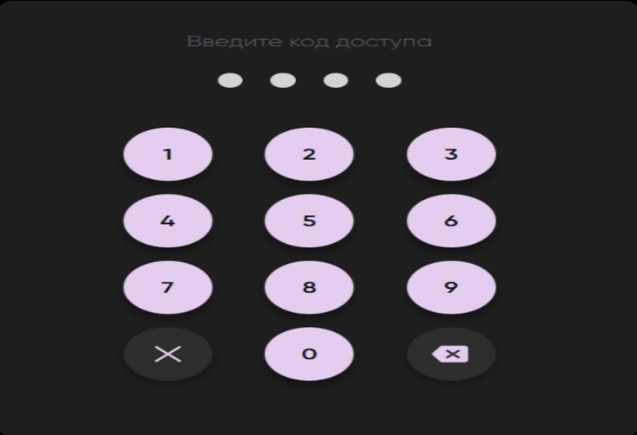
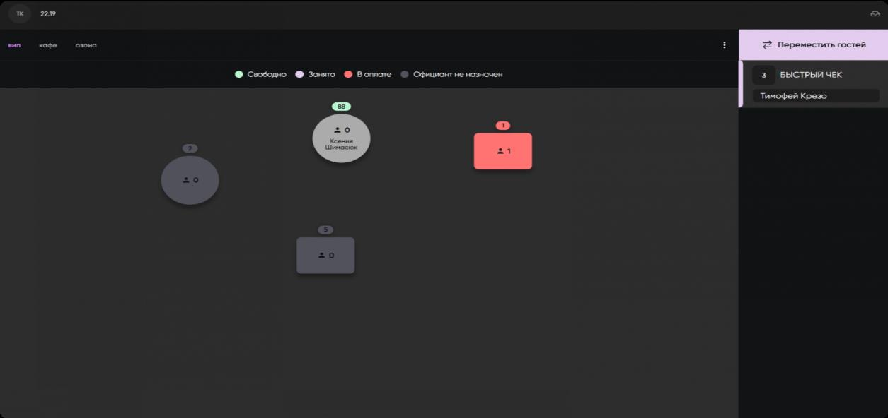
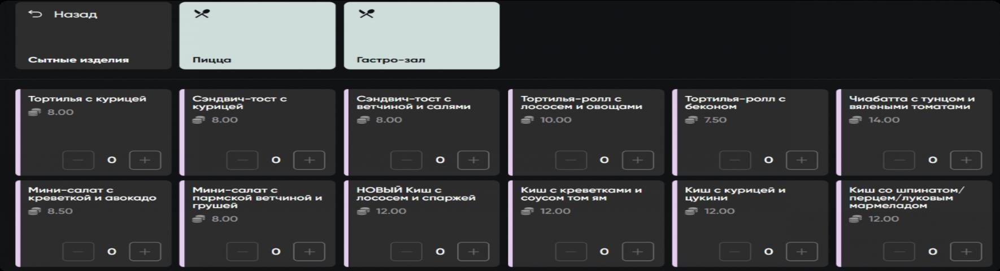
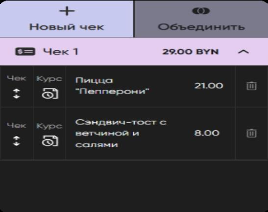
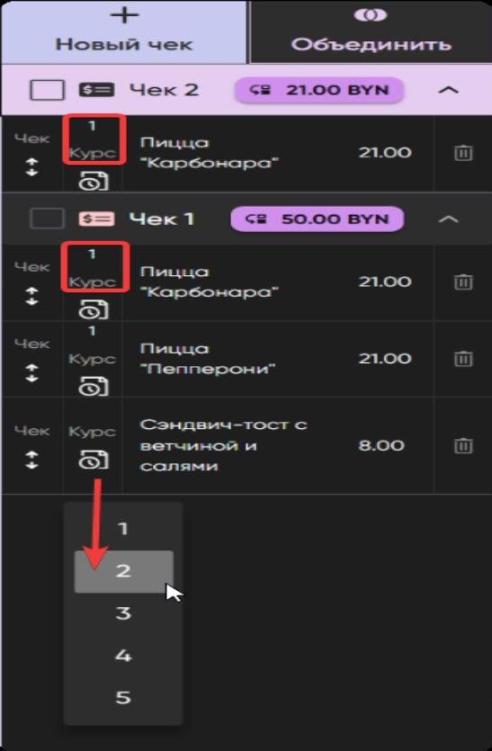
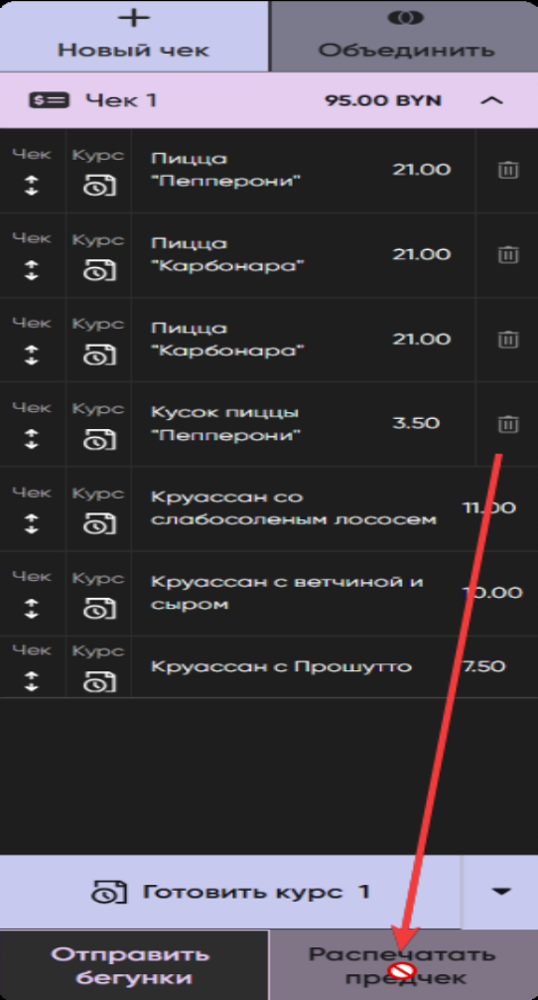
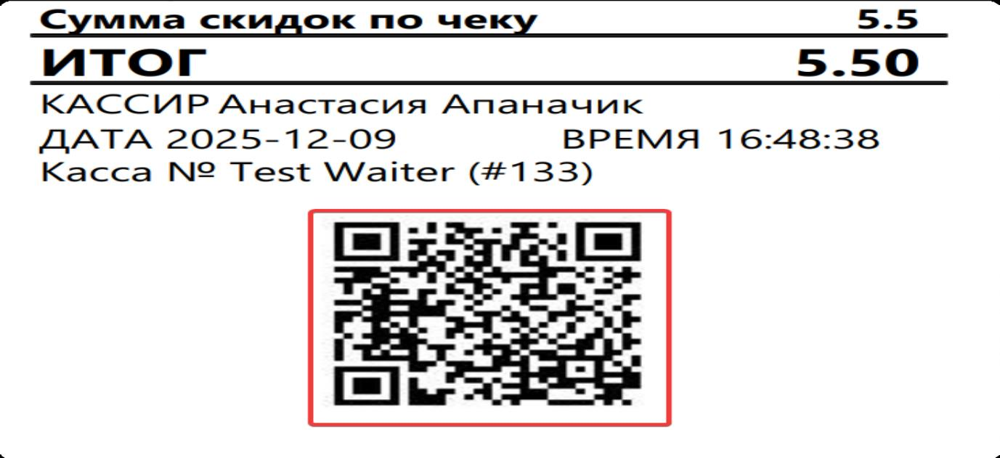
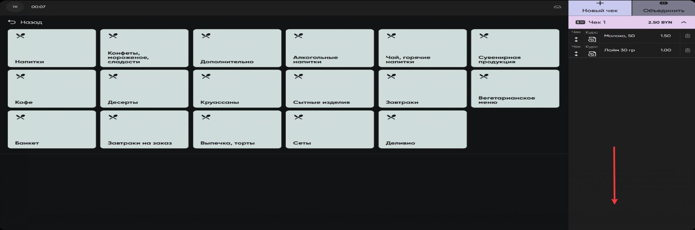
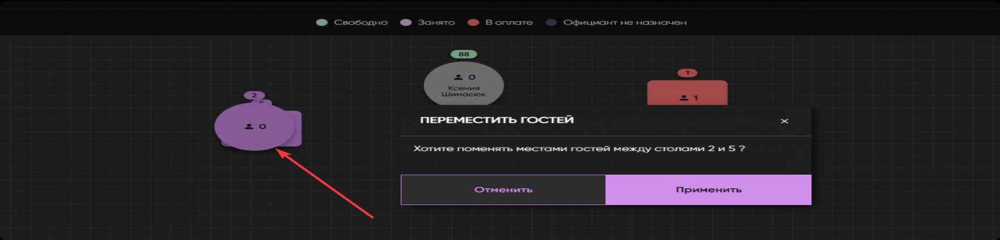
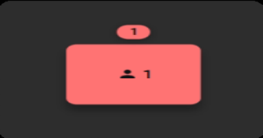

# Работа официанта с гостями и оплатой в Waiter

## Суть

Waiter используется официантом для обслуживания гостей в зале: входа по PIN-коду, выбора зоны и стола, добавления блюд в чеки гостей, отправки бегунков на кухню, печати предчека и сопровождения оплаты.

Официант не закрывает заказ в системе. После фактического получения денег закрытие стола выполняет администратор.

## Авторизация

Официант входит в приложение через персональный 4-значный PIN-код. PIN назначает администратор.

После успешного ввода PIN-кода открывается основной экран со схемой зала.

## Основной экран: карта зала

На карте зала официант видит доступные зоны, столы и их текущие статусы.

На экране отображаются:

- инициалы официанта и текущее время;
- список зон ресторана;
- схема столов;
- легенда статусов столов;
- блок виртуальных столов и быстрых чеков, если они есть в зоне;
- кнопка `Переместить гостей`.

Официанту доступны только те зоны и столы, на которые он назначен.

## Статусы столов

- Зелёный — свободный стол, официант назначен. Можно начинать обслуживание.
- Серый — свободный стол, но текущий официант не назначен на него.
- Розовый — занятый стол, заказ открыт.
- Красный — стол в оплате, по нему распечатан предчек.
- Стол с бронью — отображается время бронирования и количество гостей.

На столе могут отображаться номер стола, количество гостей, имя официанта и время брони.

## Новый заказ

1. Выбрать нужную зону.
2. Нажать на свободный стол.
3. Открыть каталог меню.
4. Выбрать категорию или вложенный раздел меню.
5. Добавить блюда или товары в чек.

В меню есть две кнопки `Назад`:

- серая `Назад` возвращает на уровень выше внутри меню;
- чёрная `Назад` возвращает из стола обратно на карту зала.

## Чек и гости

Правый блок `Чек` соответствует отдельному гостю за столом. По умолчанию создаётся `Чек 1`.

Официант может:

- добавить новый чек для нового гостя;
- распределять блюда между гостями;
- переносить позиции между чеками до отправки бегунков;
- объединять чеки, если гости хотят рассчитаться вместе;
- видеть итоговую сумму по каждому чеку.

Чтобы объединить чеки:

1. Нажать `Объединить`.
2. Выбрать нужные чеки галочками.
3. Нажать `Применить`.

## Курсы блюд

Курс нужен, чтобы кухня понимала порядок подачи блюд.

Пример логики:

- курс 1 — подать сразу;
- курс 2 — подать позже;
- курс 3 — после второго курса.

Курс можно назначать и менять до отправки бегунков. Каждый курс отправляется отдельно, например через действие `Готовить курс 1`.

## Отправка бегунков

`Отправить бегунки` — ключевое действие, которое передаёт блюда на кухню и фиксирует заказ.

После отправки бегунков:

- кухня получает заказ;
- отправленные позиции считаются зафиксированными;
- корзина у отправленных позиций исчезает;
- официант не может удалить, изменить курс или перенести уже отправленные позиции;
- изменить отправленные блюда может только администратор.

До отправки бегунков официант может:

- удалять блюда;
- менять курсы;
- переносить блюда между гостями;
- менять состав заказа.

Бегунки можно отправлять несколько раз: если после первой отправки добавлены новые блюда, они остаются редактируемыми до следующей отправки.

## Предчек

Предчек печатается, когда заказ полностью сформирован и все блюда отправлены бегунками.

Предчек недоступен, если в заказе есть хотя бы одна неотправленная позиция с корзиной.

Правила предчека:

- предчек можно распечатать максимум два раза;
- предчек подаётся гостю для проверки;
- предчек может быть по заказу или по конкретному гостю, если расчёт раздельный;
- после печати предчека стол подсвечивается красным и считается готовым к оплате;
- на предчеке есть QR-код для просмотра электронного предчека на сайте.

## Быстрые чеки и виртуальные столы

Быстрые чеки используются в зонах, где товар отгружается сразу и не требует кухни: бар, кофейня, кондитерская, стойка to-go.

Особенность быстрого чека: в нём нет отправки бегунков. Официант выбирает товары из меню и сразу может переходить к оплате. До оплаты товары можно удалить или поменять стандартно.

## Перемещение гостей между столами

Пересадка гостей выполняется через режим `Переместить гостей`.

Порядок действий:

1. На карте зала нажать `Переместить гостей`.
2. Выбрать стол, с которого нужно пересадить гостей.
3. Перетащить его на целевой стол.
4. Проверить системный запрос.
5. Нажать `Применить`.

После подтверждения гости, чеки и позиции переносятся автоматически. Статусы столов обновляются.

## Расчёт гостей

Финальный этап начинается после того, как гости проверили предчек и готовы оплатить.

Если гость платит наличными:

1. Официант принимает деньги.
2. Передаёт деньги на кассу администратору или кассиру по процедуре заведения.
3. Стол в системе закрывает администратор.

Если гость платит картой:

1. Официант приносит переносной банковский терминал.
2. Проводит оплату картой.
3. Забирает терминальный чек.
4. Передаёт терминальный чек на кассу.
5. Стол в системе закрывает администратор.

Терминал используется только как инструмент оплаты. Он не закрывает стол в Waiter.

## Ограничения роли официанта

Официант не выполняет административные операции.

Официант не может:

- закрывать стол в системе;
- удалять отправленные блюда;
- менять курс отправленных блюд;
- переносить отправленные блюда между гостями;
- печатать предчек, если в заказе есть неотправленные позиции;
- управлять схемой зала;
- создавать, редактировать или удалять зоны, столы и бронирования.

## Риски и контроль

- Перед отправкой бегунков проверить состав заказа, гостя и курс блюда.
- Перед печатью предчека убедиться, что все позиции отправлены бегунками.
- Перед пересадкой проверить исходный и целевой стол.
- При оплате не считать заказ закрытым, пока администратор не провёл оплату и не закрыл стол в системе.
- При раздельной оплате сверять сумму по каждому чеку.

## Частые ошибки

- Добавляют блюдо не тому гостю.
- Забывают отправить новые блюда бегунками.
- Пытаются распечатать предчек при неотправленных позициях.
- Считают оплату завершённой после терминала, хотя стол ещё не закрыт администратором.
- Путают серую кнопку `Назад` внутри меню и чёрную кнопку выхода на карту зала.
- Подтверждают пересадку, не проверив номер целевого стола.

## Связанные страницы

- QUESTIONS
