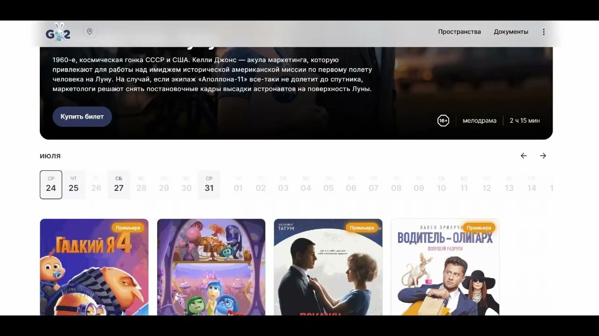
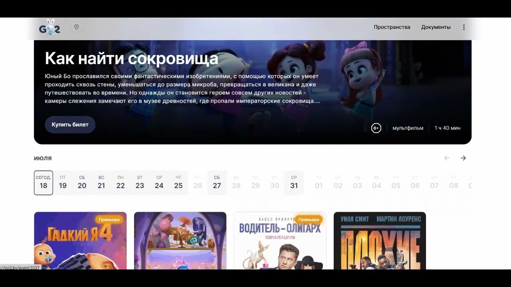
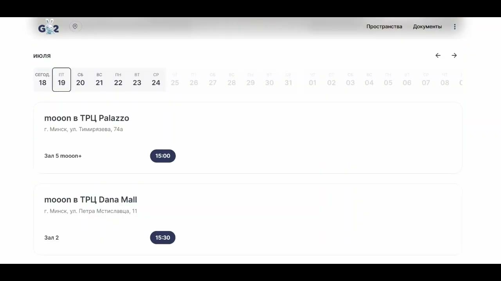
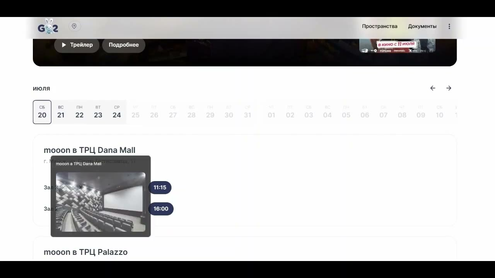
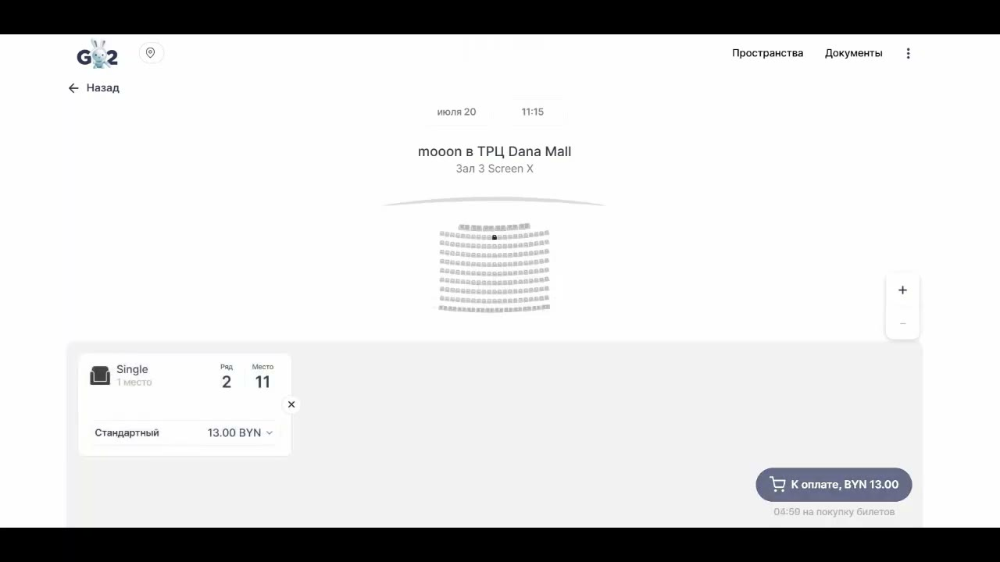
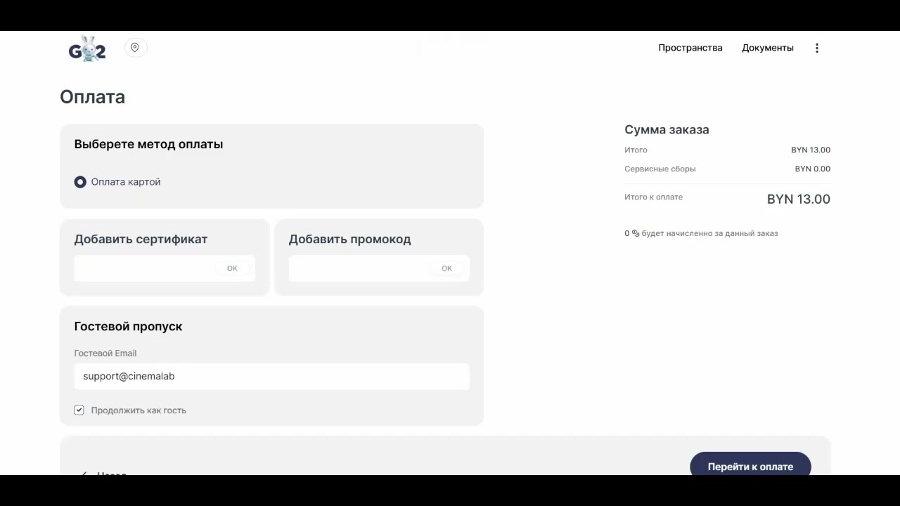
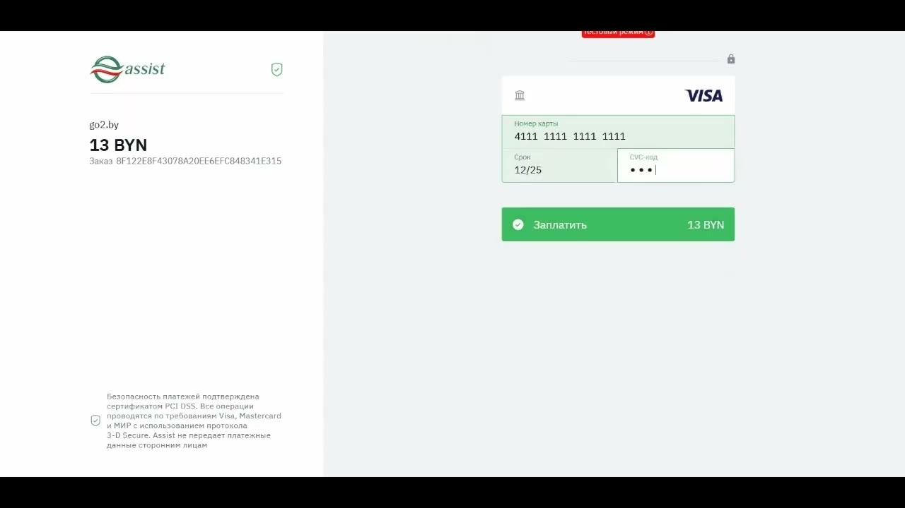
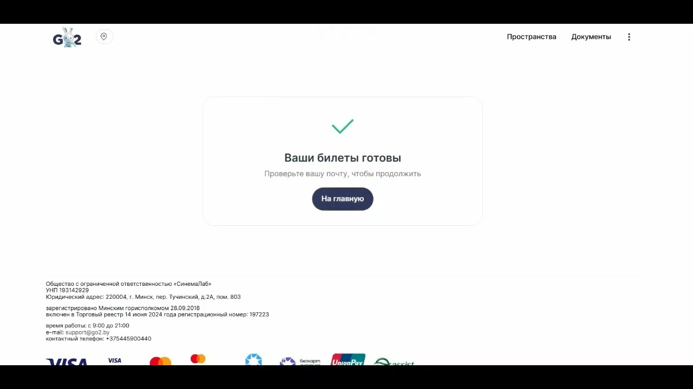
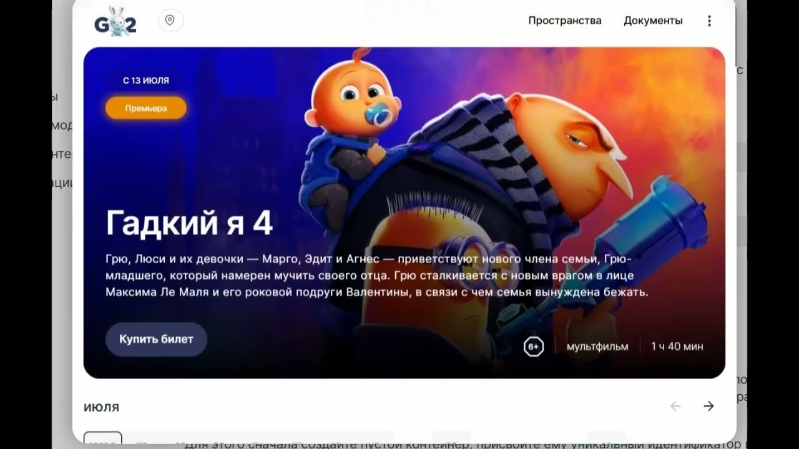

# Путь покупки в виджете

Источник: [YouTube — «Путь покупки в виджете»](https://www.youtube.com/watch?v=T6239zirZj0)

## Суть сценария

Пользовательский сценарий виджета ведёт пользователя от выбора события до оплаты билетов и возврата обратно в интерфейс.

Базовый путь:

1. открыть главную страницу виджета;
2. выбрать событие;
3. выбрать дату, объект, зал и время сеанса;
4. выбрать места;
5. ввести email;
6. перейти к оплате;
7. оплатить картой;
8. получить билеты на почту;
9. вернуться в магазин/на главную.

## 1. Главная страница

На главной странице отображаются баннеры, календарь и события. Календарь можно пролистывать стрелками.

Пользователь может начать покупку двумя способами:

- нажать «Купить билет» на баннере;
- нажать на карточку события.

## 2. Страница события

После выбора события открывается страница события. На ней доступны:

- трейлер;
- актуальные даты;
- объекты/площадки;
- время сеансов;
- залы;
- описание события.

Пользователь выбирает дату, объект, зал и время сеанса.

## 3. Выбор мест

После выбора сеанса открывается схема зала. Пользователь выбирает места, они подсвечиваются тёмным цветом.

После выбора мест пользователь переходит к оплате.

## 4. Оформление заказа

Перед переходом к платёжной странице пользователь вводит гостевой email.

Email нужен для отправки билетов после оплаты.

## 5. Оплата картой

После нажатия «Перейти к оплате» пользователь попадает на страницу платёжного провайдера Assist, где вводит данные карты и подтверждает оплату.

## 6. Успешная оплата

После успешной оплаты пользователь видит подтверждение. Билеты приходят на email.

Далее пользователь может нажать «Вернуться в магазин» и продолжить работу с виджетом.

## 7. Размещение на партнёрском ресурсе

Виджет может быть размещён на стороннем партнёрском ресурсе: сайте торгового центра, развлекательном портале, информационном портале, социальной сети или другой площадке.

При открытии в модальном окне пользователь проходит тот же userflow, что и на основной странице виджета.

## Краткий сценарий для поддержки

Если пользователь спрашивает, как купить билет через виджет, базовый ответ:

1. выберите событие на главной странице или на партнёрской площадке;
2. выберите дату, объект, зал и время;
3. выберите места на схеме зала;
4. введите email;
5. перейдите к оплате;
6. оплатите банковской картой;
7. проверьте почту — билеты должны прийти на указанный email.

Если билет не пришёл или оплата завершилась ошибкой, нужно уточнить email, время покупки, событие, площадку и статус оплаты.
