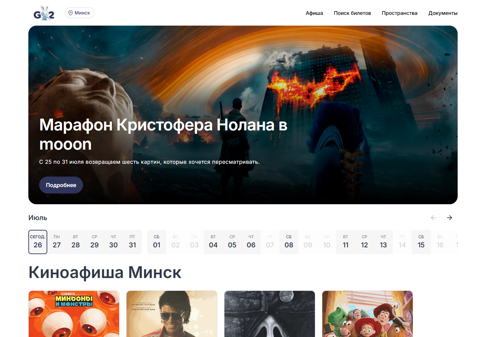
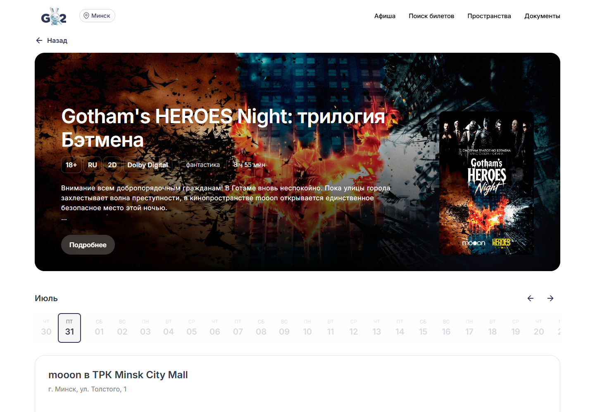
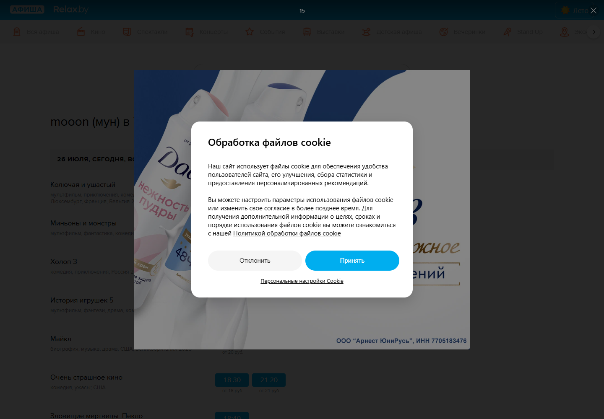
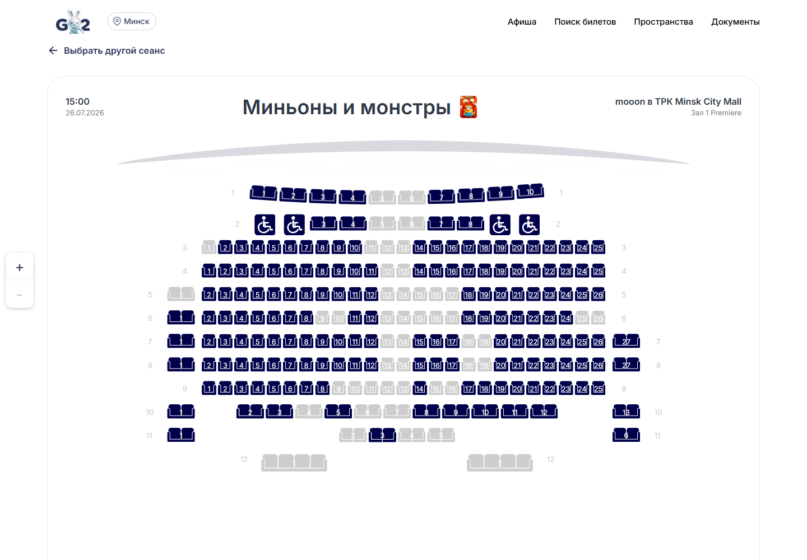
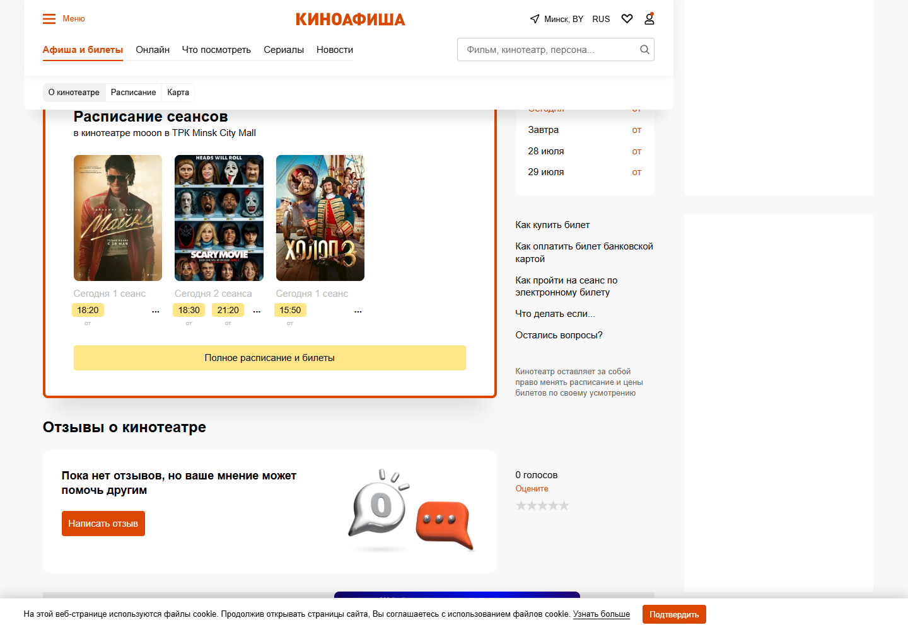
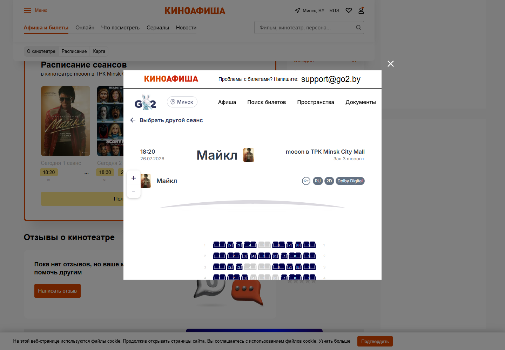
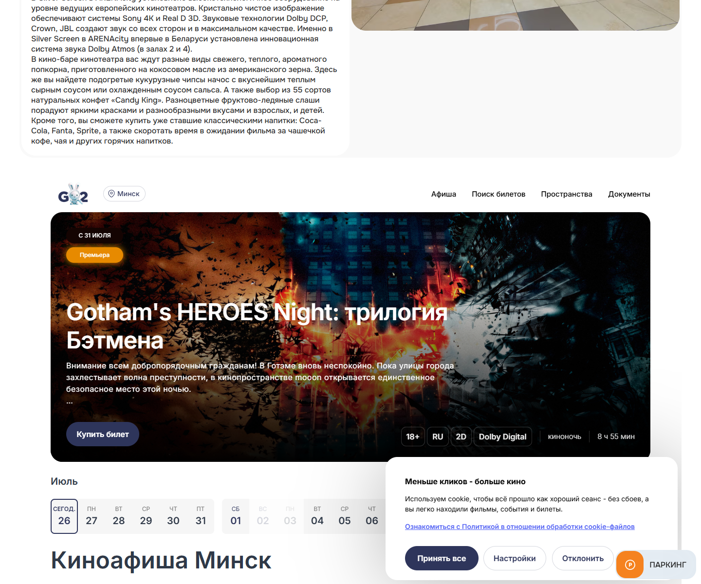
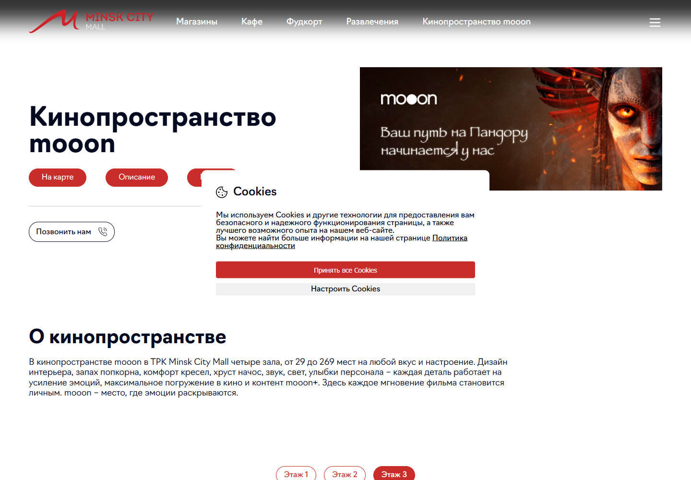
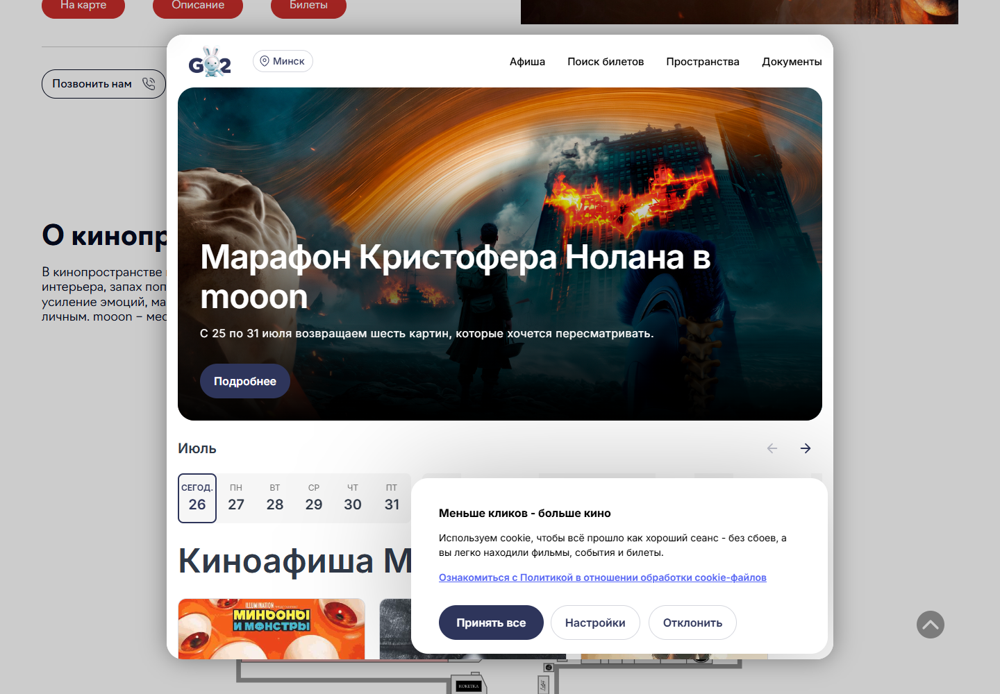
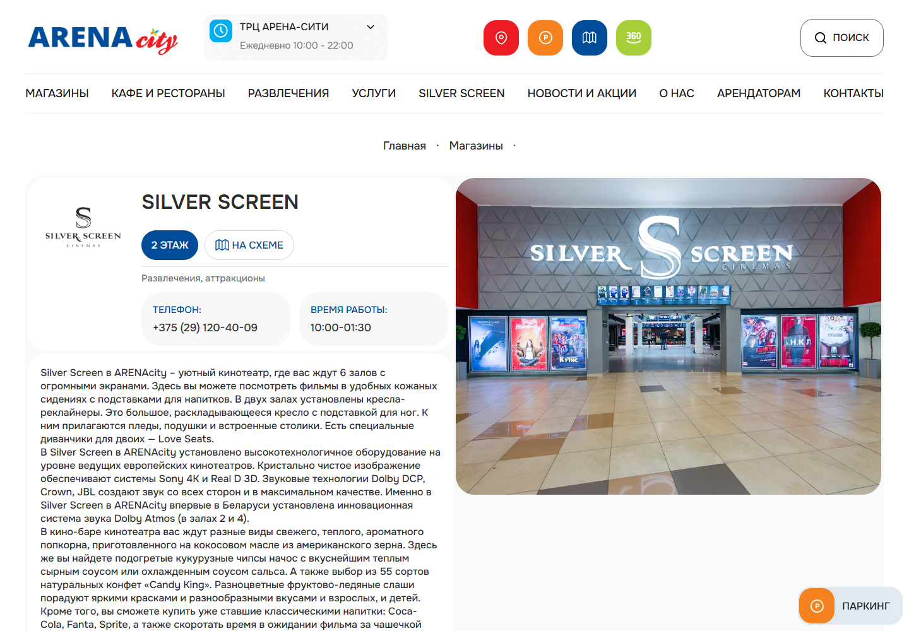

---
title: "Путь покупки в виджете"
section: "Билеты и касса"
knowledge_type: "instruction"
products:
  - "Widget"
channels:
  - "go2.by"
roles:
  - cash zone administrator
  - technical specialist
status: draft
high_risk: true
source_refs:
  - "https://go2.by/"
  - "https://afisha.relax.by/place/id/10806655/"
  - "https://by.kinoafisha.info/minsk/cinema/8330537/"
  - "https://arena-city.by/shops/silver-screen"
  - "https://minskcitymall.by/cinema"
updated: 2026-07-26
related:
  - "[Виджет](../Виджет.md)"
  - "[Принципы работы виджета](Принципы%20работы%20виджета.md)"
---

# Путь покупки в виджете

Эта страница описывает, как пользователь попадает в покупку билета через Go2Buy и как отличать варианты входа: самостоятельный сайт, прямой переход, pop-up и контейнер.

<div class="kb-meta" markdown>
<div markdown>
<strong>Для кого</strong>
Поддержка, администраторы, технические специалисты.
</div>
<div markdown>
<strong>Когда применяется</strong>
При объяснении покупки через виджет или разборе проблемы на партнёрской площадке.
</div>
<div markdown>
<strong>Что получится</strong>
Понятно, где пользователь начал покупку и на каком шаге находится.
</div>
</div>

## Базовый путь

1. Пользователь открывает `go2.by` или партнёрскую площадку.
2. Выбирает событие, фильм или конкретный сеанс.
3. Попадает в Go2Buy: на афишу, список сеансов или сразу в зал.
4. Выбирает места.
5. Вводит email для получения билетов.
6. Переходит к оплате.
7. После оплаты получает билеты на email.

Покупку в базе знаний описывают до перехода к платёжной системе и без ввода персональных или платёжных данных.

## Самостоятельный сайт Go2Buy

На `go2.by` пользователь видит афишу, поиск билетов, пространства и документы. Покупка начинается с баннера, карточки события или кнопки `Купить билет`.



После выбора события открывается страница события с описанием и доступными сеансами.



## Прямой переход с Relax

На `relax.by` расписание показывается средствами партнёра. Время сеанса ведёт прямо на `go2.by/hall`.



Пример URL после клика:

```text
https://go2.by/hall/?showId=392523&partnerNIP=191700409&city=minsk
```

В таком сценарии пользователь минует афишу Go2Buy и сразу видит схему зала выбранного сеанса.



## Pop-up на Kinoafisha

На `kinoafisha.info` пользователь нажимает время сеанса в расписании mooon или Silver Screen. После клика открывается pop-up с iframe Go2Buy.



Внутри pop-up открывается Go2Buy на этапе выбора мест. В проверенном примере iframe был загружен с параметрами `stage=hall`, `showId` и `partnerNIP`.



## Контейнер на Arena City

На `arena-city.by/shops/silver-screen` виджет встроен прямо в страницу партнёра как iframe-контейнер.

```text
https://go2.by/?theme=light&stage=afisha&header=true&footer=true
```



## Контейнер на Minsk City Mall

На `minskcitymall.by/cinema` кнопка `Билеты` раскрывает встроенный контейнер. В DOM страницы виджет загружается как iframe:

```text
https://go2.by/?theme=light&stage=afisha&header=true&footer=true
```





## Страница Silver Screen на Arena City

На `arena-city.by` есть отдельная страница Silver Screen. Выше по странице она выглядит как информационная карточка кинотеатра, а ниже загружается контейнер Go2Buy.



## Проверка сценария

При разборе вопроса по виджету проверь:

- на какой площадке пользователь начал покупку;
- что было нажато: кнопка, время сеанса, карточка события или блок `Билеты`;
- открылся ли `go2.by` в той же вкладке, новой вкладке, pop-up или iframe-контейнере;
- есть ли в URL `showId`, `eventId`, `partnerNIP`;
- соответствует ли открытый этап ожиданию: афиша, сеансы или зал.

## Связанные страницы

- [Виджет](../Виджет.md)
- [Принципы работы виджета](Принципы%20работы%20виджета.md)
- [Возврат билетов](../Продажа%20билетов/Возврат%20билетов.md)
