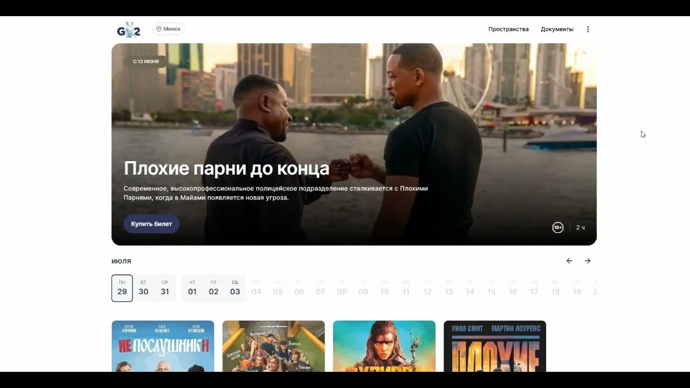
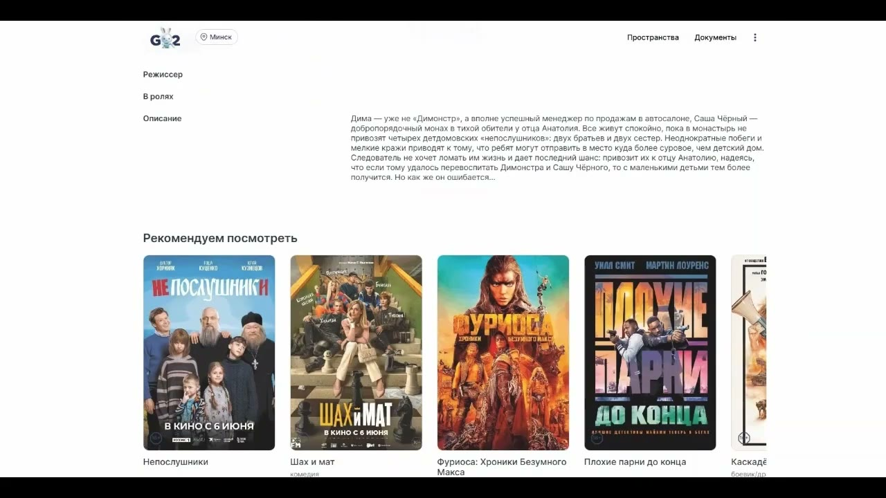
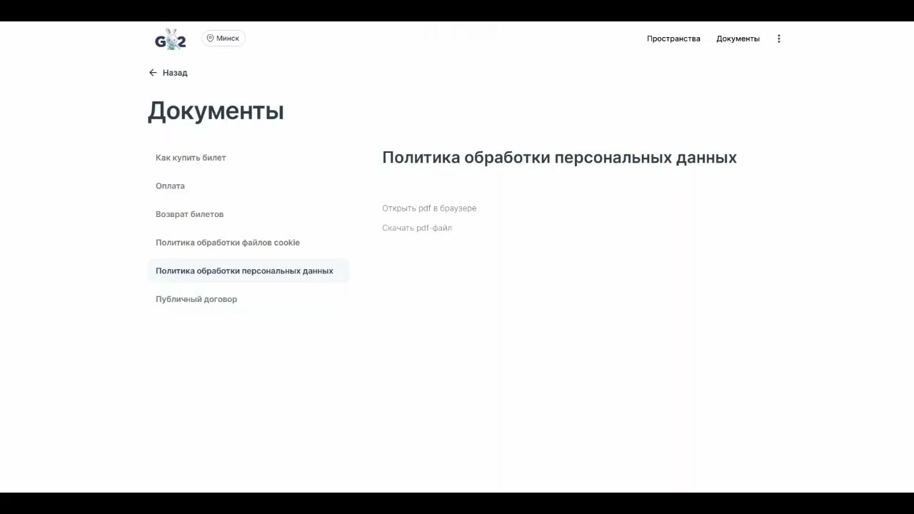
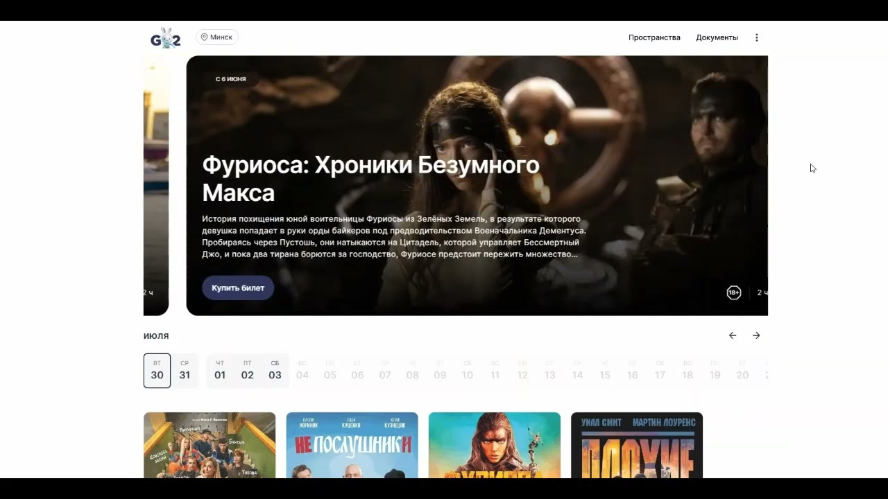
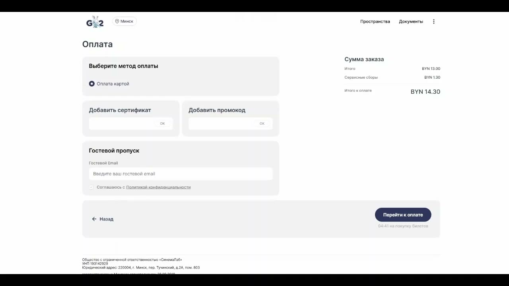
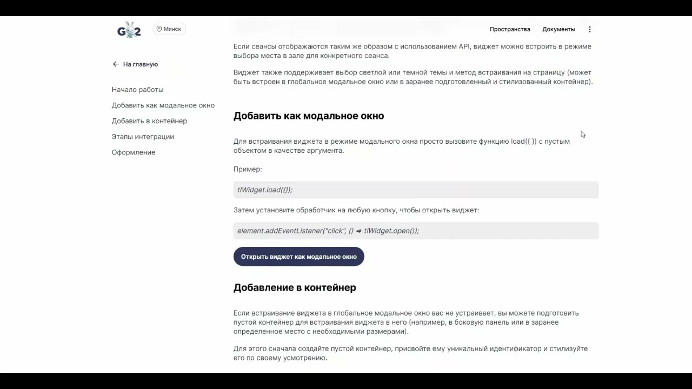
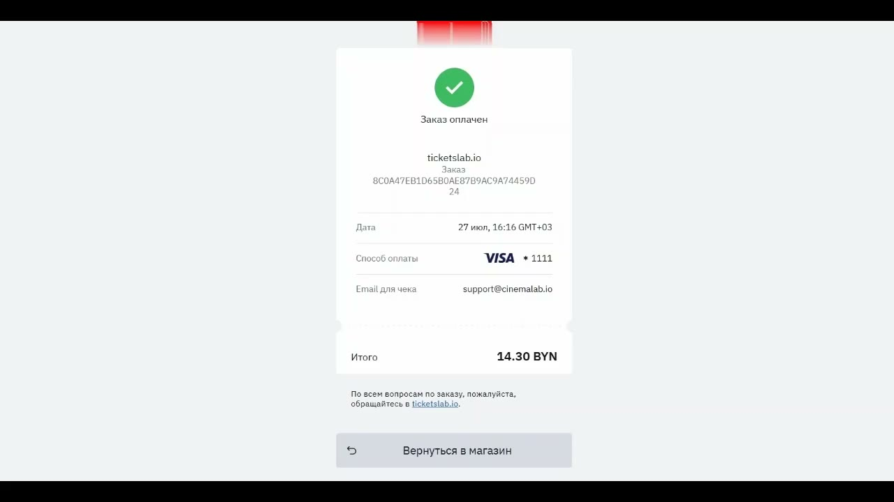
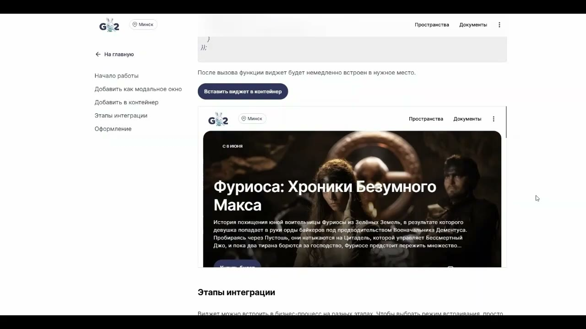
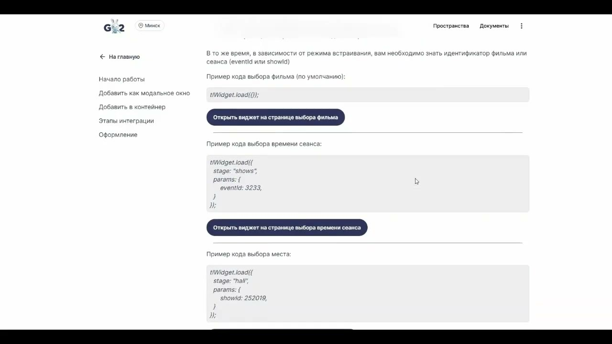
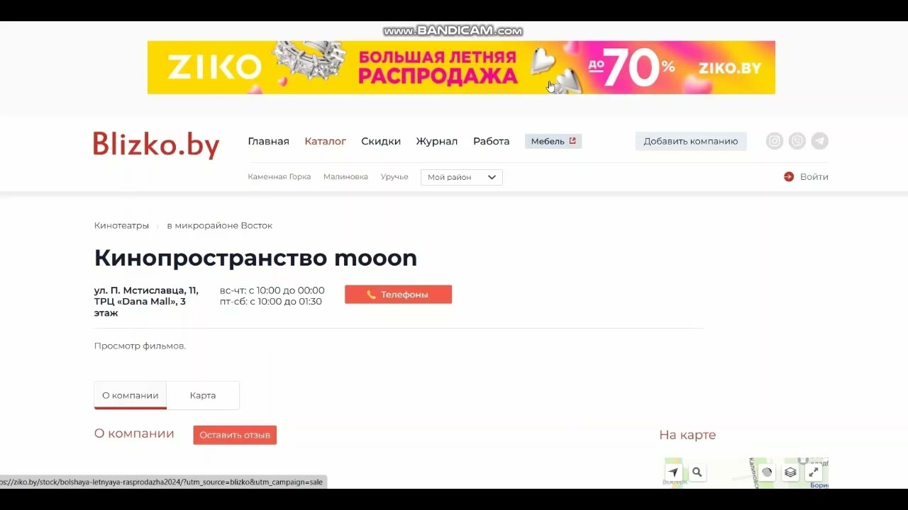

# Принципы работы виджета

Источник: [YouTube — «Описание принципов работы виджета Go2.by»](https://www.youtube.com/watch?v=0PsK5bO-R7U)

## Суть

Виджет — это встроенный интерфейс для покупки билетов на сторонних ресурсах: сайтах партнёров, агрегаторах, мобильных приложениях, порталах торговых центров и других площадках.

Главная идея: пользователь остаётся на площадке партнёра, но внутри встроенного интерфейса проходит сценарий выбора события, сеанса, мест и оплаты.

В видео это объясняется как принцип **«сайт в сайте»** или **«картинка в картинке»**.

## Технологический принцип

Виджет работает как встроенный веб-интерфейс. В видео принцип объясняется через подход iframe: внутрь страницы партнёра встраивается отдельный интерактивный интерфейс.

Это позволяет разместить покупку билетов не только на основном сайте, но и на внешних площадках.

## Основные элементы интерфейса

На главной странице виджета доступны:

- логотип проекта;
- выбор города/местоположения;
- слайдер с анонсами фильмов и событий;
- календарь дат;
- плитки фильмов/событий;
- переход в разделы «Пространства» и «Документы».

## Раздел «Документы»

В разделе документов размещаются справочные и юридические материалы для пользователя:

- помощь и ответы на частые вопросы;
- инструкция «Как купить билет»;
- порядок оплаты;
- порядок возврата билета;
- политика обработки персональных данных;
- договор оферты.

## Страница события

На странице события пользователь видит:

- баннер события;
- краткое описание;
- постер;
- кнопку просмотра трейлера;
- подробную информацию;
- доступные даты;
- список кино-пространств, залов и времени сеансов.

## Выбор мест и оформление покупки

После выбора события, даты, объекта и времени сеанса пользователь переходит к выбору мест в зале.

На оплату выбранного места отводится ограниченное время — в видео указано **5 минут**. После этого выбор места сбрасывается.

## Оплата

Оплата выполняется банковской картой через платёжную систему. Перед переходом к оплате пользователь вводит email и подтверждает согласие с политикой конфиденциальности.

В сценарии также упоминается возможность использовать сертификаты и промокоды, эмитированные сетью кино-пространств.

После успешной оплаты пользователь видит подтверждение заказа, а билеты приходят на email.

## Варианты размещения виджета

### 1. Модальное окно

Партнёр размещает кнопку или другую точку входа, например «Купить билеты». После клика открывается модальное окно, внутри которого пользователь проходит весь сценарий покупки.

### 2. Контейнер на странице

Партнёр выделяет на странице область нужного размера, и виджет постоянно отображается внутри этой области.

## Точки входа в пользовательский сценарий

Партнёр может запускать пользователя в разные места сценария:

1. **Общая афиша** — если партнёр только сообщает о кино-пространстве и предлагает купить билеты.
2. **Конкретное событие** — если партнёр анонсирует фильм, спектакль или другое событие.
3. **Конкретный сеанс** — если на стороне партнёра уже выбрано время сеанса, и пользователь сразу переходит к выбору мест.

## Партнёрские площадки

В видео перечислены типы ресурсов, где может размещаться виджет:

- мобильные приложения и агрегаторы;
- банковские ресурсы;
- афишные ресурсы;
- сайты торговых центров, где размещены кино-пространства;
- развлекательные и новостные порталы;
- туристические порталы и сайты.

Пример размещения на партнёрском ресурсе:

## Важное для поддержки

Вопросы пользователей виджета чаще всего операционные: «что-то не получается», «не работает», «не прошла оплата», «не пришёл билет».

При ответах важно разделять:

- операционную деятельность кино-пространств;
- работу виджета как отдельного канала/интерфейса;
- вопросы оплаты и билетов;
- вопросы партнёрского размещения.

Если данных недостаточно, нужно фиксировать вопрос как gap, а не додумывать ответ.
