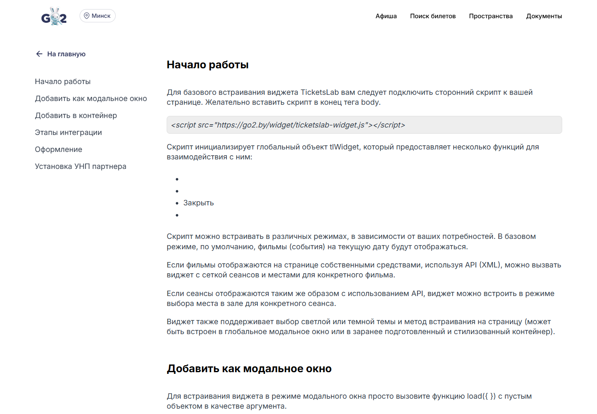
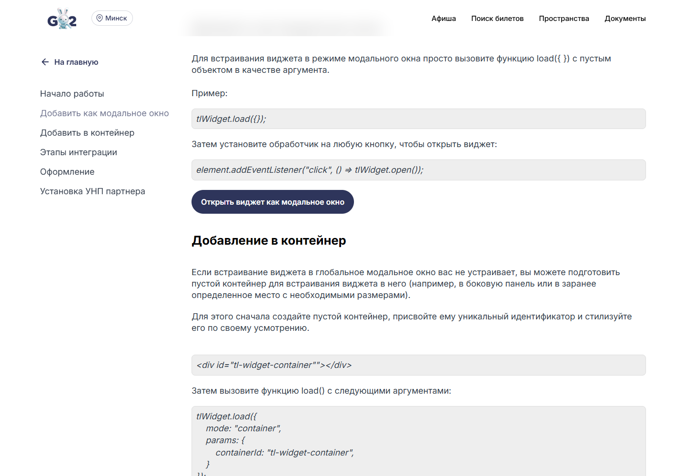
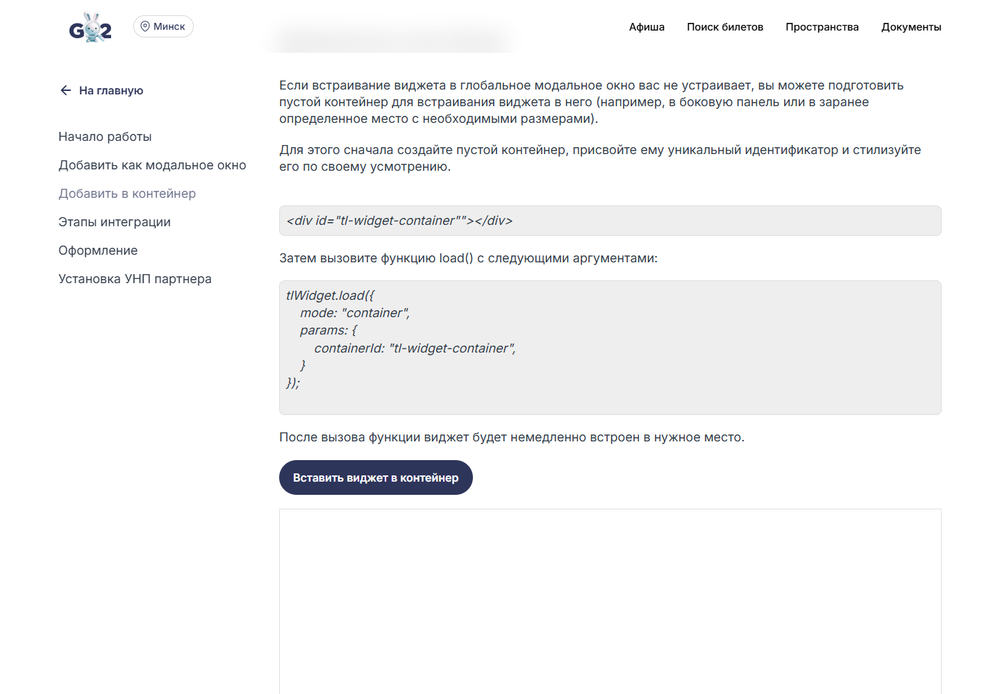
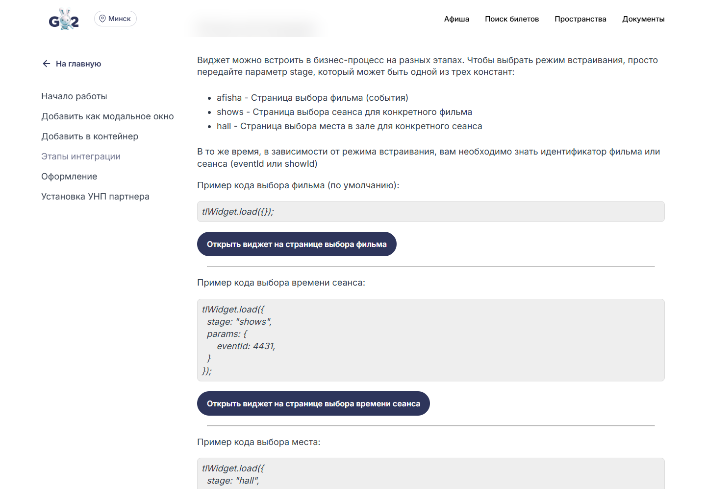
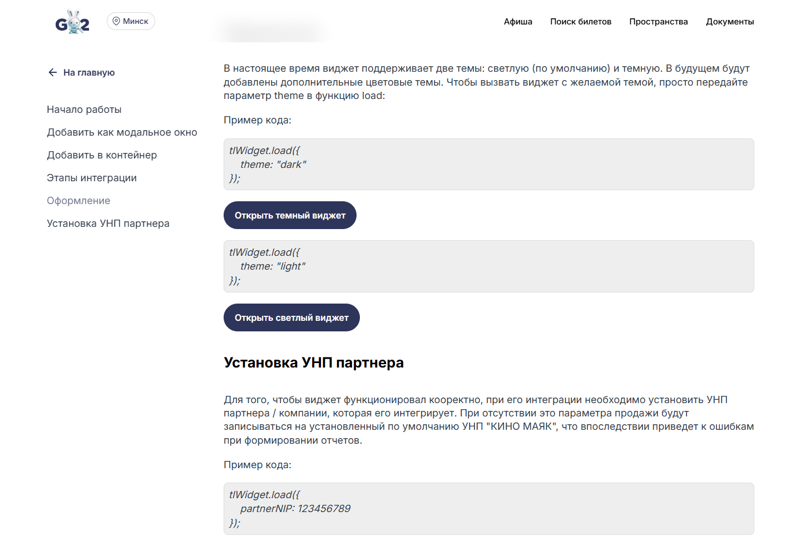

---
title: "Принципы работы виджета"
section: "Билеты и касса"
knowledge_type: "reference"
products:
  - "Widget"
channels:
  - "go2.by"
roles:
  - technical specialist
  - system administrator
  - cash zone administrator
status: draft
high_risk: true
source_refs:
  - "https://go2.by/docs/widget"
  - "https://youtu.be/0PsK5bO-R7U"
updated: 2026-07-26
related:
  - "[Виджет](../Виджет.md)"
  - "[Путь покупки в виджете](Userflow%20покупки%20в%20виджете.md)"
---

# Принципы работы виджета

Виджет Go2Buy — это встраиваемый веб-интерфейс покупки билетов. Он позволяет партнёру продавать билеты mooon и Silver Screen на своей площадке, не реализуя собственный выбор мест и оплату.

## Суть

Виджет работает как отдельный интерфейс внутри чужой страницы. Пользователь видит страницу партнёра, но путь выбора события, сеанса, мест и оплаты проходит через Go2Buy.

В рабочей терминологии проекта:

- `go2.by` — канал `widget`;
- виджет и Go2Buy — одна сущность;
- встраивание нужно для сторонних афиш, сайтов торговых центров, партнёрских сервисов и других внешних контуров.

## Базовое подключение

Партнёр подключает скрипт виджета к своей странице. Рекомендуемое место — конец `body`.

```html
<script src="https://go2.by/widget/ticketslab-widget.js"></script>
```

После подключения доступен объект `tlWidget`.



## Модальное окно

Для открытия виджета в pop-up используется загрузка с пустым объектом и отдельный обработчик на кнопку партнёра.

```js
tlWidget.load({});

element.addEventListener("click", () => tlWidget.open());
```

После клика пользователь остаётся на странице партнёра, а поверх неё открывается окно покупки.



## Контейнер на странице

Если виджет должен быть постоянно виден в определённом месте страницы, партнёр создаёт контейнер и передаёт его идентификатор.

```html
<div id="tl-widget-container"></div>
```

```js
tlWidget.load({
    mode: "container",
    params: {
        containerId: "tl-widget-container",
    }
});
```

После вызова `load()` виджет встраивается в этот блок.



## Этапы запуска сценария

Виджет можно открыть на разных этапах покупки. Для этого используется параметр `stage`.

| `stage` | Что открывается | Что нужно передать |
| --- | --- | --- |
| `afisha` | выбор фильма или события | можно использовать как базовый режим |
| `shows` | выбор сеанса для конкретного события | `eventId` |
| `hall` | выбор места в зале для конкретного сеанса | `showId` |

Примеры:

```js
tlWidget.load({});
```

```js
tlWidget.load({
  stage: "shows",
  params: {
      eventId: 4431,
  }
});
```

```js
tlWidget.load({
  stage: "hall",
  params: {
      showId: 392112,
  }
});
```



## Оформление

Документация Go2Buy фиксирует две темы:

- `light` — светлая тема;
- `dark` — тёмная тема.

```js
tlWidget.load({
    theme: "dark"
});
```

```js
tlWidget.load({
    theme: "light"
});
```



## УНП партнёра

Для корректного учёта продаж при интеграции передаётся УНП партнёра.

```js
tlWidget.load({
    partnerNIP: 123456789
});
```

!!! warning "Важно"
    Если `partnerNIP` не передан, продажи могут записаться на УНП по умолчанию. Это влияет на отчёты и разбор продаж по партнёрам.

## Частые ошибки

- Партнёр открыл общий `go2.by`, хотя нужен переход сразу к залу. Для такого сценария нужен `stage: "hall"` и `showId`.
- Виджет встроен в контейнер без стабильных размеров. Пользователь видит обрезанный интерфейс или не может выбрать места.
- Не передан `partnerNIP`. Продажи сложнее корректно связать с партнёром.
- Поддержка разбирает инцидент без URL. Для диагностики нужен полный адрес с параметрами `showId`, `eventId`, `partnerNIP`, если они есть.

## Связанные страницы

- [Виджет](../Виджет.md)
- [Путь покупки в виджете](Userflow%20покупки%20в%20виджете.md)
- [Возврат билетов](../Продажа%20билетов/Возврат%20билетов.md)
