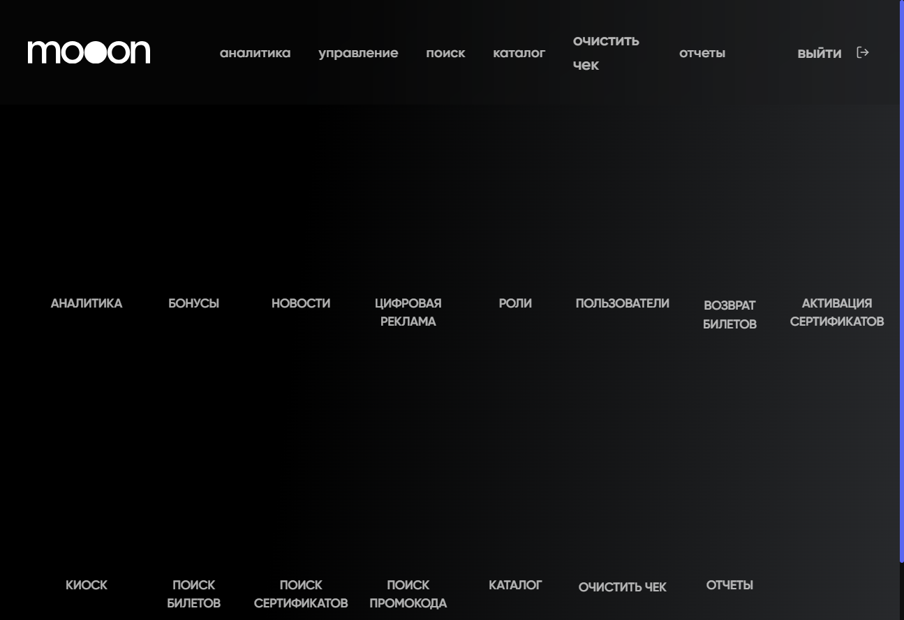

# Портал

`https://portal.mooon.by` — внутренний веб-портал для административных и служебных операций Maverick. Состав доступных разделов и действий зависит от роли сотрудника.

<strong>Для кого</strong>
Сотрудники, которым выдан доступ к Portal.

<strong>Когда применяется</strong>
Когда рабочая задача выполняется в веб-портале.

<strong>Риск</strong>
В Portal есть операции с бонусами, возвратами, сертификатами, чеками, ролями, каталогом, НДС и отчётами.

## Карта Portal

На главной странице доступны разделы:

- `Аналитика`;
- `Бонусы`;
- `Новости`;
- `Цифровая реклама`;
- `Роли`;
- `Пользователи`;
- `Возврат билетов`;
- `Активация сертификатов`;
- `Киоск`;
- `Поиск билетов`;
- `Поиск сертификатов`;
- `Поиск промокода`;
- `Каталог`;
- `Очистить чек`;
- `Отчеты`.

## Рабочие задачи

### Начало работы

- [Открыть Portal и найти раздел](Портал/Запуск%20и%20навигация%20в%20Portal.md)
- [Посмотреть аналитику](Портал/Аналитика%20в%20Portal.md)
- [Сформировать и выгрузить отчёт](Портал/Отчеты%20в%20Portal.md)

### Управление

- [Начислить бонусы](Портал/Бонусы%20в%20Portal.md)
- [Управлять новостями](Портал/Новости%20в%20Portal.md)
- [Проверить роли и разрешения](Портал/Роли%20и%20доступы%20в%20Portal.md)
- [Оформить возврат билета](Продажа%20билетов/Возврат%20билетов.md#portal)
- [Активировать сертификаты](Сертификаты/Активация%20сертификатов%20через%20Portal.md)
- [Обновить баннеры киоска](Портал/Киоск%20в%20Portal.md)

### Поиск и диагностика

- [Найти билет](Портал/Поиск%20билета%20в%20Portal.md)
- [Найти сертификат](Портал/Поиск%20сертификата%20в%20Portal.md)
- [Найти промокод](Портал/Поиск%20промокода%20в%20Portal.md)
- [Очистить чек кассовой зоны](Портал/Очистка%20чека%20в%20Portal.md)

### Справочники и клиентские интерфейсы

- [Найти и проверить данные каталога](Портал/Каталог%20в%20Portal.md)
- [Обновить баннеры киоска](Портал/Киоск%20в%20Portal.md)

## Разделы в разработке

Страницы `Цифровая реклама` и `Пользователи` сейчас показывают сообщение `The page is under development ...`. Подтверждённых рабочих действий на этих страницах нет.

## Связанные разделы

- [Manager / back-office](Manager.md)
- [Сертификаты](Сертификаты.md)
- [Прайсы и налоги](Прайсы%20и%20налоги.md)
- [Киоск](Киоск.md)
