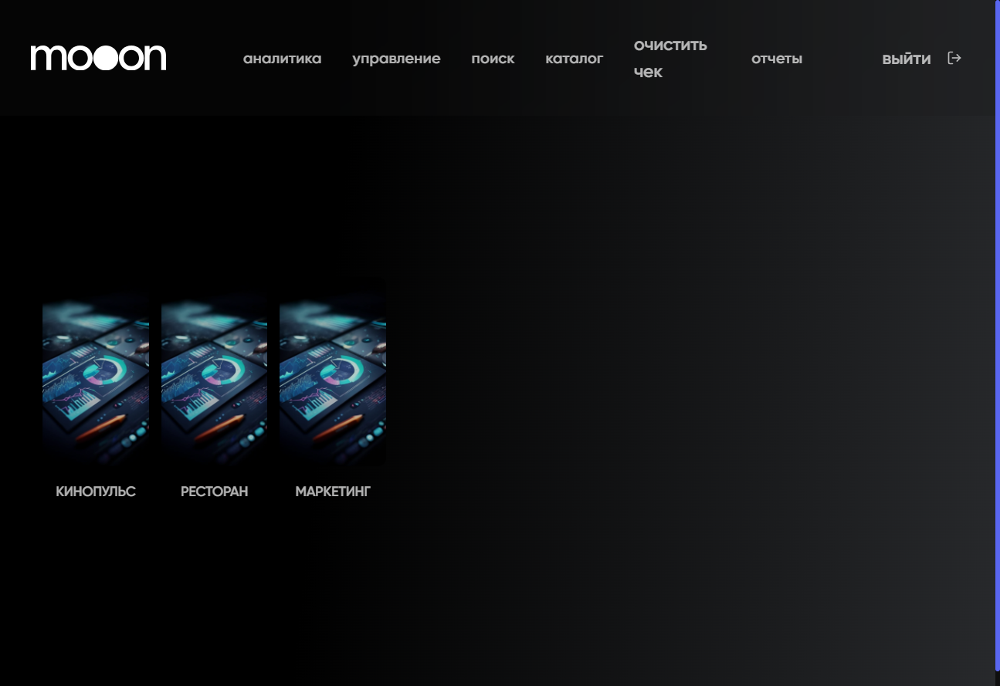

# Просмотр аналитики в Portal

Раздел `Аналитика` содержит три дашборда: `Кинопульс`, `Ресторан`, `Маркетинг`.

## Где находится

Portal → `аналитика`.

## Кинопульс

Доступны:

- выбор месяца;
- быстрые периоды `Вчера`, `Выходные`, `Текущий месяц`;
- `Выручка всего`;
- направления `Билеты`, `Кинобар`, `Ресторан`, `Кафе`, `Услуги`, `Магазин`;
- представления `Метрики`, `Таблица`, `График`;
- переход `Подробнее` из ресторанного блока.

## Ресторан

На дашборде есть выбор месяца и быстрые периоды. В блоке `Ключевые метрики` отображаются:

- общая выручка;
- количество гостей;
- количество чеков;
- средний чек;
- `Разбивка по дням недели`.

## Маркетинг

Доступны периоды `90 дней`, `30 дней`, `7 дней`, а также режимы `Метрики` и `График`.

На экране видны показатели:

- частота посещений;
- разница трат участника программы лояльности;
- количество участников с программой лояльности и без неё;
- средняя выручка на гостя с программой лояльности и без неё;
- распределение выручки и траты участников программы;
- структура посещений и база участников;
- активные, неактивные, потерянные и новые участники;
- скорость использования баллов.

На странице также показана справочная подпись `1 byn = 100 бонусов`.

## Порядок просмотра

1. Открой нужный дашборд.
2. Выбери месяц или быстрый период, если такой элемент доступен.
3. Переключи `Метрики`, `Таблица` или `График`.
4. Проверь название периода перед использованием значений.

## Важно

!!! warning "Показатели требуют бизнес-трактовки"
    Не используй суммы, проценты и показатели программы лояльности как бухгалтерское правило без подтверждения владельца метрики. Дашборд показывает значения, но не формулу их расчёта.

## Связанные страницы

- [Портал](../Портал.md)
- [Отчеты в Portal](Отчеты%20в%20Portal.md)
- [Программы лояльности в Manager](../Manager/Программы%20лояльности%20в%20Manager.md)
