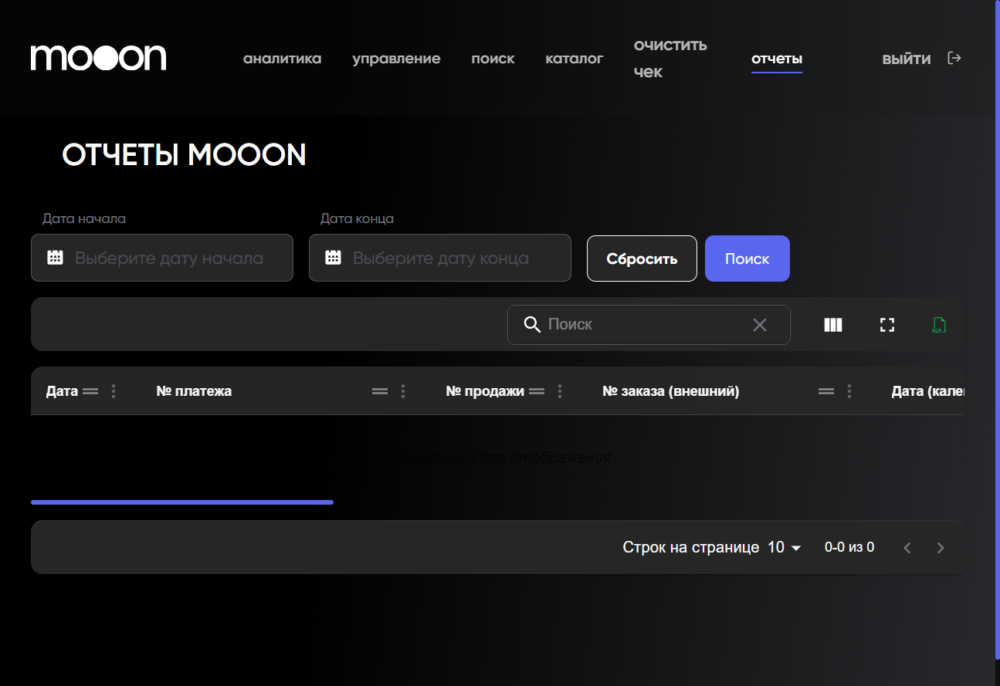

# Аналитика и отчеты в Portal

Portal содержит два разных блока для просмотра данных: `Аналитика` с дашбордами и `Отчеты` с табличными отчётами.

<strong>Для кого</strong>
Сотрудник, который проверяет выручку, посещаемость, операции или сверочные отчёты.

<strong>Когда применяется</strong>
Когда нужно посмотреть показатели или выгрузить табличные данные из Portal.

<strong>Что получится</strong>
Открыт нужный дашборд или отчёт с фильтрами, таблицей и колонками.

## Аналитика

Где находится: Portal → `аналитика`.

В разделе доступны дашборды:

- `Кинопульс`;
- `Ресторан`;
- `Маркетинг`.

### Кинопульс

На дашборде `Кинопульс` доступны:

- выбор месяца;
- быстрые периоды `Вчера`, `Выходные`, `Текущий месяц`;
- блок `Выручка всего`;
- показатели по направлениям `Билеты`, `Кинобар`, `Ресторан`, `Кафе`, `Услуги`, `Магазин`;
- переключатели представления `Метрики`, `Таблица`, `График`;
- кнопка `Подробнее` для отдельных блоков.

### Ресторан

На дашборде `Ресторан` доступны:

- выбор месяца;
- быстрые периоды;
- блок `Ключевые метрики`;
- показатели `Общая выручка`, `Количество гостей`, `Количество чеков`, `Средний чек`;
- таблица `Разбивка по дням недели`.

### Маркетинг

На дашборде `Маркетинг` доступны периоды:

- `90 дней`;
- `30 дней`;
- `7 дней`.

В видимой части дашборда есть блок `Активность > Монетизация`, метрики и график.

## Отчеты

Где находится: Portal → `отчеты`.

В разделе доступны группы:

- `MOOON`;
- `WIDGET`;
- `РЕСТОРАН`;
- `TICKET READER`.

### Отчеты MOOON

На странице `ОТЧЕТЫ MOOON` есть фильтры:

- `Дата начала`;
- `Дата конца`;
- `Сбросить`;
- `Поиск`.

В таблице видны колонки:

- `Дата`;
- `№ платежа`;
- `№ продажи`;
- `№ заказа (внешний)`;
- `Дата (календарная)`;
- `Дата учета`;
- `Организация`;
- `Объект`;
- `Билет`;
- `Продукт`;
- `Комбо`;
- `Сертификат`;
- `Бонус`;
- `BePaid`;
- `Δ (расхождение)`;
- `Норма`.

### Отчеты WIDGET

В таблице `ОТЧЕТЫ WIDGET` видны колонки:

- `№ продажи`;
- `№ платежа`;
- `Дата транзакции`;
- `Дата платежа`;
- `Дата в платежном сервисе`;
- `Совпадение дат`;
- `Тип операции`;
- `Партнер`;
- `Статус`;
- `Сумма (билеты)`;
- `Сумма комиссии`;
- `Сумма оплаты`;
- `Другие оплаты`;
- `Сумма в платежном сервисе`;
- `Норма`.

### Отчеты РЕСТОРАН

В таблице `ОТЧЕТЫ РЕСТОРАН` видны колонки:

- `№ продажи`;
- `Дата транзакции`;
- `Начало продажи`;
- `Завершение продажи`;
- `№ продавца`;
- `Имя продавца`;
- `Касса`;
- `№ чека`;
- `Зона`;
- `Объект`;
- `Организация`;
- `Номер стола`;
- `Количество гостей`;
- `Статус`;
- `Сумма без НДС`;
- `Сумма НДС`;
- `Сумма с НДС`.

### Отчеты TICKET READER

В таблице `ОТЧЕТЫ TICKET READER` видны колонки:

- `№`;
- `Организация`;
- `Название объекта`;
- `Аудитория`;
- `Событие Id`;
- `Событие`;
- `Схема продаж`;
- `Вкл`;
- `Начало`;
- `Конец`;
- `Дата учета`;
- `Количество мест`;
- `Кол-во отсканирвоанных`;
- `Кол-во купленных`.

## Табличные инструменты

На страницах отчётов доступны:

- поиск по таблице;
- показ и скрытие колонок;
- полноэкранный режим;
- выгрузка в XLS;
- выбор количества строк на странице.

## Важно

!!! warning "Отчёты могут использоваться для сверки"
    Не трактуй суммы, расхождения, нормы и налоговые показатели без подтверждённого регламента владельца процесса. В статье зафиксированы видимые поля и назначение экранов, а не бухгалтерские правила расчёта.

## Частые ошибки

- Открывают дашборд `Аналитика`, когда нужна табличная выгрузка из `Отчеты`.
- Смотрят отчёт без дат и получают пустую таблицу.
- Используют выгрузку до проверки набора колонок.

## Связанные страницы

- [Портал](../Портал.md)
- [Отчёты в Manager](../Manager/Отчёты%20в%20Manager.md)
