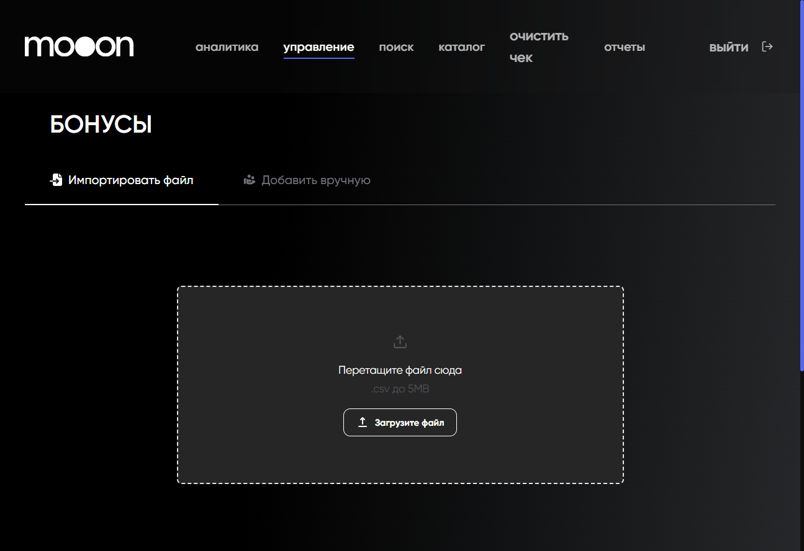

# Начисление бонусов через Portal

Раздел `Бонусы` позволяет подготовить начисление одному гостю вручную или загрузить список начислений.

<strong>Для кого</strong>
Сотрудник с правом начислять бонусы.

<strong>Когда применяется</strong>
Когда есть подтверждённое основание для начисления бонусов.

<strong>Что получится</strong>
Подготовлена операция с email, суммой, периодом действия и комментарием.

## Где находится

Portal → `управление` → `Бонусы`.

## Импорт списка

1. Открой вкладку `Импортировать файл`.
2. Скачай файл по ссылке `Скачать файл шаблона с примером`. Portal отдаёт шаблон в формате `.xlsx`.
3. Открой шаблон в Google Таблицах и заполни данные.
4. Скачай заполненную таблицу в формате `.csv`.
5. Загрузи CSV в Portal. Допустимый размер — до 5 MB.
6. Перед нажатием `Начислить бонусы` проверь файл и основание операции.

Шаблон содержит:

| Поле | Что указывается |
|---|---|
| `Email` | email гостя |
| `Сумма` | сумма бонусов к начислению в белорусских рублях |
| `Дата начала` | дата начала использования |
| `Дата конца` | дата окончания использования |
| `Комментарий` | причина или пояснение |

## Ручное начисление

1. Открой вкладку `Добавить вручную`.
2. Заполни `Email`, `Сумма`, `Дата начала`, `Дата конца`, `Комментарий`.
3. Проверь значения перед нажатием `Начислить бонусы`.

## Важно

!!! warning "Бонусы влияют на расчёты с гостем"
    Не запускай начисление без подтверждённого основания и права на операцию. Ошибка в email, сумме или периоде может изменить баланс не того гостя или создать неверные условия использования.

## Частые ошибки

- Загружают скачанный `.xlsx` напрямую, хотя форма импорта принимает `.csv`.
- Используют собственную таблицу вместо актуального шаблона.
- Путают даты начала и окончания.
- Не проверяют email и сумму перед начислением.

## Связанные страницы

- [Портал](../Портал.md)
- [Проверка ролей и разрешений](Роли%20и%20доступы%20в%20Portal.md)
- [Программы лояльности в Manager](../Manager/Программы%20лояльности%20в%20Manager.md)
