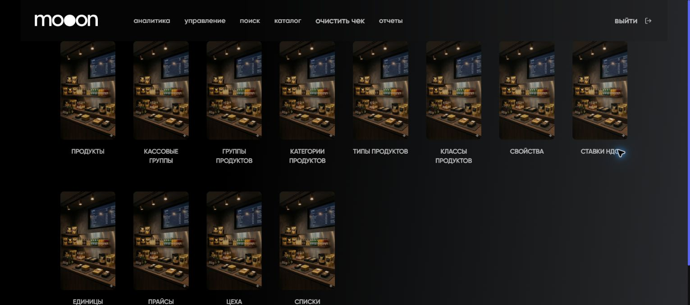

# Поиск и проверка справочников каталога в Portal

`Каталог` объединяет таблицы продуктов и связанных справочников. Статья описывает поиск и видимые поля; правила создания и изменения сущностей требуют отдельного регламента.

## Где находится

Portal → `каталог`.

## Разделы

| Раздел | Основные колонки |
|---|---|
| `Продукты` | объект, имя, признаки активности и видимости, классификация, НДС, вес, маркировка, возраст, доставка |
| `Кассовые группы` | владелец, имя, активный, видимый, публичный, сокращённое наименование, порядок |
| `Группы продуктов` | номер, имя |
| `Категории продуктов` | номер, имя |
| `Типы продуктов` | номер, имя |
| `Классы продуктов` | номер, имя |
| `Свойства` | номер, имя |
| `Ставки НДС` | номер, имя, значение |
| `Единицы измерения` | номер, имя |
| `Прайсы продуктов` | номер, имя, активный, начало и окончание действия |
| `Цеха` | номер, имя |
| `Списки продуктов` | номер, имя |

## Поиск в таблице

1. Открой нужный справочник.
2. Введи запрос в поле `Поиск`.
3. При необходимости открой `Показать/Скрыть колонки`.
4. Проверь найденную строку по нескольким признакам, а не только по имени.
5. Используй `Очистить поиск`, чтобы вернуться к полному списку.

В таблицах также доступны сортировка, действия с колонками, полноэкранный режим, выбор числа строк и постраничная навигация. На страницах есть кнопка `Добавить ...`, но поля форм и правила изменения сущностей пока не подтверждены.

## Колонки продукта

В таблице `ПРОДУКТЫ` видны:

- `№`, `Объект`, `Имя`;
- `Активный`, `Видимый`, `Публичный`;
- `Сокр. наименование`, `Порядок`, `Штрихкод`;
- `Единица измерения`;
- `Тип продуктов`, `Класс продуктов`, `Категория продуктов`, `Группа продуктов`, `Кассовая группы`;
- `Свойство`, `Ставка ндс`, `Цвет`;
- `Весовой`, `Вес тары`;
- `Маркированный`, `Маркированный SI`, `Маркированный UKZ`;
- `Возрастное ограничение`;
- `С доставкой`, `Товар`, `Материал`.

## Важно

!!! warning "Каталог влияет на продажи и учёт"
    Продукты, прайсы, ставки НДС и цеха могут влиять на кассу, киоск, Waiter и отчёты. Наличие кнопки добавления не является разрешением на изменение справочника.

## Частые ошибки

- Ищут только по имени и не проверяют объект или признаки активности.
- Считают скрытую колонку отсутствующим полем.
- Принимают значение в справочнике НДС за налоговый регламент.
- Меняют одну сущность без проверки связанных прайсов и каналов.

## Связанные страницы

- [Портал](../Портал.md)
- [Прайсы и налоги](../Прайсы%20и%20налоги.md)
- [Настройка меню и цехов для Waiter](../Waiter/Настройка%20меню%20и%20цехов%20в%20Manager%20для%20Waiter.md)
- [Таблицы, фильтры и выгрузка в Manager](../Manager/Таблицы%20фильтры%20и%20выгрузка%20в%20Manager.md)
