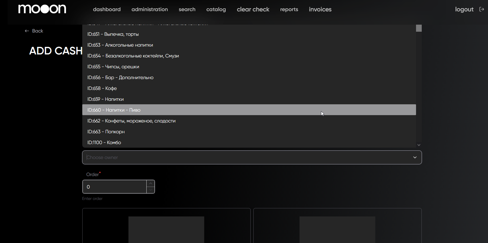

# Каталог в Portal

Здесь управляют товарами: создают карточки, задают их место в кассовом меню, цену, объект продажи и место приготовления. Изменения в каталоге связаны с кассой, Seller и киоском.

## #ДобавитьТоварВКаталог

1. Создайте или проверьте кассовую группу, класс и категорию.
2. В `каталог → Продукты` создайте карточку товара: название, сокращённое название, кассовая группа, класс и категория — обязательны.
3. Привяжите прайс: цена и объект продаж.
4. Если товар готовят через Waiter — укажите цех. Если он участвует в программе лояльности или сертификатах — добавьте в список продуктов.
5. Проверьте активность, видимость, публичность и порядок отображения карточки.

## Как связаны данные

- `Кассовая группа` → место товара в меню на кассе
- `Класс и категория` → классификация товара
- `Прайс + объект` → где и по какой цене продаётся товар
- `Цех` → куда Waiter направляет приготовление
- `Список продуктов` → участие в программах лояльности и сертификатах

## Инструкции

- [Создать, изменить или скопировать товар](Продукты%20в%20Portal.md)
- [Настроить кассовую группу и классификацию](Кассовые%20группы%20и%20классификация%20продуктов%20в%20Portal.md)
- [Назначить цену, объект и ставку НДС](Прайсы%20продуктов%20и%20ставки%20НДС%20в%20Portal.md)
- [Привязать цех и список продуктов](Цеха%20и%20списки%20продуктов%20в%20Portal.md)

!!! danger "Не создавайте кассовую группу внутри неё самой"
    В поле `Choose owner` не выбирайте эту же кассовую группу с тем же ID. Такая связь создаёт циклическую иерархию. Если её уже сохранили, прекратите изменения в каталоге и передайте системному администратору ID группы и выбранного владельца.

