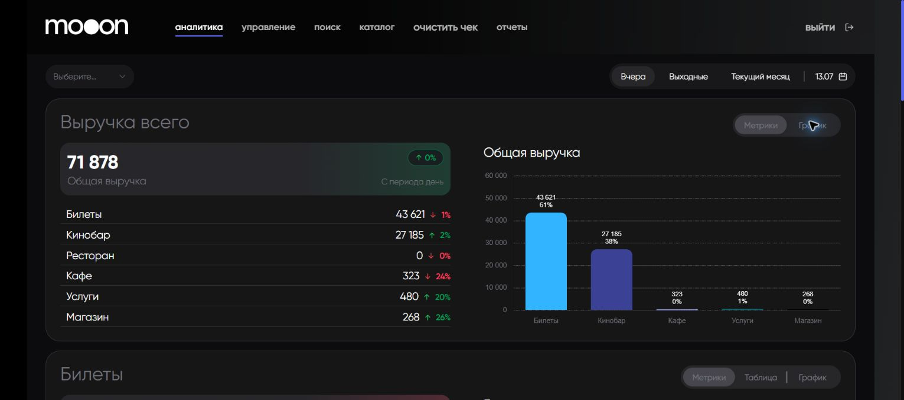
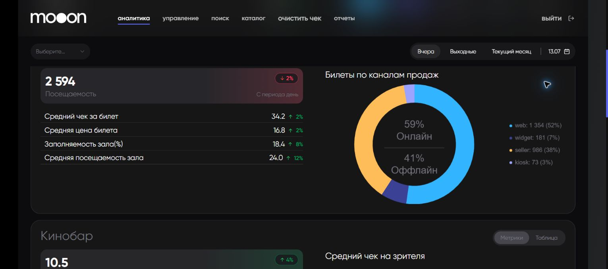
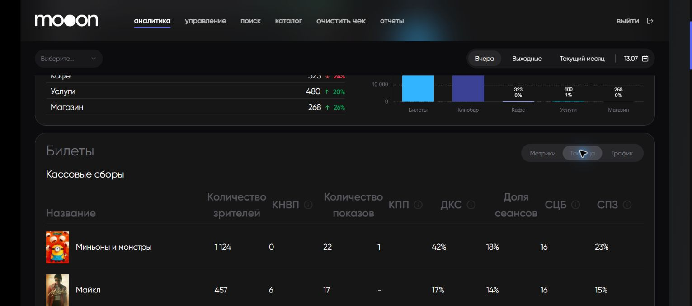
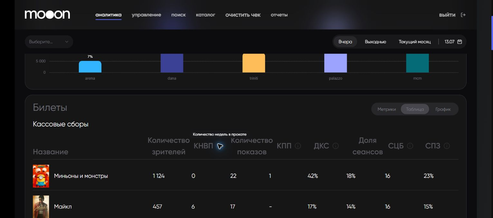
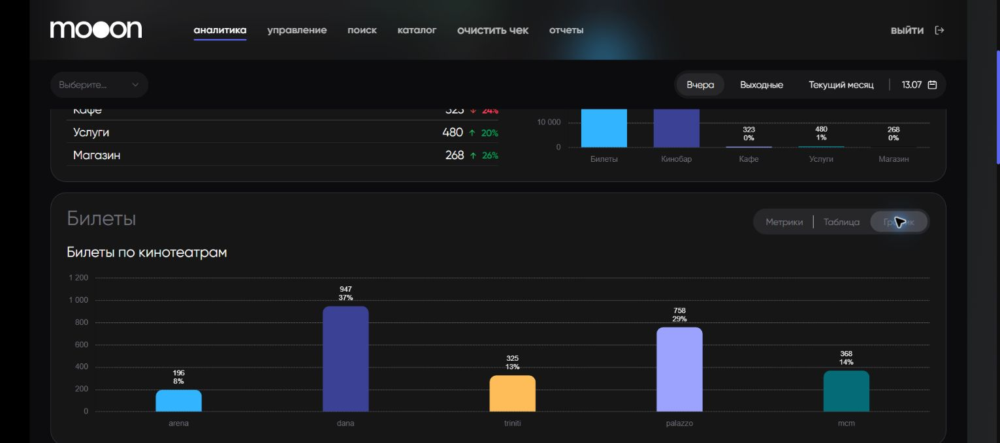
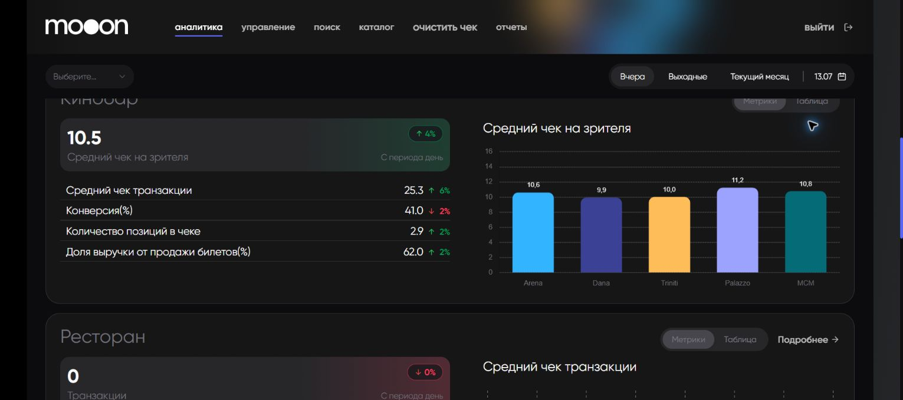
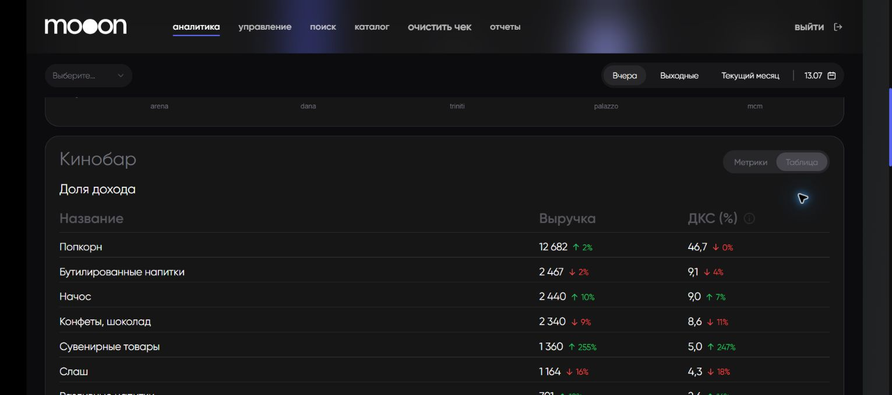
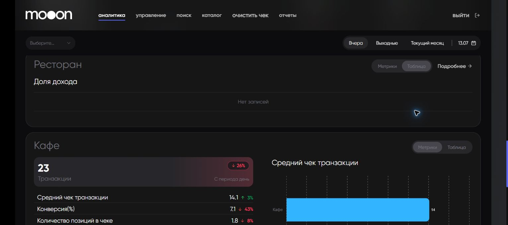
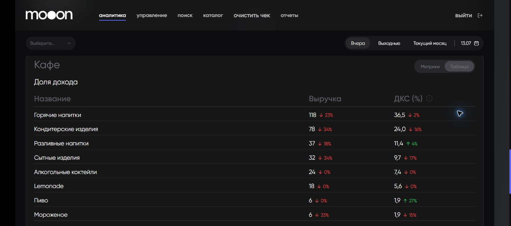
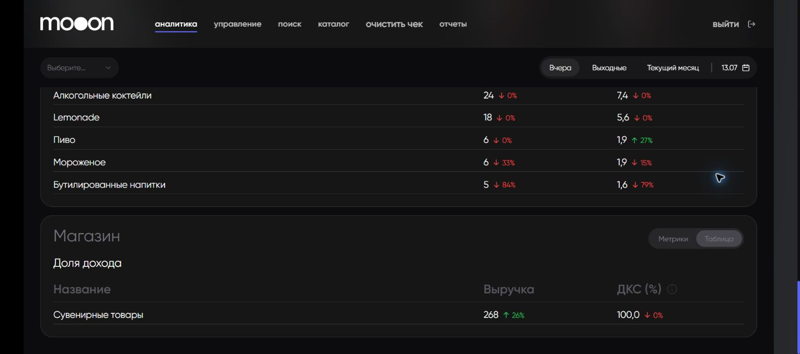

# Кинопульс в Portal

`Кинопульс` сводит показатели кинотеатров, билетов и торговых направлений за один период.

## Период

| Элемент | Что делает |
|---|---|
| Выбор месяца | Загружает календарный месяц из списка. |
| `Вчера` | Показывает предыдущий день. |
| `Выходные` | Показывает ближайший доступный срез выходных. Фактические даты видны справа. |
| `Текущий месяц` | Показывает текущий календарный месяц. |
| Календарь | Открывает произвольный интервал. |
| Подпись даты | Показывает день или границы выбранного интервала. |

## Выручка всего

Главная карточка показывает общую выручку. Строки под ней раскладывают сумму по направлениям: `Билеты`, `Кинобар`, `Ресторан`, `Кафе`, `Услуги`, `Магазин`. Диаграмма справа показывает тот же состав графически.

| Метрика | Что означает в интерфейсе |
|---|---|
| `Общая выручка` | Сумма выручки всех показанных направлений. |
| `Билеты` | Выручка от билетов без возвратов и отмен. |
| `Кинобар` | Выручка от оплаченных продаж снеков и напитков. |
| `Ресторан`, `Кафе`, `Магазин`, `Услуги` | Выручка соответствующего направления. |

## Билеты: Метрики

| Метрика | Подсказка Portal и назначение |
|---|---|
| `Посещаемость` | Количество проданных билетов без возвратов и отмен. |
| `Средний чек за билет` | Карточка среднего чека билетной продажи. В текущей версии её тултип ошибочно совпадает с подсказкой про скидку; точная формула требует подтверждения. |
| `Средняя цена билета` | Выручка от билетов / количество реально проданных билетов. |
| `Заполняемость зала(%)` | Доля занятых мест на сеансах за период; учитываются активные залы и оплаченные билеты. |
| `Средняя посещаемость зала` | Среднее количество зрителей на проведённый сеанс. |
| `Билеты по каналам продаж` | Количество билетов по каналам `web`, `widget`, `seller`, `kiosk`; центр диаграммы объединяет их в `Онлайн` и `Оффлайн`. |

## Билеты: Таблица

`Таблица` показывает кассовые сборы по фильмам. Постер и название помогают идентифицировать фильм; остальные колонки позволяют сравнить прокат и эффективность сеансов.

| Колонка | Полное название | Что показывает |
|---|---|---|
| `Количество зрителей` | — | Проданные билеты без возвратов и отмен. |
| `КНВП` | Количество недель в прокате | Сколько недель фильм находится в прокате. |
| `Количество показов` | — | Число проведённых сеансов фильма. |
| `КПП` | Количество пустых показов | Сеансы без зрителей. |
| `ДКС` | Доля кассовых сборов | Доля фильма в кассовых сборах периода. |
| `Доля сеансов` | — | Доля показов фильма среди всех сеансов периода. |
| `СЦБ` | Средняя цена билета | Средняя цена проданного билета по фильму. |
| `СПЗ` | Средняя посещаемость зала | Среднее число зрителей на показ фильма. |

Значок `i` рядом с сокращением открывает его полное название.

## Билеты: График

`График` заменяет карточки и таблицу диаграммой `Билеты по кинотеатрам`. Для каждого кинотеатра показаны количество билетов и доля от общего числа.

## Кинобар

В режиме `Метрики` доступны:

| Метрика | Что показывает |
|---|---|
| `Средний чек на зрителя` | Выручка еды и напитков / количество зрителей с билетами. |
| `Средний чек транзакции` | Средняя сумма одной оплаченной продажи направления. |
| `Конверсия(%)` | Доля зрителей, совершивших покупку направления. Точная формула в Portal не раскрыта. |
| `Количество позиций в чеке` | Среднее количество товарных позиций в транзакции. |
| `Доля выручки от продажи билетов(%)` | Подпись интерфейса; связь показателя с билетной выручкой требует подтверждения. |

В режиме `Таблица` блок `Доля дохода` показывает товарные категории, их `Выручку` и `ДКС (%)`. Значок `i` раскрывает `ДКС` как `Доля кассовых сборов`.

## Ресторан, Кафе и Магазин

У трёх блоков одинаковая структура: `Транзакции`, `Средний чек транзакции`, `Конверсия(%)`, `Количество позиций в чеке`, `Доля выручки от продажи билетов(%)`, а также режим `Таблица` с категориями, выручкой и `ДКС (%)`.

- `Подробнее` в блоке `Ресторан` открывает отдельный ресторанный дашборд.
- `Нет записей` означает, что для выбранного периода в табличном срезе нет строк. Это не ошибка загрузки.
- В таблице кафе и магазина проценты возле значений показывают изменение относительно сравнительного периода.

## Известное расхождение подсказок

!!! warning "Не все тултипы соответствуют карточкам"
    В текущей версии одинаковая подсказка про сумму скидки назначена нескольким несвязанным показателям, включая `Средний чек за билет`, `Количество позиций в чеке` и `Услуги`. Не используй этот текст как формулу этих метрик.

## Связанные страницы

- [Аналитика в Portal](Аналитика%20в%20Portal.md)
- [Ресторанная аналитика в Portal](Ресторанная%20аналитика%20в%20Portal.md)
- [Отчеты в Portal](Отчеты%20в%20Portal.md)

