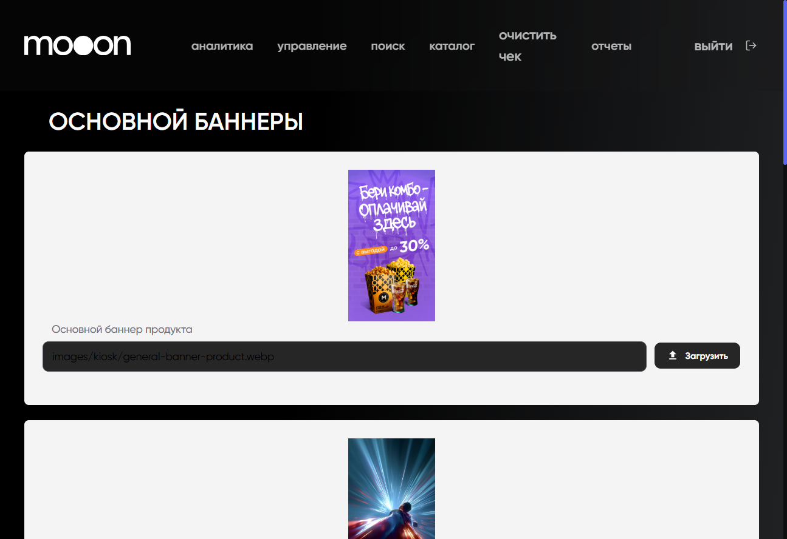

# Киоск в Portal

Раздел `Киоск` используется для настройки изображений и баннеров, которые относятся к интерфейсу киоска.

<strong>Для кого</strong>
Технический специалист или сотрудник, отвечающий за визуальные материалы киоска.

<strong>Когда применяется</strong>
Когда нужно проверить или обновить ссылки и файлы баннеров для киоска.

<strong>Что получится</strong>
Загружены или подготовлены изображения для нужного типа баннера.

## Где находится

Portal → `управление` → `Киоск`.

## Какие поля есть

На странице `ОСНОВНОЙ БАННЕРЫ` видны поля:

| Поле | Что настраивается |
|---|---|
| `Основной баннер продукта` | ссылка или файл основного баннера продукта |
| `Основной баннер билет` | ссылка или файл основного баннера билета |
| `Основное изображение комбо` | ссылка или файл изображения комбо |
| `Основной баннер комбо` | ссылка или файл баннера комбо |
| `Стандартный баннер продукта` | ссылка или файл стандартного баннера продукта |
| `Стандартный баннер фильма` | ссылка или файл стандартного баннера фильма |

Для каждого поля доступно:

- текстовое поле с подсказкой `Добавьте ссылку на картинку`;
- загрузка файла;
- кнопка `Загрузить`.

## Проверка результата

Перед загрузкой проверь:

- к какому типу баннера относится изображение;
- что ссылка ведёт на нужную картинку;
- что файл выбран для правильного поля;
- что изменение согласовано с владельцем киоска или контента.

## Важно

!!! warning "Изображения влияют на клиентский интерфейс"
    Ошибка в баннере может отобразиться на киоске. Не загружай изображение без проверки назначения поля и актуальности материала.

## Частые ошибки

- Загружают изображение комбо в поле баннера продукта.
- Указывают ссылку на картинку, которая недоступна для киоска.
- Меняют стандартное изображение вместо конкретного баннера.

## Связанные страницы

- [Портал](../Портал.md)
- [Киоск](../Киоск.md)
