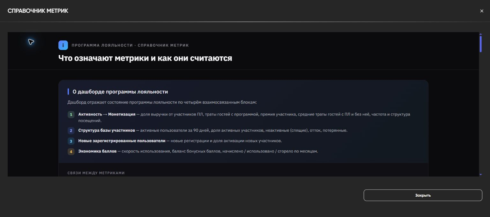
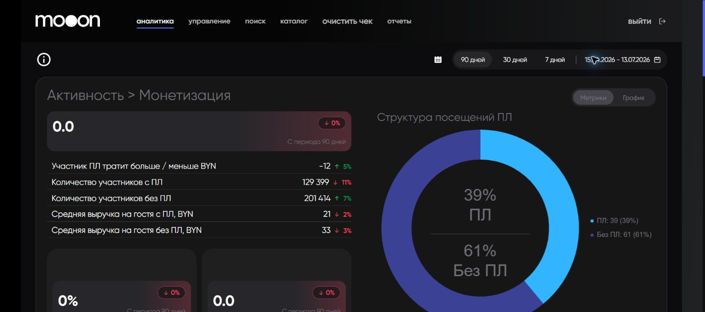
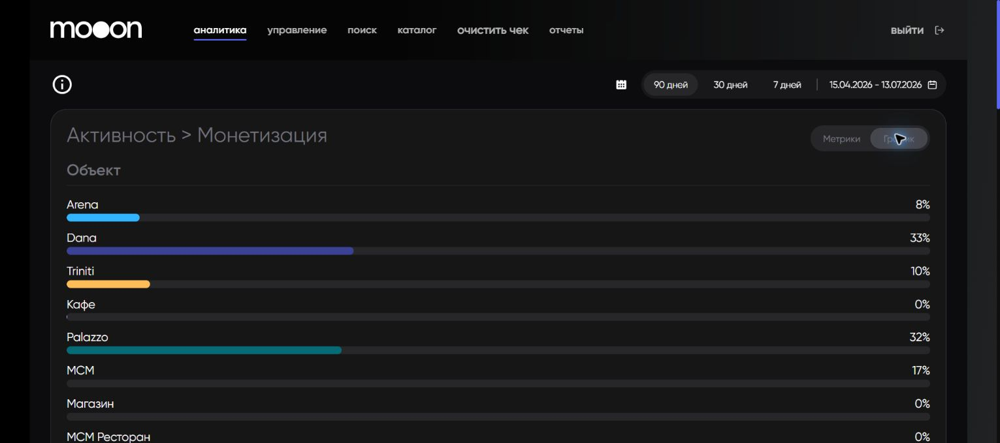
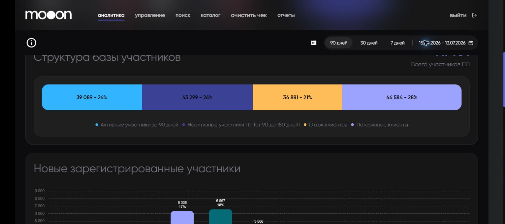
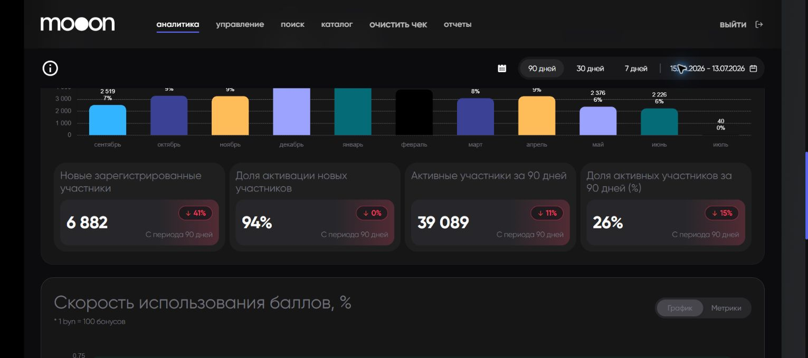
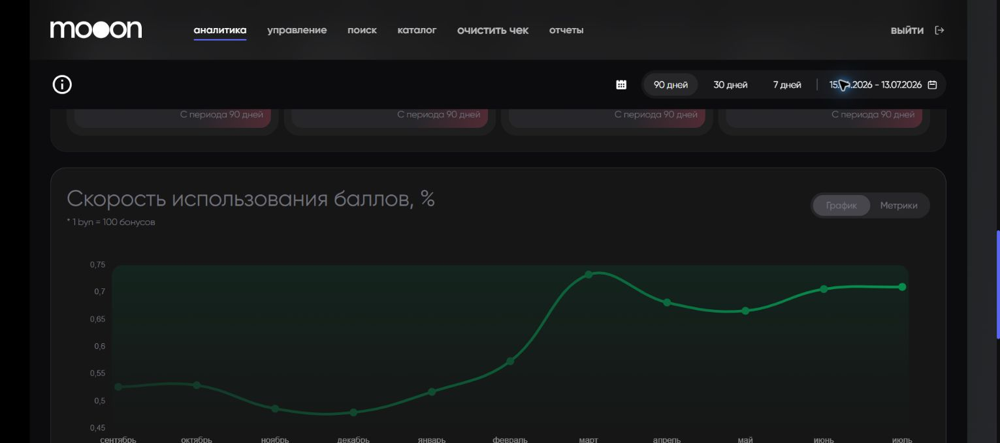
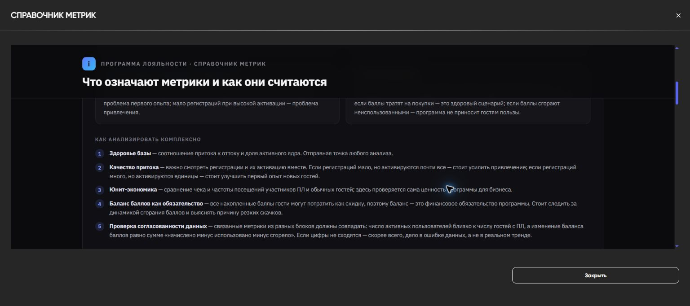

# Маркетинговая аналитика в Portal

Дашборд `Маркетинг` описывает программу лояльности по четырём связанным блокам: монетизация, структура базы, новые регистрации и экономика баллов.

## Период и справочник

| Элемент | Что делает |
|---|---|
| `90 дней`, `30 дней`, `7 дней` | Переключает быстрый период всего дашборда. |
| Значок календаря | Открывает произвольный интервал. |
| Строка дат | Показывает фактические границы периода. |
| Значок `i` слева | Открывает `Справочник метрик` с формулами, назначением и правилами совместного анализа. |

## Активность и монетизация

Режим `Метрики` показывает показатели программы и структуру посещений. `График` показывает распределение по объектам.

| Метрика | Что показывает | Формула справочника |
|---|---|---|
| `Распределение выручки по программе лояльности (%)` | Доля общей выручки, которую дают участники ПЛ. | Выручка участников ПЛ / общая выручка × 100% |
| `Средние траты на одного посетителя` | Сколько один гость оставляет за визит: билет и кинобар. | (Билеты + Кинобар) / Admission |
| `Средняя выручка на гостя с ПЛ` | Средние траты участника ПЛ. | Выручка ПЛ / Admission ПЛ |
| `Средняя выручка на гостя без ПЛ` | Средние траты гостя без ПЛ. | (Общая выручка − выручка ПЛ) / (общий Admission − Admission ПЛ) |
| `Участник ПЛ тратит больше / меньше BYN` | Абсолютная премия участника ПЛ. Отрицательное значение означает, что наблюдаемая сумма ниже. | Loyalty SPH − Non-Loyalty SPH |
| `Премия участника ПЛ, %` | Относительная разница трат. | (Loyalty SPH − Non-Loyalty SPH) / Non-Loyalty SPH × 100% |
| `Количество участников с ПЛ` и `без ПЛ` | Размеры сравниваемых групп гостей за период. | Используются для доли ПЛ в трафике. |
| `Доля участников ПЛ в трафике` | Охват программы среди посетителей. | Admission ПЛ / общий Admission × 100% |
| `Частота посещений` | Сколько визитов в среднем приходится на участника ПЛ за период. | Визиты участников ПЛ / участники ПЛ за период |

`Admission` в справочнике означает количество проданных билетов или посещений.

!!! info "Почему траты ПЛ нельзя сравнивать напрямую"
    Наблюдаемый чек участника ПЛ уменьшают скидки и оплата баллами, а в ПЛ чаще состоят постоянные посетители. Для оценки ценности программы справочник рекомендует сравнивать валовой чек до бонусов, выручку на гостя за период и инкрементальную выручку за вычетом стоимости скидок и списанных баллов.

## Структура базы участников

Сегменты образуют жизненный цикл: `Активные` → `Неактивные` → `Отток` → `Потерянные`.

| Сегмент или метрика | Определение справочника |
|---|---|
| `Всего участников ПЛ` | Общая база программы лояльности. |
| `Активные участники за 90 дней` | Уникальные участники минимум с одним целевым действием за 90 дней: покупка билета, бара или использование бонусов. |
| `Доля активных участников за 90 дней (%)` | Активные за 90 дней / общая база ПЛ × 100%. |
| `Неактивные участники ПЛ (от 90 до 180 дней)` | Последняя активность была 90–180 дней назад. |
| `Отток клиентов` | Нет активности 180–360 дней. |
| `Потерянные клиенты` | Нет активности более 360 дней. |

Справочник считает долю активных ниже 20% признаком слабой активности базы, а долю неактивных выше 30% — тревожным сигналом. Эти пороги используются как аналитические ориентиры, не как бухгалтерские правила.

## Новые зарегистрированные участники

| Метрика | Что показывает | Формула |
|---|---|---|
| `Новые зарегистрированные участники` | Все новые регистрации за период; это регистрации, не покупки. | Сумма новых регистраций |
| `Доля активации новых участников` | Доля новых участников, совершивших первую покупку в заданный срок. | Новые участники с первой покупкой / все новые регистрации × 100% |
| `Активные участники за 90 дней` | Размер активного ядра. | Уникальные пользователи с целевой активностью за 90 дней |
| `Доля активных участников за 90 дней (%)` | Доля активного ядра в общей базе. | Активные / общая база × 100% |

Много регистраций при низкой активации указывает на проблему первого опыта. Мало регистраций при высокой активации указывает на проблему привлечения.

## Экономика баллов

Подпись дашборда: `1 BYN = 100 бонусов`.

| Метрика | Что показывает | Формула |
|---|---|---|
| `Скорость использования баллов, %` / `Burn Rate` | Как быстро участники списывают накопленные баллы. | Списано за период / баланс на начало периода × 100% |
| `Баланс бонусных баллов` | Сумма доступных к списанию баллов всех участников на текущую дату. | Сумма балансов участников |
| `Начислено` | Баллы, начисленные в месяце. | Значение месячного среза |
| `Использовано` | Баллы, списанные на покупки в месяце. | Значение месячного среза |
| `Сгорело` | Баллы, срок которых завершился без использования. | Значение месячного среза |

`График` показывает динамику скорости использования. `Метрики` переключает блок на карточки месячных значений. Низкий баланс может означать активное использование, а высокий — накопление и возможные ограничения списания. Причину нужно проверять по `Использовано` и `Сгорело`.

## Как сопоставлять метрики

1. Начни со здоровья базы: доля активного ядра и соотношение притока к оттоку.
2. Смотри регистрации только вместе с долей активации.
3. Сравнивай траты ПЛ и без ПЛ вместе с частотой посещений и списанием баллов.
4. Рассматривай баланс баллов как обязательство: накопленные баллы могут быть использованы как скидка.
5. Проверяй согласованность: активные пользователи должны быть сопоставимы с гостями ПЛ, а изменение баланса — с `начислено − использовано − сгорело`.

## Красные флаги справочника

- Резко упали регистрации: сначала проверь канал привлечения и выгрузку данных.
- Участники ПЛ тратят меньше: сначала проверь долю оплаты баллами и валовой чек до бонусов.
- Резко выросло сгорание: проверь массовое истечение срока, изменение правил и переход гостей в неактивные сегменты.
- Растут неактивные и отток при слабом притоке: база стареет.
- Связанные показатели не сходятся: сначала ищи ошибку данных, а не бизнес-тренд.

## Связанные страницы

- [Аналитика в Portal](Аналитика%20в%20Portal.md)
- [Бонусы в Portal](Бонусы%20в%20Portal.md)
- [Программы лояльности в Manager](../Manager/Программы%20лояльности%20в%20Manager.md)

