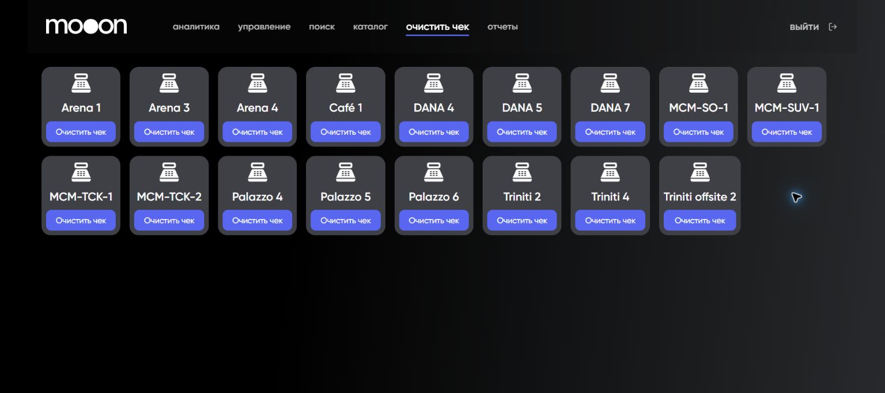

# Очистка чека кассовой зоны в Portal

Экран `Очистить чек` показывает кассовые зоны и отдельную кнопку очистки для каждой зоны.

## Где находится

Portal → `очистить чек`.

Состав карточек зависит от текущей конфигурации кассовых зон и может меняться. Перед действием нужно сверить точное название зоны.

Каждая строка состоит из названия кассовой зоны и собственной кнопки `Очистить чек`. На странице нет общего выбора или дополнительного подтверждения до первого нажатия, поэтому особенно важно проверить строку.

## Порядок проверки

1. Открой `Очистить чек`.
2. Найди карточку нужной кассовой зоны.
3. Сверь зону с обращением или инцидентом.
4. Не нажимай `Очистить чек`, пока не подтверждены причина, допустимость операции и способ проверки результата.

## Важно

!!! danger "Служебная операция"
    Кнопка может изменить состояние активного чека кассовой зоны. Точный эффект, допустимые случаи и восстановление после ошибки не подтверждены.

## Связанные страницы

- [Портал](../Портал.md)
- [Поиск билета в Portal](Поиск%20билета%20в%20Portal.md)
- [Базовая работа в Seller Web](../Seller/Базовая%20работа%20в%20Seller%20Web.md)
