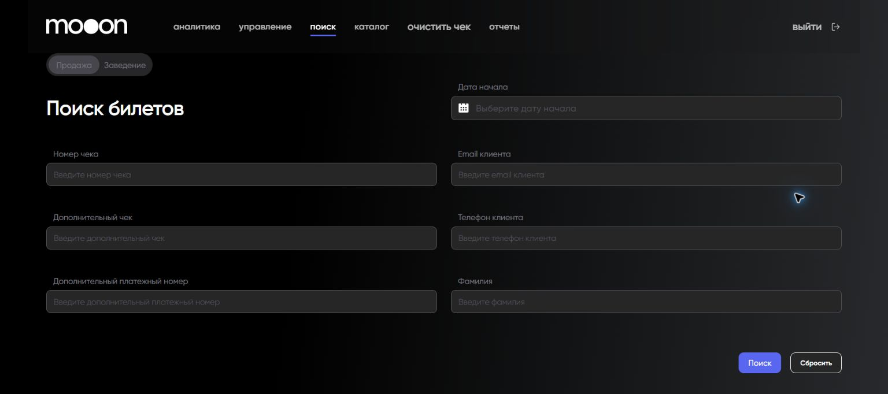
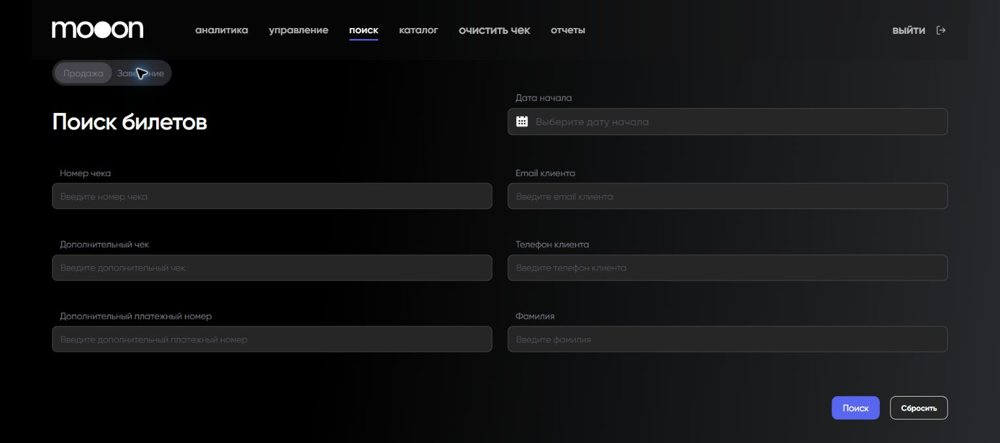

# Поиск билета в Portal

Экран `Поиск билетов` помогает найти продажу по данным чека или клиента.

## Где находится

Portal → `поиск` → `Поиск билетов`.

## Режим `Продажа`

Поля поиска продажи:

- `Дата начала`;
- `Номер чека`;
- `Email клиента`;
- `Дополнительный чек`;
- `Телефон клиента`;
- `Дополнительный платежный номер`;
- `Фамилия`.

## Режим `Заведение`

Режим ищет билет по параметрам показа и места:

| Поле | Что выбирается |
|---|---|
| `Дата сеанса` | Календарная дата показа. |
| `Заведение` | Кинотеатр или площадка. |
| `Зал` | Зал выбранного заведения. |
| `Событие` | Фильм или другое событие. |
| `Время показа` | Сеанс выбранного события. |
| `Ряд` | Ряд в схеме зала. |
| `Место` | Место в выбранном ряду. |

Зависимые списки заполняются последовательно: выбор заведения ограничивает залы, а выбор события и времени — доступные ряды и места.

## Порядок поиска

1. Выбери `Продажа`, если известны реквизиты продажи или клиента; `Заведение` — если известны сеанс и место.
2. Заполни известные поля.
3. Нажми `Поиск`.
4. Для нового запроса используй `Сбросить`.

## Важно

!!! warning "Форма использует персональные и платёжные идентификаторы"
    Используй только те данные, которые нужны для рабочей задачи. Не переноси email, телефон и платёжные номера в открытые заметки или переписку.

Состав результата поиска и доступные действия требуют подтверждения. Не делай вывод о статусе продажи только по одной найденной строке.

## Связанные страницы

- [Портал](../Портал.md)
- [Возврат билетов](../Продажа%20билетов/Возврат%20билетов.md)
- [Отчеты в Portal](Отчеты%20в%20Portal.md)
