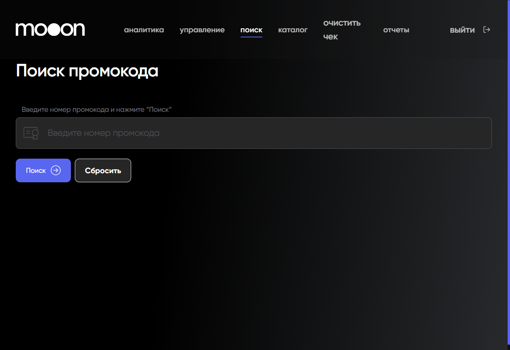

# Поиск промокода в Portal

Экран `Поиск промокода` используется для поиска по номеру промокода.

## Где находится

Portal → `поиск` → `Поиск промокода`.

## Порядок поиска

1. Введи код в поле `Введите номер промокода`.
2. Нажми `Поиск`.
3. Для нового запроса используй `Сбросить`.

## Важно

!!! warning "Промокод может влиять на стоимость покупки"
    Результат поиска не подтверждает правила применения, срок действия или возможность восстановления промокода. Эти условия проверяются по регламенту конкретной программы.

Состав результата и доступные действия после поиска пока не подтверждены.

## Связанные страницы

- [Портал](../Портал.md)
- [Программы лояльности в Manager](../Manager/Программы%20лояльности%20в%20Manager.md)
- [Афиша и покупка билета](../Сайт%20mooon.by/Афиша%20и%20покупка%20билета.md)
