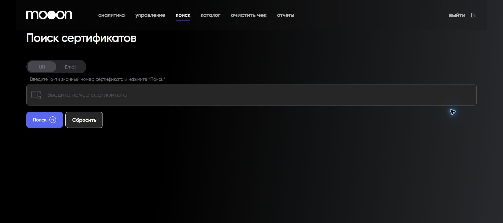
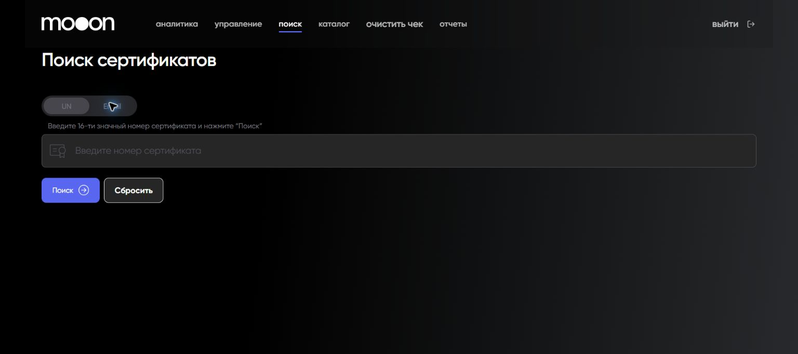

# Поиск сертификата в Portal

Экран `Поиск сертификатов` позволяет искать сертификат по режиму `UN` или `Email`.

## Где находится

Portal → `поиск` → `Поиск сертификатов`.

## Порядок поиска

1. Выбери `UN` или `Email`.
2. Введи значение в поле поиска.
3. Нажми `Поиск`.
4. Для очистки формы используй `Сбросить`.

В режиме `UN` интерфейс показывает подсказку: `Введите 16-ти значный номер сертификата и нажмите “Поиск”`.

В режиме `Email` появляется поле `Email покупателя` с подсказкой `Введите правильный email`.

`Поиск` отправляет запрос в выбранном режиме. `Сбросить` очищает введённое значение и результат предыдущего запроса.

## Важно

!!! warning "Сертификаты связаны с деньгами и персональными данными"
    Не меняй состояние сертификата по результату поиска без подтверждённого регламента. При поиске по email не передавай адрес в открытые каналы.

В Portal одновременно используется название режима `UN` и подсказка про 16-значный номер сертификата. До подтверждения владельца процесса не считай эти понятия взаимозаменяемыми.

## Связанные страницы

- [Портал](../Портал.md)
- [Проверка и разбор проблем с сертификатами](../Сертификаты/Проверка%20и%20разбор%20проблем%20с%20сертификатами.md)
- [Активация сертификатов через Portal](../Сертификаты/Активация%20сертификатов%20через%20Portal.md)
