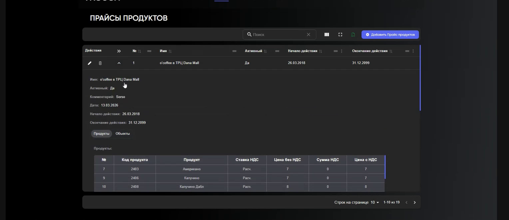

# Прайсы продуктов и ставки НДС в Portal

Прайс связывает товар с ценой и объектом продаж.

Portal → `каталог` → `Прайсы продуктов` или `Ставки НДС`.

## Настроить прайс

1. Откройте существующий прайс или нажмите **«Добавить прайс продуктов»**.
2. Укажите период действия и нужные поля карточки.
3. На вкладке `Продукты` добавьте товар, ставку НДС и цену.
4. На вкладке `Объекты` привяжите объект продаж.
5. Сначала сохраните строку товара, затем карточку прайса.

Товар можно добавить из карточки прайса или из карточки товара. После сохранения связь видна в обеих карточках.

!!! warning "Цены и НДС"
    Не меняйте цену, ставку НДС или период действия прайса без подтверждённого права и основания: это влияет на продажи и учёт.

[← Каталог в Portal](Каталог%20в%20Portal.md)
