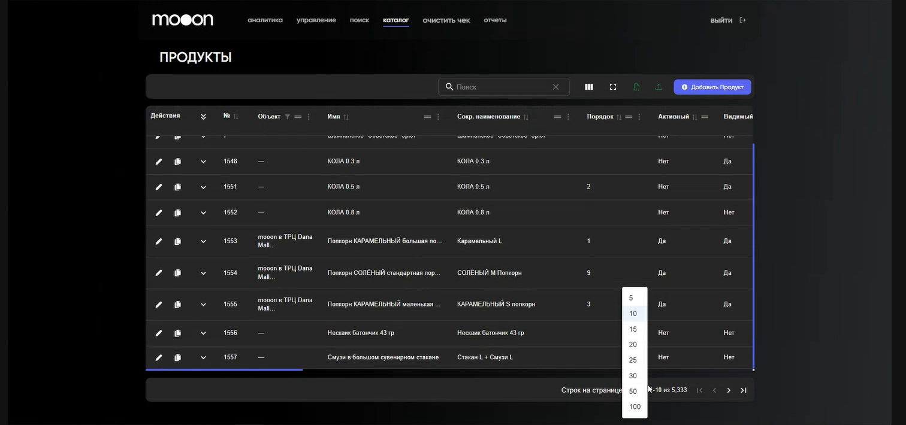
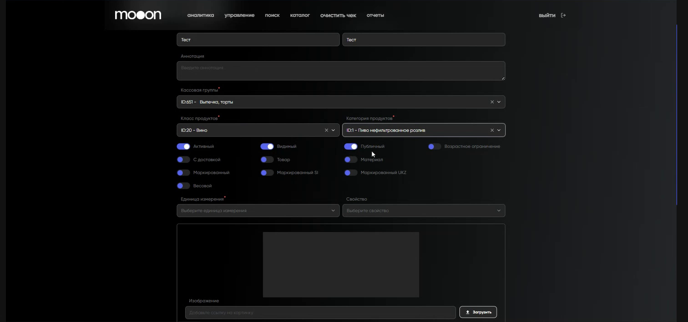

# Работа с продуктами в Portal

Для сотрудников, которым разрешено менять каталог продуктов.

> **#ДобавитьТоварВКаталог:** создайте карточку товара здесь, затем назначьте ему прайс и объект, а при необходимости — цех и список продуктов.

Portal → `каталог` → `Продукты`.

## Найти продукт

- Введите название или номер в поле поиска.
- При необходимости отфильтруйте по объекту или отсортируйте строки.
- Колонки можно перемещать, закреплять слева или справа и скрывать. Эти настройки сохраняются только у текущего пользователя.
- Таблицу можно выгрузить в Excel; для массового создания доступна загрузка заполненного шаблона.

## Создать или изменить карточку

1. Нажмите **«Добавить продукт»** либо карандаш в строке продукта.
2. Заполните обязательные поля: название, сокращённое название, кассовая группа, класс и категория продукта.
3. Проверьте признаки `Активный`, `Видимый` и `Публичный`.
4. Если это требуется для товара, укажите `Весовой товар`, возрастное ограничение, единицу измерения и свойство.
5. Для отображения в киоске можно загрузить изображение. В карточке также доступны цвет и порядок отображения товара в пределах кассовой группы.
6. Добавьте нужные связи: штрихкод, цех, список продуктов, ставку НДС и прайс.
7. В строке прайса укажите цену с НДС, ставку НДС и прайс, затем сохраните строку и саму карточку продукта.

`Цех` определяет место приготовления в Waiter; список продуктов используется в программах лояльности и сертификатах; прайс связывает продукт с ценой и объектом продаж.

## Что изменится после сохранения

Каталог Portal связан с продажами. Изменения цены, признаков доступности, порядка или других параметров товара могут отразиться на кассе, в Seller и киоске после обновления рабочих интерфейсов.

Перед сохранением сопоставьте кассовую группу, прайс, объект, активность и видимость с нужным каналом продаж.

## Скопировать продукт

Выберите копирование в строке исходного продукта. В новой карточке уже заполнены обязательные поля — проверьте их, измените отличающиеся значения и сохраните.

!!! warning "Проверьте влияние на продажи"
    Карточка продукта влияет на связанные каналы продаж. Не меняйте цену, объект, активность, видимость или порядок отображения без проверки нужного сценария.

[← Каталог в Portal](Каталог%20в%20Portal.md)
