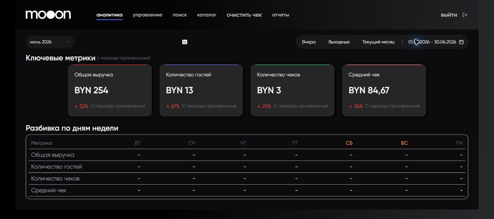

# Ресторанная аналитика в Portal

Дашборд `Ресторан` показывает ключевые показатели ресторанных продаж и их распределение по дням недели.

## Элементы периода

- Выбор месяца загружает календарный месяц.
- `Вчера`, `Выходные`, `Текущий месяц` задают быстрый период.
- Календарь открывает произвольный интервал.
- Строка дат показывает фактический интервал.
- `с периода ...` и подписи на карточках указывают сравнительный период.

## Ключевые метрики

| Метрика | Что показывает | Единица |
|---|---|---|
| `Общая выручка` | Выручка ресторана за выбранный период. | BYN |
| `Количество гостей` | Число гостей, учтённых в ресторанных продажах. | человек, не BYN |
| `Количество чеков` | Число чеков за период. | чеки, не BYN |
| `Средний чек` | Средняя сумма чека. | BYN |

Зелёная или красная карточка и процент показывают изменение относительно периода сравнения.

## Разбивка по дням недели

Таблица повторяет четыре ключевые метрики по колонкам `ПН`–`ВС`. Прочерк означает, что Portal не вывел значение для соответствующего дня.

## Известные расхождения интерфейса

!!! warning "Ошибочная единица у счётчиков"
    Portal добавляет `BYN` к карточкам `Количество гостей` и `Количество чеков`. По смыслу названий это количественные показатели, а не денежные суммы.

!!! warning "Итог и дневная разбивка могут не сходиться"
    За проверенный период верхние карточки содержали ненулевые значения, а все ячейки разбивки по дням недели показывали прочерки. Не восстанавливай дневные значения из итогов и не считай прочерк нулём без проверки данных.

## Связанные страницы

- [Аналитика в Portal](Аналитика%20в%20Portal.md)
- [Кинопульс в Portal](Кинопульс%20в%20Portal.md)
- [Отчеты в Portal](Отчеты%20в%20Portal.md)

