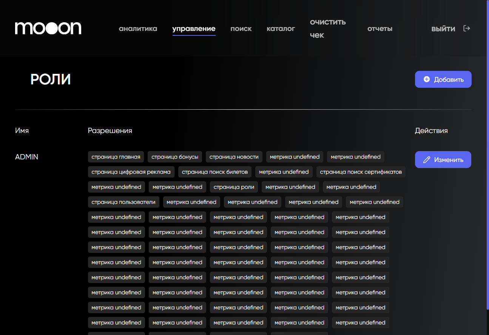

# Проверка ролей и разрешений в Portal

Раздел `Роли` показывает роли Portal, выданные им разрешения и доступные действия.

## Где находится

Portal → `управление` → `Роли`.

## Что есть на странице

Таблица содержит колонки:

- `Имя`;
- `Разрешения`;
- `Действия`.

Также доступны `Добавить` и `Изменить`.

В строке роли видны разрешения уровня страницы, например:

- `страница главная`;
- `страница бонусы`;
- `страница новости`;
- `страница цифровая реклама`;
- `страница поиск билетов`;
- `страница поиск сертификатов`;
- `страница роли`;
- `страница пользователи`.

## Как проверить роль

1. Найди роль по имени.
2. Просмотри весь список разрешений.
3. Сопоставь разрешения с рабочими задачами сотрудника.
4. Не переходи к изменению без подтверждённого запроса и перечня нужных доступов.

В текущем интерфейсе часть разрешений отображается как `метрика undefined`. Эти значения нельзя использовать для определения доступа: их назначение не подписано.

## Пользователи

Страница `Пользователи` сейчас показывает `The page is under development ...`. Подтверждённых действий с пользователями в Portal нет.

## Важно

!!! warning "Роль определяет доступ к служебным операциям"
    Ошибка в разрешениях может открыть лишние функции или закрыть сотруднику рабочий раздел. Формы добавления и изменения роли не используются без утверждённой матрицы доступов.

## Связанные страницы

- [Портал](../Портал.md)
- [Запуск и навигация в Portal](Запуск%20и%20навигация%20в%20Portal.md)
