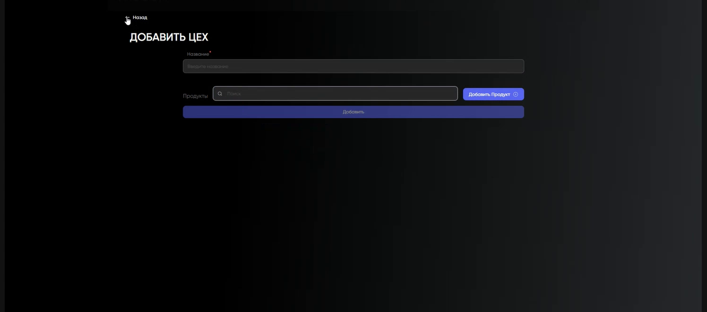
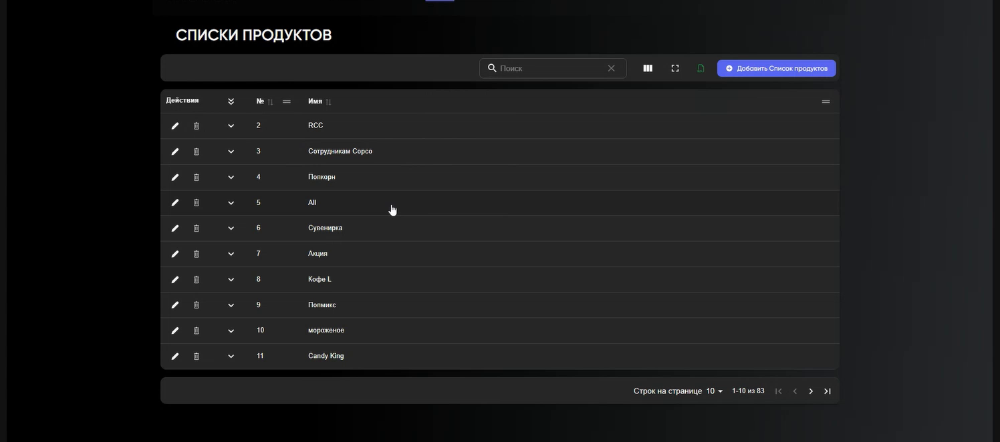

# Цеха и списки продуктов в Portal

Цех указывает место приготовления товара в Waiter. Списки продуктов используются в программах лояльности и сертификатах.

Portal → `каталог` → `Цеха` или `Списки продуктов`.

## Цех

1. Создайте или откройте цех.
2. Укажите название и добавьте товары.
3. Сохраните карточку.

Связь товара и цеха можно создать из любой из двух карточек. В развернутой строке цеха видны связанные товары.

## Список продуктов

1. Создайте или откройте список.
2. Укажите название, добавьте товары и сохраните.

Товар можно добавить из карточки списка или карточки товара.

!!! warning "Проверьте связанные сценарии"
    Изменение цеха влияет на приготовление в Waiter, а изменение списка — на программы лояльности и сертификаты.

[← Каталог в Portal](Каталог%20в%20Portal.md)
