# Базовая работа в Seller Web

## Суть

Seller Web — кассовое приложение для продажи билетов, товаров, комбо и сертификатов. В базовом сценарии кассир выбирает сеанс, места, проверяет корзину, применяет доступные скидки или сертификаты и проводит оплату.

## Когда применяется

- продажа билетов на сеанс;
- продажа товаров магазина;
- продажа комбо;
- продажа подарочных сертификатов;
- применение промокодов, ручных скидок и клиентских данных;
- поиск чека и выполнение служебных операций через панель администратора.

## Кто выполняет

- кассир;
- администратор кассовой зоны — для служебных действий, возвратов, смены, отчётов и операций с кассой.

## Основные элементы верхней панели

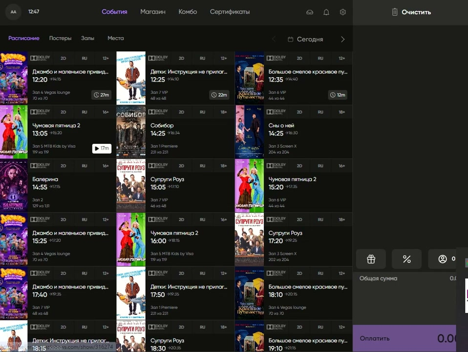

На верхней панели доступны:

- кнопка с инициалами пользователя — выход из программы;
- текущее время;
- кнопка денежного ящика — открытие кассового ящика из программы;
- уведомления — системные сообщения программы;
- настройки.

## Основные разделы Seller Web

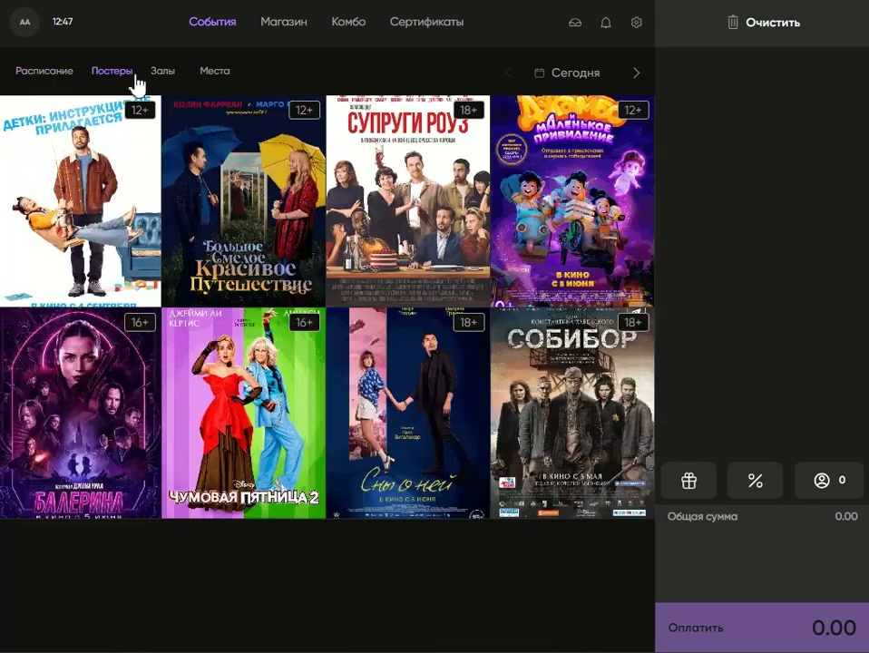

В Seller Web используются разделы:

- **События** — выбор фильма, сеанса и мест для продажи билетов;
- **Магазин** — продажа товаров, например попкорна, напитков и сувениров;
- **Комбо** — готовые наборы товаров, которые удобно продавать одним кликом;
- **Сертификаты** — продажа подарочных карт.

Настройка комбо выполняется в Manager. См. [Комбо в Manager и Seller Web](../Manager/Комбо%20в%20Manager%20и%20Seller%20Web.md).

В разделе **События** есть подменю:

- Расписание;
- Постеры;
- Залы;
- Места.

## Выбор сеанса

### Через расписание

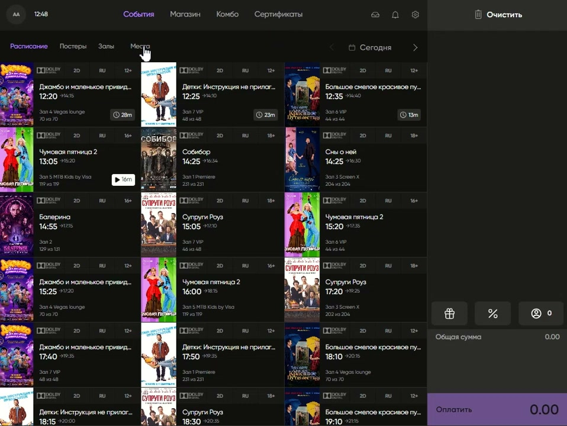

Во вкладке **Расписание** отображаются фильмы и сеансы по времени. Это основной рабочий режим кассира:

1. Открыть «События» → «Расписание».
2. Выбрать фильм.
3. Выбрать время сеанса.
4. Перейти к схеме зала.

### Через постеры

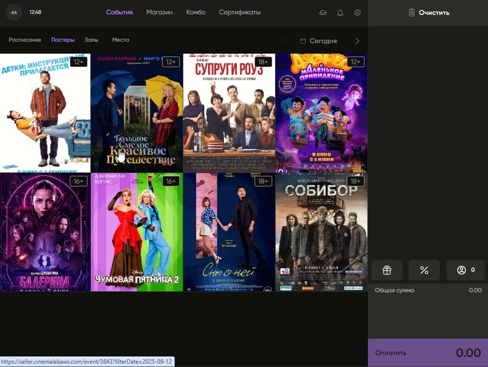

Во вкладке **Постеры** фильм выбирается по афише:

1. Выбрать постер фильма.
2. Выбрать время сеанса.
3. Перейти дальше к покупке билетов.

### Через залы

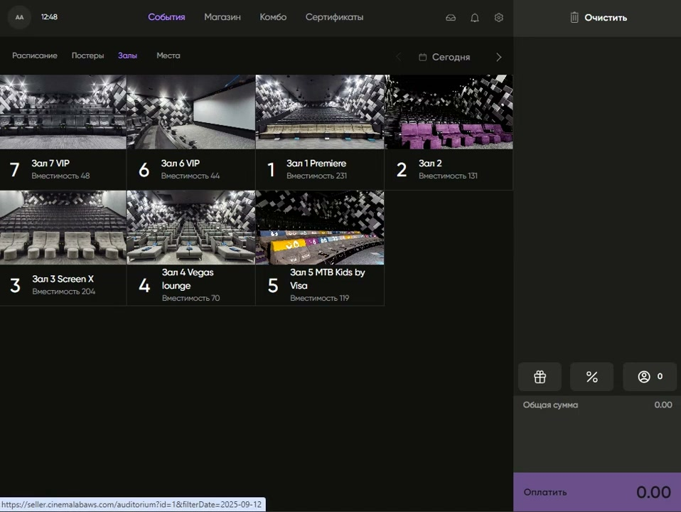

Во вкладке **Залы** сначала выбирается зал. После этого открываются фильмы и сеансы, доступные в выбранном зале.

### Через места

Во вкладке **Места** можно сразу перейти к схеме зала и выбрать свободные места напрямую.

## Работа со схемой зала

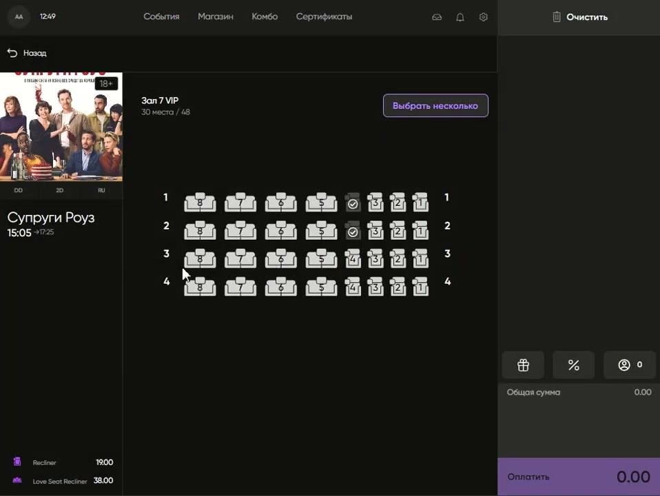

На схеме зала отображаются:

- название фильма;
- время сеанса;
- зал;
- количество мест;
- сколько мест свободно и сколько всего;
- свободные и занятые места.

Правила выбора мест:

- клик по свободному месту добавляет его в заказ;
- повторный клик снимает выбор;
- если нужно отметить несколько мест подряд, включается режим множественного выбора;
- если нажать на занятое место, программа показывает данные о покупке.

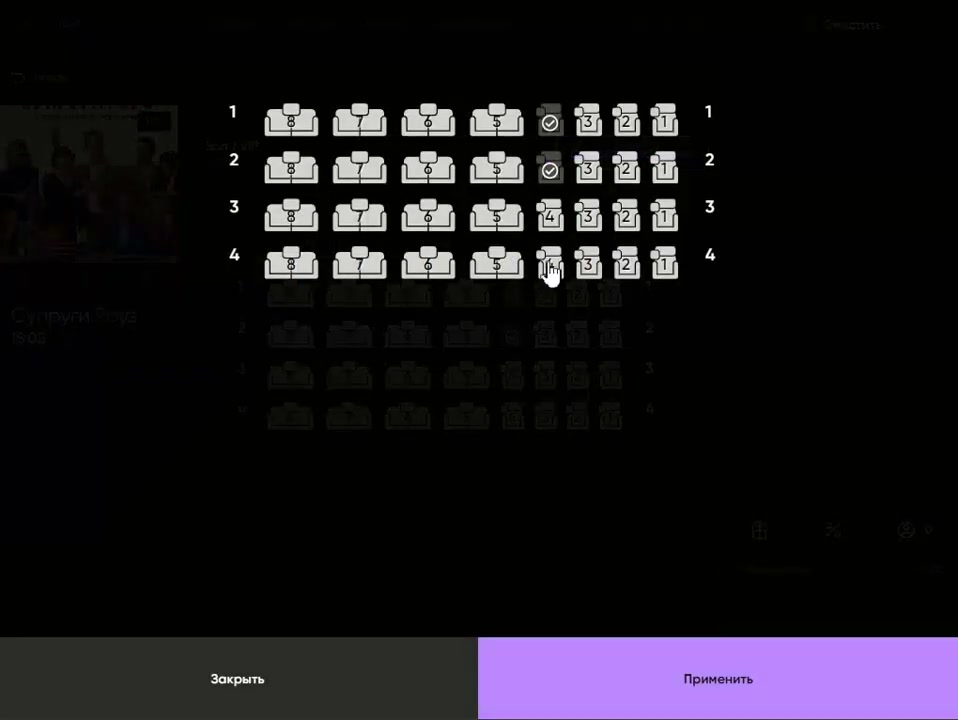

Функция просмотра данных по занятому месту используется для поиска билета и проверки покупки.

## Корзина заказа

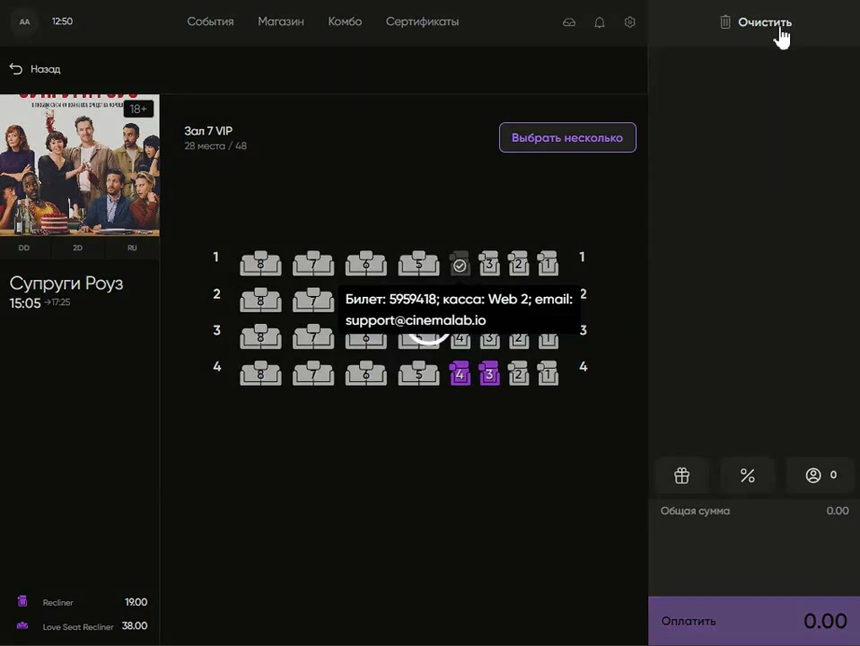

Все выбранные билеты отображаются в корзине. В корзине видно:

- ряд;
- место;
- цена;
- итоговая сумма заказа.

Если нужно начать заказ заново, используется кнопка **Очистить**. Она удаляет выбранные билеты и товары из корзины.

## Скидки, промокоды и клиент

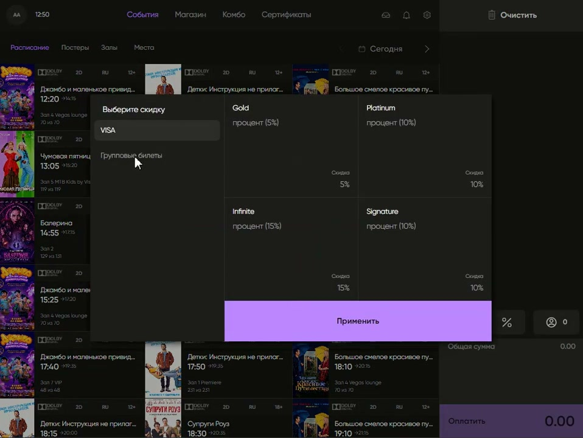

В корзине доступны дополнительные действия:

- кнопка с подарком — ввод промокода;
- кнопка с процентом — ручные скидки на кассе;
- кнопка с человеком — данные клиента, бонусы и история покупок.

Перед оплатой кассир должен проверить состав заказа и итоговую сумму.

## Оплата

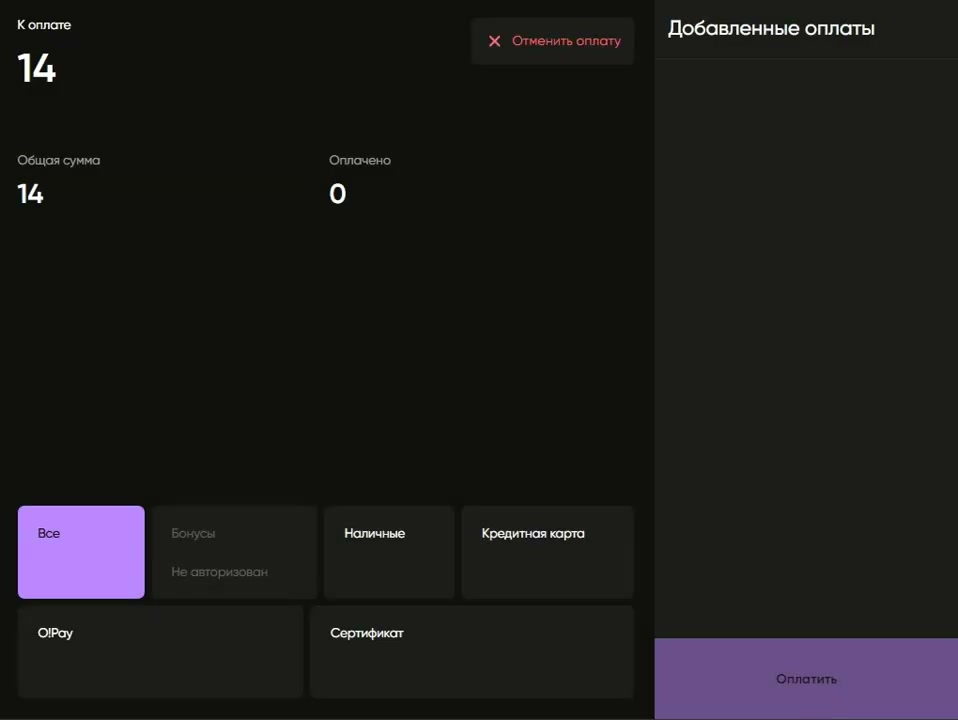

После проверки заказа кассир нажимает **Оплатить**. Открывается страница оплаты.

Доступные способы оплаты в базовом сценарии:

- наличные;
- банковская карта;
- сертификат.

После подтверждения оплаты программа печатает банковский чек и билеты.

## Панель администратора

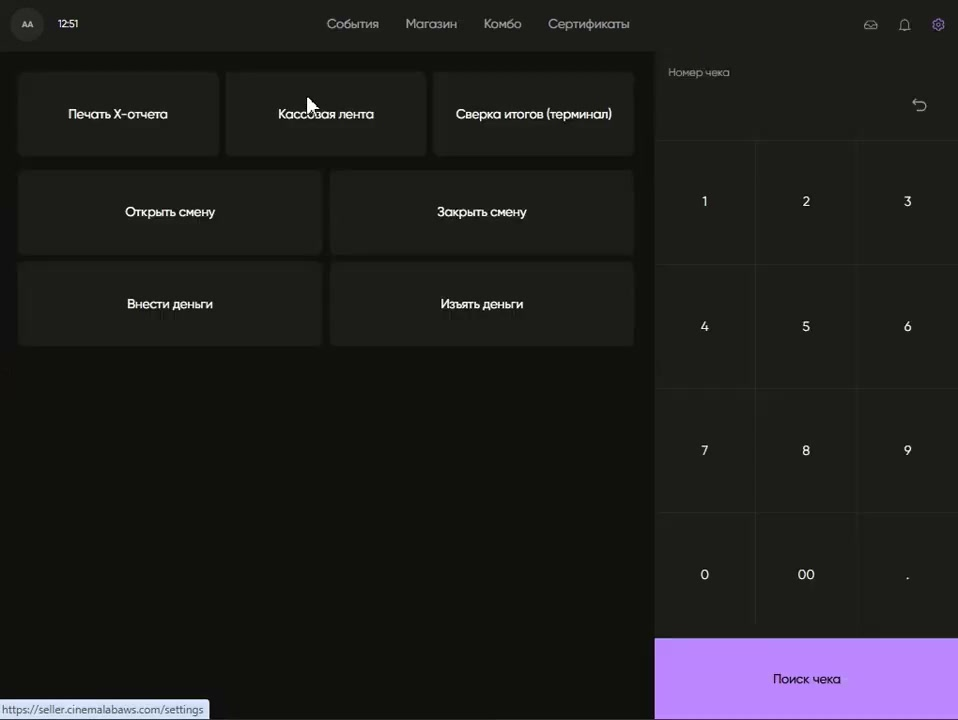

В панели администратора доступны служебные функции:

- печать X-отчёта;
- кассовая лента;
- сверка итогов по терминалу;
- открытие и закрытие смены;
- внесение и изъятие денег.

## Поиск чека и возвраты

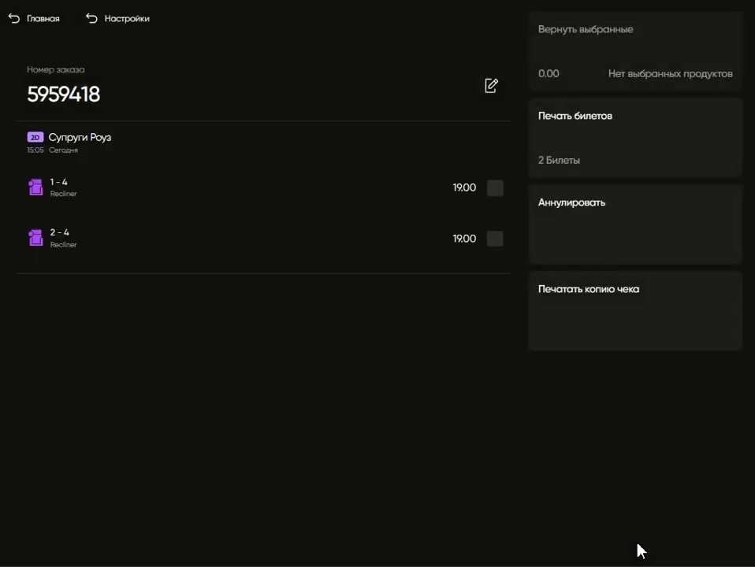

В Seller Web можно найти чек по номеру. Это используется для проверки операций.

В Seller Web для возврата используются действия:

- найти чек;
- напечатать билеты;
- выполнить аннулирование;
- при необходимости напечатать копию чека.

Публичные правила возврата по каналам покупки, срокам и ограничениям вынесены отдельно: [Возврат билетов](Возврат%20билетов.md).

## Обязательные правила

- Перед оплатой проверить места, товары и итоговую сумму.
- Если заказ нужно начать заново — использовать «Очистить» до оплаты.
- При применении промокода или скидки проверить итоговую сумму до оплаты.
- Служебные операции выполнять только пользователем с соответствующими правами.
- Возвраты и аннулирования проводить только по утверждённому регламенту.

## Риски и контроль

- Неверно выбранный сеанс или место приведёт к продаже неправильного билета.
- Ручная скидка влияет на итоговую сумму — её нужно проверять до оплаты.
- Оплата сертификатом требует проверки правил сертификата.
- Возврат и аннулирование — операции повышенного риска; выполняй их только по подтверждённому регламенту.
- Служебные кассовые операции влияют на смену и отчётность.

## Частые ошибки

- Выбрали места, но не проверили корзину перед оплатой.
- Не очистили корзину перед началом нового заказа.
- Применили промокод или скидку, но не проверили итоговую сумму.
- Путают выбор сеанса через «Расписание», «Постеры», «Залы» и «Места».
- Пытаются выполнять возврат без поиска исходного чека.

## Связанные страницы

- [Seller](../Seller.md)
- [Продажа билетов](../Продажа%20билетов.md)
- [Сертификаты](../Сертификаты.md)
- [Возврат билетов](Возврат%20билетов.md)
