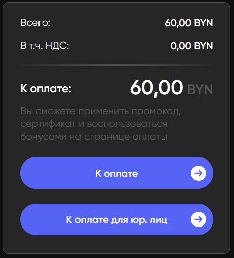
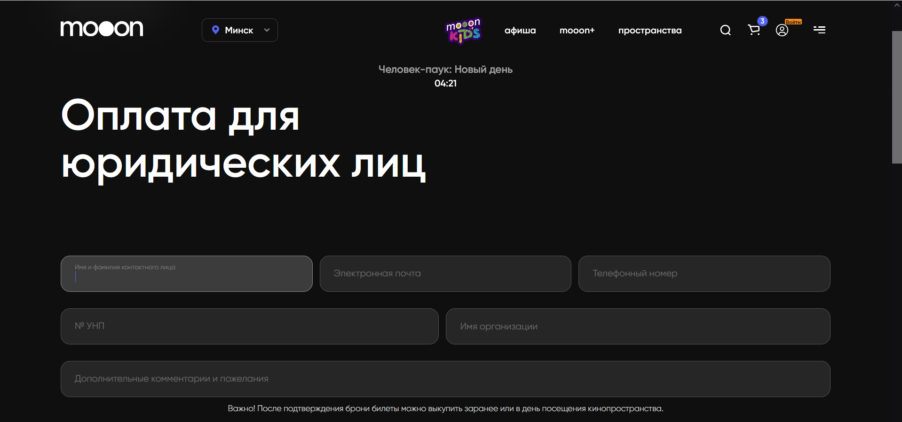
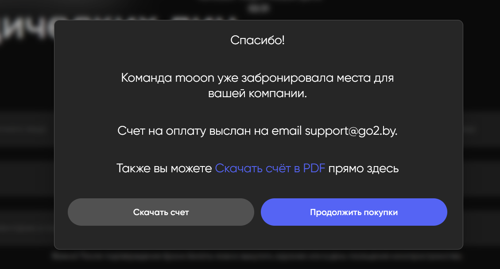
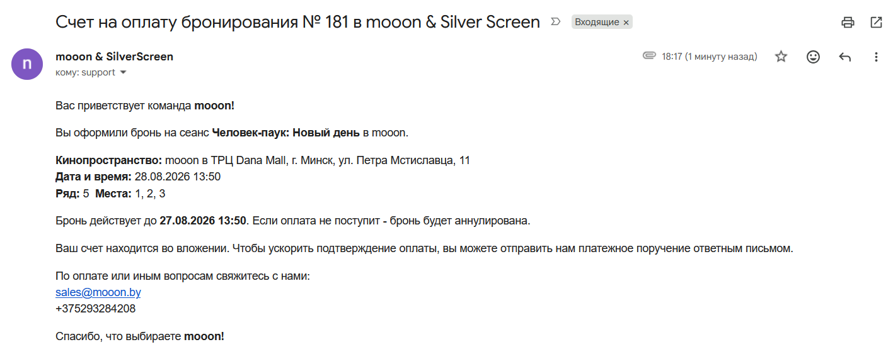
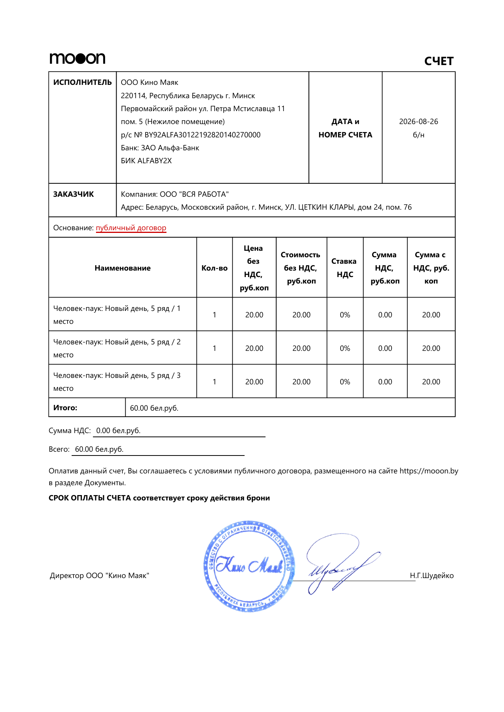

# Бронирование билетов для юридических лиц на mooon.by

Это инструкция для сотрудников о том, как гость оформляет резерв мест на сайте mooon.by и получает счёт на организацию. Используйте её, чтобы объяснить сценарий гостю или проверить, на каком он этапе.

<strong>Для кого</strong>
Сотрудники, которые консультируют по покупке билетов и резервированию мест для организаций.

<strong>Когда применяется</strong>
Гость хочет оплатить билеты от имени юридического лица по счёту.

<strong>Результат для гостя</strong>
Создаётся резерв мест; счёт в PDF и информация о сроке брони приходят на email гостя.

## Условия сценария

- Сеанс должен начинаться более чем через 30 часов. Если до него остаётся 30 часов или меньше, вместо формы сайт предлагает гостю связаться с менеджером.
- В одном заказе можно выбрать не более 10 билетов.
- При переходе к оплате по счёту завершается сессия гостя в личном кабинете. Скидки программы лояльности в счёт не переносятся: счёт формируется по полной стоимости.

## Что делает гость на сайте

1. Гость на `mooon.by` находит фильм или событие, выбирает сеанс и места, затем добавляет билеты в корзину.
2. В корзине гость выбирает **«К оплате для юр. лиц»**.

3. Сайт показывает предупреждение о переходе к оплате по счёту. После подтверждения открывается форма **«Оплата для юридических лиц»**.

4. В форме гость указывает имя и фамилию контактного лица, email для счёта и билетов, номер телефона и УНП организации. При корректном УНП данные организации подгружаются из налогового сервиса. Поле с комментарием или пожеланием необязательно.
5. Гость отправляет форму кнопкой **«Оставить заявку»**.

## Что гость видит после отправки заявки

Сайт подтверждает создание заявки и предлагает два действия: скачать счёт сразу или продолжить покупки.

На указанный email приходит письмо со счётом в PDF. В письме указаны событие, кинопространство, дата и время сеанса, ряд, места и срок действия брони.

Счёт содержит данные организации, выбранные билеты и сумму к оплате.

## Срок и результат бронирования

Бронь действует до 72 часов, но завершается не позднее чем за 24 часа до начала сеанса. Если оплата по счёту не поступает до окончания срока брони, резерв аннулируется. После подтверждения оплаты сотрудником билеты отправляются на email, который гость указал в форме.

## Что сообщить гостю при обращении

- Проверьте с гостем, что до сеанса остаётся более 30 часов и в заказе не более 10 билетов.
- Сообщите, что для оформления понадобятся контактные данные и УНП организации.
- Предупредите, что при этом способе оплаты счёт будет выставлен на организацию по полной стоимости, а скидки программы лояльности не применяются.
- Напомните, что билеты будут отправлены на email только после подтверждения оплаты счёта.

## Связанные страницы

- [Билеты и касса](../Продажа%20билетов.md)
- [Обработка счетов за бронирования билетов для юридических лиц](Обработка%20счетов%20за%20бронирования%20билетов%20для%20юридических%20лиц.md)
- [Афиша и покупка билета](../Сайт%20mooon.by/Афиша%20и%20покупка%20билета.md)
