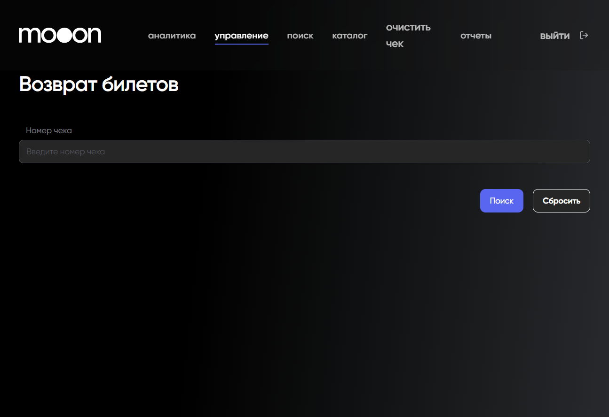

# Возврат билетов

Эта страница собирает публично описанные правила возврата билетов на `mooon.by` и связанные кассовые ориентиры. Она не заменяет внутренний регламент кассы и юридические документы: для спорного случая нужно сверять актуальные правила сайта и действующий порядок владельца процесса.

## Когда применяется

Сценарий нужен, когда гость просит вернуть билет, отменить покупку, изменить сеанс или разобраться со сроком поступления денег после возврата.

Перед консультацией нужно определить:

- где куплен билет: касса, сайт `mooon.by` или портал `go2.by`;
- к какому кинотеатру относится билет;
- сколько времени осталось до сеанса или события;
- использовались ли подарочная карта, абонемент, сертификат или промокод;
- есть ли оригинальный билет, электронный билет, номер заказа или подтверждение оплаты.

## Правила по каналу покупки

| Канал покупки | Что зафиксировано для возврата |
| --- | --- |
| Касса кинотеатра | Возврат выполняется в кассе того же кинотеатра не позднее чем за 10 минут до начала сеанса. |
| Сайт `mooon.by` | Билет можно вернуть в кассе любого кинотеатра сети не позднее чем за 10 минут до начала сеанса. Для Arena City указан отдельный порядок: возврат в кассе того же кинотеатра. |
| Сайт `mooon.by`, зарегистрированный пользователь | Онлайн-возврат описан через замену на бонусы не позднее чем за 60 минут до начала сеанса. |
| Портал `go2.by` | Возврат оформляется через форму возврата билета или поддержку `support@go2.by` не позднее чем за 60 минут до начала сеанса. |
| События | Для событий указан более ранний предел: не позднее чем за 24 часа до начала. |
| Оплата подарочной картой, абонементом или сертификатом | Возврат таких билетов выполняется только через кассы кинотеатров. |
| Покупка с промокодом | При возврате билета промокод не восстанавливается. |

## Срок поступления денег

Срок поступления денег на карту зависит от банка, который выпустил карту. На публичной странице указан ориентир до 15 дней. Если после этого срока деньги не поступили, гостю нужно обращаться в свой банк.

## Обмен билета

Отдельный обмен билета на другой сеанс или другое место не описан как доступная операция. Рабочий маршрут — вернуть исходный билет по правилам возврата и купить новый билет, если это допустимо по времени и условиям.

## Служебный экран Portal

В Portal есть отдельный вход в операцию:

Portal → `управление` → `Возврат билетов`.

На начальном экране доступны:

- поле `Номер чека`;
- кнопка `Поиск`;
- кнопка `Сбросить`.

Поиск чека в Portal не отменяет проверку канала покупки, времени до сеанса и оснований для возврата. Дальнейшие шаги после поиска не выполняются без подтверждённого внутреннего регламента.

## Что нельзя обещать

- Нельзя обещать точную дату поступления денег на карту.
- Нельзя обещать восстановление промокода после возврата.
- Нельзя проводить возврат без проверки канала покупки, времени до сеанса и подтверждающих данных.
- Нельзя запрашивать или фиксировать банковские данные гостя в базе знаний.

## Связанные страницы

- [Продажа билетов](../Продажа%20билетов.md)
- [FAQ и справочные сценарии](../Сайт%20mooon.by/FAQ%20и%20справочные%20сценарии.md)
- [Афиша и покупка билета](../Сайт%20mooon.by/Афиша%20и%20покупка%20билета.md)
- [Сертификаты](../Сертификаты.md)
- [Базовая работа в Seller Web](Базовая%20работа%20в%20Seller%20Web.md)
- [Портал](../Портал.md)
- [Поиск билета в Portal](../Портал/Поиск%20билета%20в%20Portal.md)
